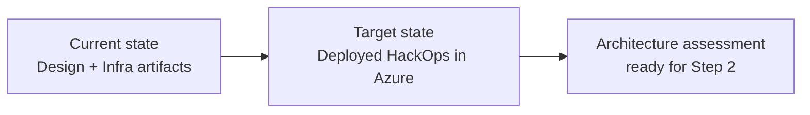

# 📋 Step 1: Requirements - hackops

<strong>📑 Requirements Overview</strong>

- [🎯 Project Overview](#-project-overview)
- [🚀 Functional Requirements](#-functional-requirements)
- [⚡ Non-Functional Requirements (NFRs)](#-non-functional-requirements-nfrs)
- [🔒 Compliance & Security Requirements](#-compliance--security-requirements)
- [💰 Budget](#-budget)
- [🔧 Operational Requirements](#-operational-requirements)
- [🌍 Regional Preferences](#-regional-preferences)
- [📋 Summary for Architecture Assessment](#-summary-for-architecture-assessment)
- [References](#references)

> Generated by requirements agent | 2026-02-26

| ⬅️ Previous | 📑 Index            | Next ➡️                                                        |
| ----------- | ------------------- | -------------------------------------------------------------- |
| —           | [README](README.md) | [02-architecture-assessment.md](02-architecture-assessment.md) |

> **Project**: HackOps — Azure hackathon management platform
> **Date**: 2026-02-26
> **Author**: 02-Requirements Agent
> **Status**: Draft — feeds architecture assessment

---

## 🎯 Project Overview

HackOps is an Azure hackathon management platform for structured
MicroHack events. It manages the complete lifecycle of a hackathon:
team registration, hacker onboarding via 4-digit event codes,
configurable Markdown-driven scoring rubrics, gated challenge
progression, live leaderboards, and a full audit trail — all behind
role-based access control.

### Target Workload Profile

| Attribute              | Value                                                |
| ---------------------- | ---------------------------------------------------- |
| Concurrent events      | 2–3 parallel hackathons                              |
| Teams per event        | 4–5 teams of ~5 members                              |
| Max concurrent users   | ~75                                                  |
| Roles                  | Admin, Coach, Hacker, Anonymous                      |
| API surface            | ~16 REST endpoints (all authenticated except health) |
| Deployment model       | Solo-dev, enterprise-policy-compliant                |
| Infrastructure as Code | Bicep with Azure Verified Modules (AVM)              |

### Application Stack

<strong>📦 Stack Rationale</strong>

This stack balances implementation speed, enterprise policy compliance,
and low dev cost while preserving a production-ready migration path.

| Layer    | Technology                                             |
| -------- | ------------------------------------------------------ |
| Frontend | Next.js 15 (App Router), Tailwind CSS 4, shadcn/ui     |
| Backend  | Next.js API Routes (Route Handlers), TypeScript        |
| Database | Azure SQL Database (S2, 50 DTU)                        |
| Auth     | GitHub OAuth via Azure App Service Easy Auth           |
| Runtime  | Containerized Node.js 22 on Linux App Service          |
| Registry | Azure Container Registry (Standard SKU)                |
| Seeding  | Azure Container Instances (VNet-integrated, ephemeral) |

---

## 🚀 Functional Requirements

### Hackathon Lifecycle Management

- Create, launch (draft → active), and archive hackathon events
- Auto-generate unique 4-digit event codes (1000–9999) per hackathon
- State machine: `draft → active → archived` (no reverse transitions)
- Freeze leaderboard and disable submissions on archive

### Hacker Onboarding

- Self-service join via event code (rate-limited: 5/min/IP)
- GitHub identity as profile (no registration forms)
- Duplicate join prevention (409 on re-join)
- Only active hackathons accept joins

### Team Management

- Fisher-Yates shuffle for unbiased random team assignment
- Configurable team size with balanced distribution
  (`ceil(teamSize/2)` minimum per team)
- Manual reassignment capability (Admin only)
- Team-scoped data access for Hackers

### Scoring Engine

- Markdown-driven rubric CRUD with version management
- Pointer + versioned document pattern for atomic rubric swap
- Hacker evidence submission → Coach score entry (form + JSON)
- Staging queue: pending → approved/rejected workflow
- Score override (Admin only) with mandatory audit reason
- Rubric-driven validation at API boundary (Zod)

### Leaderboard

- Server-side rendered ranked display (< 2s at 75 users)
- Auto-refresh every 30 seconds (client-side polling)
- Expandable rows with per-challenge score breakdown
- Grade badges (A/B/C/D) and award badges
- Only approved scores displayed
- Frozen on hackathon archive

### Challenge Progression

- Sequential gating: Challenge N+1 locked until N approved
- Auto-unlock trigger on submission approval
- Challenge 1 auto-unlocked on hackathon start
- Progress tracking per team

### Admin Operations

- Role management: invite Coach/Admin by GitHub username
- Primary admin protection (cannot be demoted)
- Hackathon-scoped role assignments
- Paginated audit trail of all reviewer actions
- Config management (refresh intervals, team size defaults)

### Authentication & Authorization

- GitHub OAuth via App Service Easy Auth
- Role resolution from `roles` container (userId + hackathonId)
- Role guards on all API routes
- Dev auth bypass for local development
- CORS restricted to App Service origin + localhost:3000
- Rate limiting: 100 req/min/IP on all API routes
- Zod validation on all request bodies

---

## ⚡ Non-Functional Requirements (NFRs)

### Performance

| Metric                     | Target       |
| -------------------------- | ------------ |
| Leaderboard SSR response   | < 2 seconds  |
| API CRUD response time     | < 500 ms     |
| Auto-refresh interval      | 30 seconds   |
| Hackathon creation to join | < 15 minutes |

### Availability

| Metric            | Target                             |
| ----------------- | ---------------------------------- |
| Uptime target     | 99.5% (single-region, no SLA)      |
| Recovery strategy | Redeploy from IaC                  |
| Backup policy     | SQL geo-redundant backup (default) |
| Deployment slots  | Staging + production swap          |

### Scalability

| Metric           | Current | Growth path                             |
| ---------------- | ------- | --------------------------------------- |
| Concurrent users | ~75     | SQL S2 handles 50 DTU burst comfortably |
| SQL Database     | S2 DTU  | Scale to S3/P1 if needed                |
| App Service SKU  | P1v4    | Scale up to P2v4/P3v4 if needed         |

### Cost Targets

| Environment | Monthly estimate | Notes                                    |
| ----------- | ---------------- | ---------------------------------------- |
| Dev         | ~$80–120         | P1v4 App Service + SQL S2 + ACR Standard |
| Prod        | ~$120–180        | P1v4 App Service + SQL S2 + ACR Standard |

---

## 🔒 Compliance & Security Requirements

### Authentication & Identity

- GitHub OAuth via App Service Easy Auth (mandatory)
- Managed identity for all service-to-service communication
- No SQL authentication — Entra ID only (`azureADOnlyAuthentication: true`)
- Managed identity as Entra AD admin on SQL Server
- No connection string auth in production
- Dev auth bypass disabled in production (`NODE_ENV=production`)

### Network Security

- Azure SQL accessible only via Private Endpoint
  (`publicNetworkAccess: Disabled`), Private DNS Zone
  (`privatelink.database.windows.net`), Entra ID only auth
- Key Vault behind Private Endpoint with RBAC authorization
- VNet integration for App Service (all outbound via VNet)
- NSGs on all subnets with deny-all inbound on PE subnet
- TLS 1.2 enforced on all services
- HTTPS-only on all endpoints

### Data Protection

- Scores immutable until approved (staging pattern)
- Audit trail on all reviewer actions
- Event codes stored as plaintext (rate-limited, not secrets)
- No PII beyond GitHub profile data

### Azure Policy Compliance

- Respect enterprise landing zone policies
- Allowed SKUs, mandatory tags, approved regions
- No public endpoints on data-plane resources
- Governance constraints documented before deployment
  (Phase 1.5 hard gate)

---

## 💰 Budget

### Cost Drivers

| Resource           | SKU/Tier      | Est. monthly (dev) | Est. monthly (prod) |
| ------------------ | ------------- | ------------------ | ------------------- |
| App Service Plan   | P1v4          | ~$85               | ~$85                |
| Azure SQL Database | S2 (50 DTU)   | ~$75               | ~$75                |
| Container Registry | Standard      | ~$5                | ~$5                 |
| Key Vault          | Standard      | ~$0.50             | ~$0.50              |
| Log Analytics      | Pay-as-you-go | ~$2–5              | ~$5–10              |
| App Insights       | Pay-as-you-go | ~$0–2              | ~$2–5               |
| Private DNS Zone   | —             | ~$0.50             | ~$0.50              |
| VNet/NSG           | Free          | $0                 | $0                  |
| ACI (ephemeral)    | On-demand     | ~$0–1              | ~$0–1               |
| **Total**          |               | **~$168–179**      | **~$173–182**       |

> Cost estimates are parametric approximations. Verify against
> Azure Pricing Calculator or Pricing MCP tools.

---

## 🔧 Operational Requirements

### Deployment

- All infrastructure deployed via Bicep (AVM-first)
- Containerized deployment: Docker image built via ACR Tasks,
  pushed to ACR, pulled by App Service with managed identity
- Idempotent deployments (redeployable with same outcome)
- Deployment script: `infra/bicep/hackops/deploy.ps1`
- CI/CD via GitHub Actions with environment gates
- SQL schema migrations via ACI (VNet-integrated, ephemeral)
  — SQL is behind PE, must seed/migrate from inside the VNet

### Monitoring & Observability

- Application Insights for APM and distributed tracing
- Log Analytics workspace as central log sink
- Custom events for audit trail entries
- Diagnostic settings on all resources

### Disaster Recovery

- Azure SQL geo-redundant backup (default retention 7 days)
- App Service redeployable from IaC + code repo
- Container images stored in ACR (Standard tier, geo-replication optional)
- Key Vault with purge protection and soft delete
- All state recoverable from Git + SQL backup + ACR images

---

## 🌍 Regional Preferences

| Preference | Region               | Justification                             |
| ---------- | -------------------- | ----------------------------------------- |
| Primary    | `swedencentral`      | EU GDPR-compliant, all services available |
| Failover   | `germanywestcentral` | EU paired alternative                     |

All resources deployed to `swedencentral` unless governance
constraints dictate otherwise.

---

## 📋 Summary for Architecture Assessment

### Resource Inventory

| #   | Resource             | AVM Module                                         | Min Version | Naming Pattern                     |
| --- | -------------------- | -------------------------------------------------- | ----------- | ---------------------------------- |
| 1   | Virtual Network      | `br/public:avm/res/network/virtual-network`        | `0.5.0`     | `vnet-hackops-{env}`               |
| 2   | NSG (× 3)            | `br/public:avm/res/network/network-security-group` | `0.5.0`     | `nsg-{purpose}-{env}`              |
| 3   | App Service Plan     | `br/public:avm/res/web/serverfarm`                 | `0.4.0`     | `asp-hackops-{env}`                |
| 4   | App Service          | `br/public:avm/res/web/site`                       | `0.12.0`    | `app-hackops-{env}`                |
| 5   | Azure SQL Server     | `br/public:avm/res/sql/server`                     | `0.10.0`    | `sql-hackops-{env}-{suffix}`       |
| 6   | Key Vault            | `br/public:avm/res/key-vault/vault`                | `0.11.0`    | `kv-hackops-{env}-{suffix}`        |
| 7   | Log Analytics        | `br/public:avm/res/operational-insights/workspace` | `0.9.0`     | `log-hackops-{env}`                |
| 8   | Application Insights | `br/public:avm/res/insights/component`             | `0.4.0`     | `appi-hackops-{env}`               |
| 9   | Container Registry   | `br/public:avm/res/container-registry/registry`    | `0.6.0`     | `cr{project}{env}{suffix}`         |
| 10  | Private DNS Zone     | Native Bicep resource                              | —           | `privatelink.database.windows.net` |

### Networking Topology

| Subnet         | CIDR            | IPs | Purpose                      |
| -------------- | --------------- | --- | ---------------------------- |
| `snet-app`     | `10.0.0.0/25`   | 128 | App Service VNet integration |
| `snet-pe`      | `10.0.0.128/26` | 64  | Private Endpoints (SQL, KV)  |
| `snet-default` | `10.0.0.192/26` | 64  | ACI / future services        |
| **VNet**       | `10.0.0.0/23`   | 512 | Total address space          |

### Azure SQL Tables

| Table         | Primary Key            | Purpose          |
| ------------- | ---------------------- | ---------------- |
| `hackathons`  | `id`                   | Event lifecycle  |
| `teams`       | `id` (FK: hackathonId) | Team roster      |
| `hackers`     | `id` (FK: hackathonId) | Hacker profiles  |
| `scores`      | `id` (FK: teamId)      | Approved scores  |
| `submissions` | `id` (FK: teamId)      | Staging queue    |
| `rubrics`     | `id`                   | Scoring rubrics  |
| `config`      | `id`                   | App config       |
| `roles`       | `id` (FK: hackathonId) | Role assignments |
| `challenges`  | `id` (FK: hackathonId) | Challenge defs   |
| `progression` | `id` (FK: teamId)      | Unlock state     |

> Azure SQL provides referential integrity via foreign keys,
> relational joins, and ACID transactions — advantages over
> Azure SQL Database for this workload (see ADR-0004 for migration rationale).

### Key Invariants for Infrastructure

1. All resources in `swedencentral` (verify governance allows)
2. Azure SQL `publicNetworkAccess: Disabled` — Private Endpoint +
   Private DNS Zone (`privatelink.database.windows.net`) +
   Entra ID only auth (`azureADOnlyAuthentication: true`)
3. Key Vault RBAC authorization, purge protection enabled
4. App Service VNet integration with `WEBSITE_VNET_ROUTE_ALL=1`
5. Managed identity for SQL (Entra AD admin) and Key Vault
6. Containerized deployment: ACR Standard → App Service (DOCKER)
7. ACR pull via managed identity (`acrUseManagedIdentityCreds: true`)
8. SQL schema seeding via ACI (VNet-integrated, ephemeral)
9. SKUs: App Service P1v4 (fallback P1v3), SQL S2 (50 DTU), ACR Standard
10. 9 mandatory tags per governance Deny policy
11. 6-character deterministic suffix from `uniqueString(resourceGroup().id)`

### Deployment Target

| Parameter       | Value                        |
| --------------- | ---------------------------- |
| Resource Group  | `rg-hackops-se-dev`          |
| Region          | `swedencentral`              |
| Environment     | `dev`                        |
| Project Name    | `hackops`                    |
| Deployment Mode | `az deployment group create` |
| Container Image | ACR → App Service (DOCKER)   |

---

## References

- Technical plan: `.github/prompts/plan-hackOps.prompt.md`
- PRD: `docs/prd.md`
- API contract: `docs/api-contract.md`
- Azure defaults: `.github/skills/azure-defaults/SKILL.md`
- AVM module index: <https://aka.ms/avm/index>

---

_Requirements captured using [plan-requirements.prompt.md](../../.github/prompts/plan-requirements.prompt.md) template_

---

| ⬅️ — | 🏠 [Project Index](README.md) | ➡️ [02-architecture-assessment.md](02-architecture-assessment.md) |
| ---- | ----------------------------- | ----------------------------------------------------------------- |

