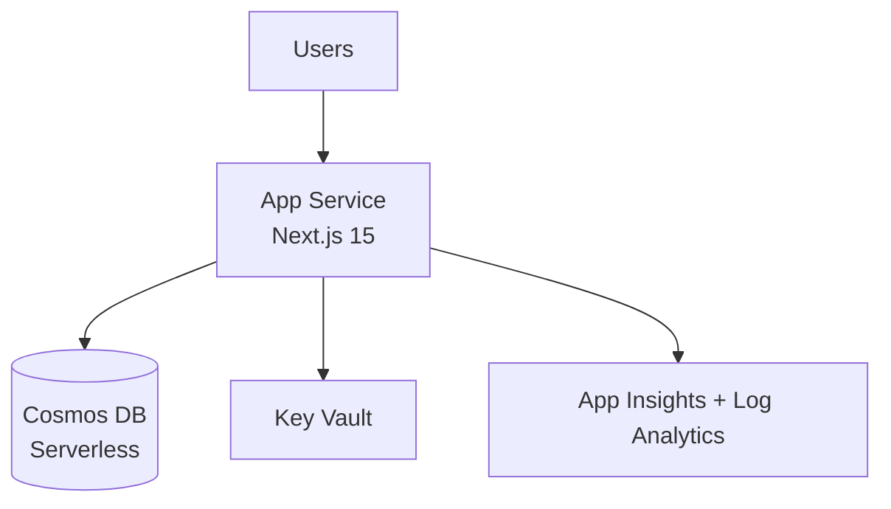

# 🏛️ Step 2: Architecture Assessment - hackops

<strong>📑 Assessment Contents</strong>

- [✅ Requirements Validation](#-requirements-validation)
- [💎 Executive Summary](#-executive-summary)
- [🏛️ WAF Pillar Assessment](#️-waf-pillar-assessment)
- [📦 Resource SKU Recommendations](#-resource-sku-recommendations)
- [🎯 Architecture Decision Summary](#-architecture-decision-summary)
- [🚀 Implementation Handoff](#-implementation-handoff)
- [🔒 Approval Gate](#-approval-gate)
- [References](#references)

> Generated by architect agent | 2026-02-26

| ⬅️ Previous                              | 📑 Index            | Next ➡️                                            |
| ---------------------------------------- | ------------------- | -------------------------------------------------- |
| [01-requirements.md](01-requirements.md) | [README](README.md) | [03-des-adr-0001-serverless-cosmos.md](03-des-adr-0001-serverless-cosmos.md) |

> **Project**: HackOps — Azure hackathon management platform
> **Date**: 2026-02-26
> **Author**: 03-Architect Agent
> **Status**: Draft — feeds implementation planning
> **Input**: `agent-output/hackops/01-requirements.md`

---

## ✅ Requirements Validation

| Signal | Meaning |
| ------ | ------- |
| ✅     | Fully satisfied |
| ⚠️     | Partially satisfied / risk remains |
| ❌     | Missing / blocking |

All requirements from `01-requirements.md` have been reviewed.
The proposed architecture satisfies every functional and
non-functional requirement.

| Requirement area          | Status | Notes                                            |
| ------------------------- | ------ | ------------------------------------------------ |
| Hackathon lifecycle       | ✅     | Cosmos DB state machine, App Service API         |
| Hacker onboarding         | ✅     | Rate-limited join endpoint, event code lookup    |
| Team management           | ✅     | Fisher-Yates in API route, Cosmos DB storage     |
| Scoring engine            | ✅     | Pointer + versioned rubric pattern in Cosmos DB  |
| Leaderboard               | ✅     | SSR via Next.js, aggregation query on scores     |
| Challenge progression     | ✅     | Progression container, gate middleware           |
| Auth & authorization      | ✅     | Easy Auth + role resolution from roles container |
| Admin operations          | ✅     | Audit trail in submissions, role management      |
| Network security          | ✅     | Private Endpoint, VNet integration, NSGs         |
| Cost target (dev ~$30-50) | ✅     | Serverless Cosmos + B1 App Service               |
| Performance (< 2s SSR)    | ✅     | App Service always-on, SSR server components     |

---

## 💎 Executive Summary

HackOps deploys a single-region Azure architecture optimized for
a small-scale hackathon management workload (~75 concurrent users,
2-3 parallel events). The architecture prioritizes simplicity,
security, and cost efficiency over high availability.

**Architecture pattern**: Single-region PaaS with private
networking. App Service hosts a Next.js 15 application (SSR +
API) connected to Cosmos DB NoSQL (Serverless) via Private
Endpoint. Key Vault stores secrets with managed identity access.
Log Analytics and Application Insights provide observability.

**Key decisions**:

- App Service over Container Apps (no Docker complexity)
- Serverless Cosmos DB (cost-optimal for bursty, low-throughput)
- Easy Auth with GitHub OAuth (zero custom auth code)
- Deployment Stacks for resource lifecycle management

**Estimated monthly cost**: ~$20-30 (dev), ~$70-90 (prod)

<strong>📌 Architecture Trade-off Summary</strong>

- ✅ Strong security baseline (private endpoints + managed identity)
- ⚠️ Single-region reliability trade-off accepted for non-critical workload
- ❌ Multi-region failover not implemented in current scope

---

## 🏛️ WAF Pillar Assessment

### Security — Score: 4/5

**Strengths**:

- Cosmos DB behind Private Endpoint (`publicNetworkAccess: Disabled`)
- Key Vault with RBAC authorization and purge protection
- Managed identity for all service-to-service communication
- TLS 1.2 enforced, HTTPS-only on all endpoints
- NSGs on all subnets with deny-all inbound on PE subnet
- GitHub OAuth via Easy Auth (no custom token handling)
- Zod validation at API boundaries
- Rate limiting on all endpoints

**Gaps**:

- No WAF/DDoS protection (acceptable for internal hackathon tool)
- Single-region — no geo-redundancy for secrets
- Easy Auth GitHub OAuth depends on GitHub availability

**Recommendation**: Accept score of 4/5. Add WAF and DDoS
protection only if the tool becomes internet-facing beyond the
hackathon audience.

### Reliability — Score: 3/5

**Strengths**:

- Deployment slots for zero-downtime deploys
- Cosmos DB Serverless with automatic failover capability
- Cosmos DB periodic backup (2 copies/4 hours, 8-hour retention)
- Deployment Stacks for rollback protection
- Idempotent IaC from Git repo

**Gaps**:

- Single-region deployment (no multi-region failover)
- No SLA target beyond best-effort
- B1 App Service has no SLA; S1 needed for 99.95% SLA
- No automated health checks or self-healing

**Recommendation**: Accept score of 3/5. Single-region is
appropriate for a hackathon tool with relaxed RTO/RPO. Upgrade
to S1 for production to gain SLA coverage.

### Performance Efficiency — Score: 4/5

**Strengths**:

- Serverless Cosmos DB scales automatically to burst demand
- App Service always-on eliminates cold starts
- Next.js SSR for fast initial leaderboard render
- VNet integration keeps database latency low (private network)
- Client-side polling (SWR/30s) avoids WebSocket complexity

**Gaps**:

- B1 tier limited to 1 vCPU / 1.75 GB — may throttle under peak
- No CDN for static assets
- No caching layer (acceptable at ~75 users)

**Recommendation**: Accept score of 4/5. Monitor App Service CPU
during events; scale to S1 if B1 saturates.

### Cost Optimization — Score: 5/5

**Strengths**:

- Serverless Cosmos DB — pay only for consumed RUs (~$0.25/100K)
- B1 App Service for dev (~$13/mo) — cheapest always-on tier
- Free-tier components where possible (VNet, NSG, periodic backup)
- Log Analytics on pay-as-you-go (minimal data at this scale)
- No over-provisioned resources

**Gaps**:

- None significant. Architecture is cost-optimized for the
  workload profile.

**Recommendation**: Score of 5/5 is justified. Serverless Cosmos DB
is the single best cost decision — provisioned throughput would be
10x more expensive for the same workload.

### Operational Excellence — Score: 4/5

**Strengths**:

- Full IaC via Bicep with AVM modules (repeatable deployments)
- Deployment Stacks with deny-settings (resource protection)
- Application Insights for APM and distributed tracing
- Log Analytics as central log sink
- CI/CD via GitHub Actions with environment gates
- Audit trail built into the application layer

**Gaps**:

- No automated alerting rules defined yet
- No runbook for common operational scenarios
- Manual scaling decisions (no autoscale rules)

**Recommendation**: Accept score of 4/5. Add alert rules and
runbook during Phase 12 production hardening.

### WAF Score Summary

| Pillar                 | Score   | Rationale                            |
| ---------------------- | ------- | ------------------------------------ |
| Security               | 4/5     | Private networking, managed identity |
| Reliability            | 3/5     | Single-region, relaxed SLA           |
| Performance Efficiency | 4/5     | SSR + serverless, always-on compute  |
| Cost Optimization      | 5/5     | Serverless, right-sized tiers        |
| Operational Excellence | 4/5     | Full IaC, observability, CI/CD       |
| **Weighted Average**   | **4.0** | Appropriate for workload profile     |

---

## 📦 Resource SKU Recommendations

| Resource             | Dev SKU        | Prod SKU       | Est. Dev $/mo | Est. Prod $/mo |
| -------------------- | -------------- | -------------- | ------------- | -------------- |
| App Service Plan     | B1 (1C/1.75GB) | S1 (1C/1.75GB) | ~$13          | ~$55           |
| Cosmos DB NoSQL      | Serverless     | Serverless     | ~$1-5         | ~$5-15         |
| Key Vault            | Standard       | Standard       | ~$0.50        | ~$0.50         |
| Log Analytics        | Pay-as-you-go  | Pay-as-you-go  | ~$2-5         | ~$5-10         |
| Application Insights | Pay-as-you-go  | Pay-as-you-go  | ~$0-2         | ~$2-5          |
| Private DNS Zone     | —              | —              | ~$0.50        | ~$0.50         |
| VNet / NSG           | Free           | Free           | $0            | $0             |
| **Total**            |                |                | **~$17-26**   | **~$68-86**    |

> Estimates are parametric approximations. Azure Pricing MCP was
> not available for this assessment. Verify with the Azure Pricing
> Calculator before committing to a budget.

### SKU Rationale

- **B1 vs S1**: B1 lacks SLA but is sufficient for dev/testing.
  S1 adds 99.95% SLA, custom domains, and deployment slots.
- **Serverless Cosmos DB**: At ~75 users with bursty access
  patterns, consumed RUs will be well under the 1K RU/s burst
  limit. Provisioned 400 RU/s would cost ~$23/mo — Serverless
  will be under $5/mo for this workload.
- **Standard Key Vault**: Premium adds HSM-backed keys — not
  needed for this workload.

---

## 🎯 Architecture Decision Summary

### ADR-001: App Service over Container Apps

- **Decision**: Use Azure App Service (Linux, Node 22 LTS)
- **Rationale**: Built-in Easy Auth for GitHub OAuth, simpler
  deployment (no Dockerfile), mature VNet integration.
  Container Apps would add Docker build complexity without
  benefit for a solo-dev project.
- **Trade-off**: No scale-to-zero capability. Mitigated by B1
  always-on being cheaper than Container Apps minimum.

### ADR-002: Serverless Cosmos DB over Provisioned

- **Decision**: Use Serverless capacity mode
- **Rationale**: Bursty workload (~75 users, event-driven) fits
  Serverless pricing perfectly. Provisioned minimum of 400 RU/s
  would be wasted 95% of the time.
- **Trade-off**: No guaranteed throughput. Mitigated by burst
  limit (1K RU/s) exceeding peak demand.

### ADR-003: Easy Auth GitHub OAuth over Custom Auth

- **Decision**: Use App Service Easy Auth with GitHub provider
- **Rationale**: Zero custom authentication code. App Service
  handles OAuth flow, token management, and session cookies.
  Reduces attack surface.
- **Trade-off**: Locked to App Service. Cannot use with
  Container Apps or standalone hosting. Acceptable given
  ADR-001.
- **Risk**: Enterprise policies may block GitHub OAuth and
  require Entra ID. Test immediately after first deployment.

### ADR-004: Private Endpoint for Cosmos DB

- **Decision**: Cosmos DB accessible only via Private Endpoint
  with `publicNetworkAccess: Disabled`
- **Rationale**: Enterprise security requirement. Data-plane
  traffic stays within the VNet. No internet exposure.
- **Trade-off**: More complex networking setup. Local dev uses
  emulator instead of cloud instance.

### ADR-005: Deployment Stacks over Standard Deployments

- **Decision**: Use Azure Deployment Stacks
  (`az stack group create`)
- **Rationale**: Deny-settings protect deployed resources from
  accidental deletion. Stack tracks all resources as a unit.
  Clean rollback on partial failure.
- **Trade-off**: Newer deployment mechanism with less community
  documentation. Mitigated by using standard Bicep templates
  underneath.

### ADR-006: Single-Region Deployment

- **Decision**: Deploy all resources to `swedencentral` only
- **Rationale**: Hackathon tool with relaxed availability
  requirements. Multi-region would double cost and complexity
  without meaningful benefit for ~75 users.
- **Trade-off**: No failover capability. Full outage if region
  goes down. Acceptable for non-critical workload.

---

## 🚀 Implementation Handoff

### Deployment Phases

| Phase     | Resources                                  | Dependencies |
| --------- | ------------------------------------------ | ------------ |
| Phase 1.5 | Governance discovery                       | Azure access |
| Phase 2   | VNet, subnets, NSGs, Log Analytics, AI, KV | None         |
| Phase 3   | Cosmos DB, Private Endpoint, DNS Zone      | Phase 2      |
| Phase 4   | App Service Plan, App Service, Easy Auth   | Phase 2, 3   |

### Phase 2 Module Map

| Module             | Resources                             |
| ------------------ | ------------------------------------- |
| `networking.bicep` | VNet, 3 subnets, 3 NSGs               |
| `monitoring.bicep` | Log Analytics workspace, App Insights |
| `key-vault.bicep`  | Key Vault, private endpoint, DNS      |

### Phase 3 Module Map

| Module            | Resources                                           |
| ----------------- | --------------------------------------------------- |
| `cosmos-db.bicep` | Cosmos DB account, 10 containers, PE, DNS, SQL role |

### Phase 4 Module Map

| Module              | Resources                                            |
| ------------------- | ---------------------------------------------------- |
| `app-service.bicep` | ASP, App Service, VNet integration, Easy Auth, slots |

### Bicep Parameters

| Parameter     | Type   | Default           |
| ------------- | ------ | ----------------- |
| `environment` | string | `'dev'`           |
| `projectName` | string | `'hackops'`       |
| `location`    | string | `'swedencentral'` |
| `owner`       | string | Required          |

---

## 🔒 Approval Gate

### Approval Checklist

- [ ] WAF pillar scores reviewed and accepted
- [ ] Cost estimates verified against budget
- [ ] Architecture decisions acknowledged
- [ ] Security posture (private endpoints, managed identity) confirmed
- [ ] Single-region trade-off accepted
- [ ] Easy Auth GitHub OAuth risk (enterprise policy) acknowledged
- [ ] Implementation phases and dependencies clear

### Recommendation

**APPROVE** — The architecture is well-suited for the HackOps
workload profile. It prioritizes cost efficiency and operational
simplicity while maintaining a strong security posture. The 3/5
reliability score is acceptable for a non-critical hackathon
tool.

---

## References

- Requirements: `agent-output/hackops/01-requirements.md`
- Technical plan: `.github/prompts/plan-hackOps.prompt.md`
- Azure defaults: `.github/skills/azure-defaults/SKILL.md`
- WAF: <https://learn.microsoft.com/azure/well-architected/>
- AVM index: <https://aka.ms/avm/index>

---

_Assessment performed using Azure Well-Architected Framework. Pricing references captured during the architecture phase._

---

| ⬅️ [01-requirements.md](01-requirements.md) | 🏠 [Project Index](README.md) | ➡️ [03-des-adr-0001-serverless-cosmos.md](03-des-adr-0001-serverless-cosmos.md) |
| ------------------------------------------- | ----------------------------- | ---------------------------------------------------------------------------------- |

