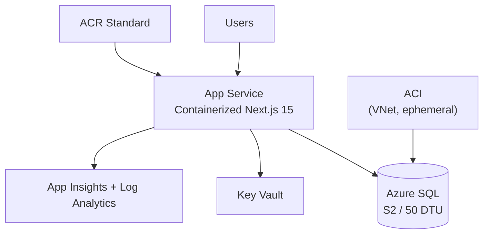

# 🏛️ Step 2: Architecture Assessment - hackops

<strong>📑 Assessment Contents</strong>

- [✅ Requirements Validation](#-requirements-validation)
- [💎 Executive Summary](#-executive-summary)
- [🏛️ WAF Pillar Assessment](#️-waf-pillar-assessment)
- [📦 Resource SKU Recommendations](#-resource-sku-recommendations)
- [🎯 Architecture Decision Summary](#-architecture-decision-summary)
- [🚀 Implementation Handoff](#-implementation-handoff)
- [🔒 Approval Gate](#-approval-gate)
- [References](#references)

> Generated by architect agent | 2026-02-26

| ⬅️ Previous                              | 📑 Index            | Next ➡️                                                                      |
| ---------------------------------------- | ------------------- | ---------------------------------------------------------------------------- |
| [01-requirements.md](01-requirements.md) | [README](README.md) | [03-des-adr-0001-serverless-cosmos.md](03-des-adr-0001-serverless-cosmos.md) |

> **Project**: HackOps — Azure hackathon management platform
> **Date**: 2026-02-26
> **Author**: 03-Architect Agent
> **Status**: Draft — feeds implementation planning
> **Input**: `agent-output/hackops/01-requirements.md`

---

## ✅ Requirements Validation

| Signal | Meaning                            |
| ------ | ---------------------------------- |
| ✅     | Fully satisfied                    |
| ⚠️     | Partially satisfied / risk remains |
| ❌     | Missing / blocking                 |

All requirements from `01-requirements.md` have been reviewed.
The proposed architecture satisfies every functional and
non-functional requirement.

| Requirement area           | Status | Notes                                            |
| -------------------------- | ------ | ------------------------------------------------ |
| Hackathon lifecycle        | ✅     | SQL tables with FK integrity, App Service API    |
| Hacker onboarding          | ✅     | Rate-limited join endpoint, event code lookup    |
| Team management            | ✅     | Fisher-Yates in API route, SQL storage           |
| Scoring engine             | ✅     | Pointer + versioned rubric pattern in SQL        |
| Leaderboard                | ✅     | SSR via Next.js, SQL aggregation with JOINs      |
| Challenge progression      | ✅     | Progression table, gate middleware               |
| Auth & authorization       | ✅     | Easy Auth + role resolution from roles table     |
| Admin operations           | ✅     | Audit trail in submissions, role management      |
| Network security           | ✅     | Private Endpoint + Private DNS, VNet, NSGs       |
| Containerized deployment   | ✅     | ACR Standard → App Service (DOCKER), ACI seeding |
| Cost target (dev ~$80-120) | ✅     | P1v4 App Service + SQL S2 + ACR Standard         |
| Performance (< 2s SSR)     | ✅     | App Service always-on, SSR server components     |

---

## 💎 Executive Summary

HackOps deploys a single-region Azure architecture optimized for
a small-scale hackathon management workload (~75 concurrent users,
2-3 parallel events). The architecture prioritizes simplicity,
security, and cost efficiency over high availability.

**Architecture pattern**: Single-region PaaS with private
networking. App Service hosts a containerized Next.js 15
application (SSR + API) pulled from ACR, connected to Azure SQL
Database (S2, 50 DTU) via Private Endpoint with Entra ID only
authentication. Key Vault stores secrets with managed identity
access. Log Analytics and Application Insights provide
observability. ACI provides VNet-integrated ephemeral containers
for SQL schema seeding and migrations.

**Key decisions**:

- Containerized App Service over Container Apps (Easy Auth + slots)
- Azure SQL Database over Cosmos DB (relational joins, FK integrity, ACID — see ADR-0004)
- ACR Standard for container image registry
- ACI for SQL schema operations (DB behind PE — must seed from inside VNet)
- Easy Auth with GitHub OAuth (zero custom auth code)
- `az deployment group create` for deployment (not Deployment Stacks)

**Estimated monthly cost**: ~$168-179 (dev), ~$173-182 (prod)

<strong>📌 Architecture Trade-off Summary</strong>

- ✅ Strong security baseline (private endpoints + managed identity)
- ⚠️ Single-region reliability trade-off accepted for non-critical workload
- ❌ Multi-region failover not implemented in current scope

---

## 🏛️ WAF Pillar Assessment

### Security — Score: 4/5

**Strengths**:

- Azure SQL behind Private Endpoint + Private DNS Zone
  (`publicNetworkAccess: Disabled`, `azureADOnlyAuthentication: true`)
- No SQL authentication — Entra ID only with managed identity as admin
- Key Vault with RBAC authorization and purge protection
- Managed identity for all service-to-service communication
- ACR pull via managed identity (`acrUseManagedIdentityCreds`)
- TLS 1.2 enforced, HTTPS-only on all endpoints
- NSGs on all subnets with deny-all inbound on PE subnet
- GitHub OAuth via Easy Auth (no custom token handling)
- Zod validation at API boundaries
- Rate limiting on all endpoints
- Container image scanning (Trivy) in CI/CD pipeline

**Gaps**:

- No WAF/DDoS protection (acceptable for internal hackathon tool)
- Single-region — no geo-redundancy for secrets
- Easy Auth GitHub OAuth depends on GitHub availability

**Recommendation**: Accept score of 4/5. Add WAF and DDoS
protection only if the tool becomes internet-facing beyond the
hackathon audience.

### Reliability — Score: 4/5

**Strengths**:

- Deployment slots (staging + production swap) for zero-downtime deploys
- Azure SQL geo-redundant backup (default 7-day retention)
- P1v4 App Service has 99.95% SLA
- Container images stored in ACR (durable, versioned)
- Auto-rollback in CI/CD pipeline on failed health check
- Idempotent IaC from Git repo
- Health check endpoint with SQL connectivity pre-warm

**Gaps**:

- Single-region deployment (no multi-region failover)
- No SLA target beyond best-effort
- No automated autoscale rules

**Recommendation**: Accept score of 4/5. P1v4 provides SLA
coverage. Single-region is appropriate for a hackathon tool
with relaxed RTO/RPO.

### Performance Efficiency — Score: 4/5

**Strengths**:

- SQL S2 (50 DTU) handles bursty hackathon queries comfortably
- P1v4 App Service (1 vCPU, 8 GB) — always-on, no cold starts
- Containerized deployment eliminates platform dependency drift
- Next.js SSR for fast initial leaderboard render
- SQL JOINs and aggregation queries more efficient than Cosmos
  cross-partition queries for relational data
- VNet integration keeps database latency low (private network)
- Client-side polling (SWR/30s) avoids WebSocket complexity

**Gaps**:

- No CDN for static assets
- No caching layer (acceptable at ~75 users)

**Recommendation**: Accept score of 4/5. Monitor SQL DTU
utilization during events; scale to S3 if S2 saturates.

### Cost Optimization — Score: 4/5

**Strengths**:

- SQL S2 (50 DTU) — predictable cost, no RU surprises
- ACR Standard (~$5/mo) — minimal registry overhead
- ACI ephemeral — billed only during schema operations
- Free-tier components where possible (VNet, NSG)
- Log Analytics on pay-as-you-go (minimal data at this scale)

**Gaps**:

- P1v4 is more expensive than B1/S1 (~$85/mo vs ~$13-55/mo)
  but justified by container support, staging slots, and SLA
- SQL S2 is fixed cost vs. Serverless Cosmos DB pay-per-use
  but justified by relational features (JOINs, FK, ACID)

**Recommendation**: Accept score of 4/5. Higher baseline cost
is justified by the move to containers, relational DB, and
production-grade SKUs with SLA.

### Operational Excellence — Score: 4/5

**Strengths**:

- Full IaC via Bicep with AVM modules (repeatable deployments)
- Containerized CI/CD: build → Trivy scan → ACR push → deploy → health check → swap
- Application Insights for APM and distributed tracing
- Log Analytics as central log sink
- CI/CD via GitHub Actions with environment gates
- Staging slot with auto-rollback on failed health check
- SQL schema seeding via ACI (repeatable, VNet-integrated)
- Audit trail built into the application layer

**Gaps**:

- No automated alerting rules defined yet
- No runbook for common operational scenarios
- Manual scaling decisions (no autoscale rules)

**Recommendation**: Accept score of 4/5. Add alert rules and
runbook during production hardening.

### WAF Score Summary

| Pillar                 | Score   | Rationale                                  |
| ---------------------- | ------- | ------------------------------------------ |
| Security               | 4/5     | PE + Entra-only SQL, MI, Trivy scanning    |
| Reliability            | 4/5     | P1v4 SLA, slots, geo-backup, auto-rollback |
| Performance Efficiency | 4/5     | SSR + SQL JOINs, P1v4 compute              |
| Cost Optimization      | 4/5     | Higher baseline justified by features      |
| Operational Excellence | 4/5     | Full IaC, container CI/CD, observability   |
| **Weighted Average**   | **4.0** | Appropriate for workload profile           |

---

## 📦 Resource SKU Recommendations

| Resource             | Dev SKU       | Prod SKU      | Est. Dev $/mo | Est. Prod $/mo |
| -------------------- | ------------- | ------------- | ------------- | -------------- |
| App Service Plan     | P1v4 (1C/8GB) | P1v4 (1C/8GB) | ~$85          | ~$85           |
| Azure SQL Database   | S2 (50 DTU)   | S2 (50 DTU)   | ~$75          | ~$75           |
| Container Registry   | Standard      | Standard      | ~$5           | ~$5            |
| Key Vault            | Standard      | Standard      | ~$0.50        | ~$0.50         |
| Log Analytics        | Pay-as-you-go | Pay-as-you-go | ~$2-5         | ~$5-10         |
| Application Insights | Pay-as-you-go | Pay-as-you-go | ~$0-2         | ~$2-5          |
| Private DNS Zone     | —             | —             | ~$0.50        | ~$0.50         |
| VNet / NSG           | Free          | Free          | $0            | $0             |
| ACI (ephemeral)      | On-demand     | On-demand     | ~$0-1         | ~$0-1          |
| **Total**            |               |               | **~$168-179** | **~$173-182**  |

> Estimates are parametric approximations. Verify with the Azure
> Pricing Calculator or Azure Pricing MCP before committing.

### SKU Rationale

- **P1v4**: Supports Linux containers, staging slots, VNet
  integration, and 99.95% SLA. Fallback to P1v3 if P1v4 not
  available in region. Higher cost than S1 justified by
  container support and production-grade features.
- **SQL S2 (50 DTU)**: Predictable DTU pricing for bursty
  hackathon workload. Relational model (JOINs, FKs, ACID)
  is a better fit than Cosmos DB NoSQL for this workload
  (see ADR-0004). Scale to S3/P1 if DTU saturates.
- **ACR Standard**: Supports geo-replication (optional),
  weekly purge of old images. Basic tier lacks purge tasks.
- **Standard Key Vault**: Premium adds HSM-backed keys — not
  needed for this workload.

---

## 🎯 Architecture Decision Summary

### ADR-001: Containerized App Service over Container Apps

- **Decision**: Use Azure App Service (Linux, DOCKER) with ACR
- **Rationale**: Built-in Easy Auth for GitHub OAuth, deployment
  slots (staging + swap), mature VNet integration, managed
  identity for ACR pull. Container Apps lacks Easy Auth.
- **Trade-off**: No scale-to-zero capability. Mitigated by P1v4
  always-on providing SLA and sufficient compute.

### ADR-002: Azure SQL Database over Cosmos DB (ADR-0004)

- **Decision**: Use Azure SQL Database (S2, 50 DTU) with Entra
  ID only authentication
- **Rationale**: Relational workload — hackathons, teams,
  scores use JOINs, foreign keys, and ACID transactions.
  Cosmos DB NoSQL required cross-partition queries and lacked
  referential integrity. See `03-des-adr-0004-*` for full
  analysis.
- **Trade-off**: Fixed DTU cost vs. Serverless pay-per-use.
  Justified by relational features and lower complexity.

### ADR-003: Easy Auth GitHub OAuth over Custom Auth

- **Decision**: Use App Service Easy Auth with GitHub provider
- **Rationale**: Zero custom authentication code. App Service
  handles OAuth flow, token management, and session cookies.
  Reduces attack surface.
- **Trade-off**: Locked to App Service. Cannot use with
  Container Apps or standalone hosting. Acceptable given
  ADR-001.
- **Risk**: Enterprise policies may block GitHub OAuth and
  require Entra ID. Test immediately after first deployment.

### ADR-004: Private Endpoint + Entra-only for Azure SQL

- **Decision**: Azure SQL accessible only via Private Endpoint
  with `publicNetworkAccess: Disabled`, Private DNS Zone
  (`privatelink.database.windows.net`), and Entra ID only auth
  (`azureADOnlyAuthentication: true`)
- **Rationale**: Enterprise security requirement. Data-plane
  traffic stays within the VNet. No SQL authentication reduces
  credential attack surface. Managed identity as Entra admin.
- **Trade-off**: More complex networking setup. Must seed/migrate
  from inside VNet — solved via ACI (VNet-integrated, ephemeral).

### ADR-005: ACR + ACI for Container Supply Chain

- **Decision**: ACR Standard for image registry, ACI for SQL
  schema operations
- **Rationale**: ACR provides secure, managed registry with
  Trivy scanning in CI. ACI runs ephemeral seed/migration
  containers inside the VNet (required since SQL is behind PE).
- **Trade-off**: Additional resources vs. direct deployment.
  Justified by security (PE) and reproducibility.

### ADR-006: Single-Region Deployment

- **Decision**: Deploy all resources to `swedencentral` only
- **Rationale**: Hackathon tool with relaxed availability
  requirements. Multi-region would double cost and complexity
  without meaningful benefit for ~75 users.
- **Trade-off**: No failover capability. Full outage if region
  goes down. Acceptable for non-critical workload.

---

## 🚀 Implementation Handoff

### Deployment Phases

| Phase     | Resources                                       | Dependencies |
| --------- | ----------------------------------------------- | ------------ |
| Phase 1.5 | Governance discovery                            | Azure access |
| Phase 2   | VNet, subnets, NSGs, Log Analytics, AI, KV      | None         |
| Phase 3   | ACR, Azure SQL, Private Endpoint, DNS Zone      | Phase 2      |
| Phase 4   | App Service Plan, App Service, Easy Auth, slots | Phase 2, 3   |
| Phase 5   | ACI seed container (ephemeral, VNet-integrated) | Phase 3, 4   |

### Phase 2 Module Map

| Module             | Resources                             |
| ------------------ | ------------------------------------- |
| `networking.bicep` | VNet, 3 subnets, 3 NSGs               |
| `monitoring.bicep` | Log Analytics workspace, App Insights |
| `key-vault.bicep`  | Key Vault, private endpoint, DNS      |

### Phase 3 Module Map

| Module                     | Resources                                          |
| -------------------------- | -------------------------------------------------- |
| `sql-database.bicep`       | SQL Server + DB (S2), PE, Private DNS, Entra admin |
| `container-registry.bicep` | ACR Standard, diagnostics                          |

### Phase 4 Module Map

| Module              | Resources                                                 |
| ------------------- | --------------------------------------------------------- |
| `app-service.bicep` | ASP (P1v4), App Service (DOCKER), Easy Auth, staging slot |

### Bicep Parameters

| Parameter                 | Type   | Default           |
| ------------------------- | ------ | ----------------- |
| `environment`             | string | `'dev'`           |
| `projectName`             | string | `'hackops'`       |
| `location`                | string | `'swedencentral'` |
| `owner`                   | string | Required          |
| `costCenter`              | string | `'hackops-dev'`   |
| `technicalContact`        | string | Required          |
| `githubOAuthClientId`     | string | Required          |
| `githubOAuthClientSecret` | secure | Required          |
| `adminGithubIds`          | string | `''`              |
| `imageTag`                | string | `'latest'`        |

---

## 🔒 Approval Gate

### Approval Checklist

- [ ] WAF pillar scores reviewed and accepted
- [ ] Cost estimates verified against budget
- [ ] Architecture decisions acknowledged
- [ ] Security posture (private endpoints, managed identity) confirmed
- [ ] Single-region trade-off accepted
- [ ] Easy Auth GitHub OAuth risk (enterprise policy) acknowledged
- [ ] Implementation phases and dependencies clear

### Recommendation

**APPROVE** — The architecture is well-suited for the HackOps
workload profile. The move to Azure SQL, containerized App
Service, and production-grade SKUs (P1v4, S2) increases the
cost baseline but delivers relational integrity, SLA coverage,
and a mature CI/CD pipeline with container scanning. The 4.0
weighted WAF score is appropriate for a non-critical hackathon
tool with enterprise-policy compliance.

---

## References

- Requirements: `agent-output/hackops/01-requirements.md`
- Technical plan: `.github/prompts/plan-hackOps.prompt.md`
- Azure defaults: `.github/skills/azure-defaults/SKILL.md`
- WAF: <https://learn.microsoft.com/azure/well-architected/>
- AVM index: <https://aka.ms/avm/index>

---

_Assessment performed using Azure Well-Architected Framework. Pricing references captured during the architecture phase._

---

| ⬅️ [01-requirements.md](01-requirements.md) | 🏠 [Project Index](README.md) | ➡️ [03-des-adr-0001-serverless-cosmos.md](03-des-adr-0001-serverless-cosmos.md) |
| ------------------------------------------- | ----------------------------- | ------------------------------------------------------------------------------- |

