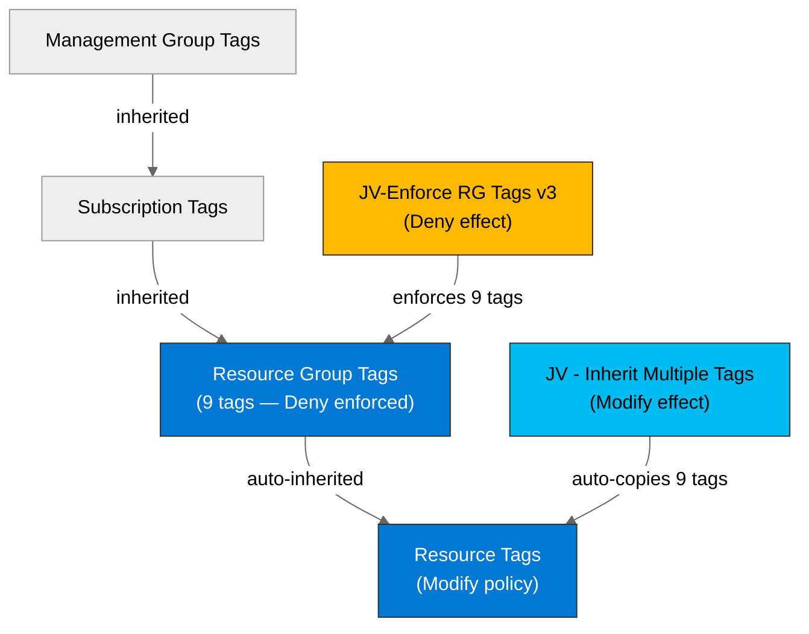

# 🛡️ Governance Constraints - HackOps


<details open>
<summary><strong>📑 Governance Contents</strong></summary>

- [🔍 Discovery Source](#-discovery-source)
- [📋 Azure Policy Compliance](#-azure-policy-compliance)
- [🔄 Plan Adaptations Based on Policies](#-plan-adaptations-based-on-policies)
- [🚫 Deployment Blockers](#-deployment-blockers)
- [🏷️ Required Tags](#-required-tags)
- [🔐 Security Policies](#-security-policies)
- [💰 Cost Policies](#-cost-policies)
- [🌐 Network Policies](#-network-policies)
- [References](#references)

</details>

> Generated by bicep-plan agent | 2026-02-26

| ⬅️ Previous                                                                | 📑 Index            | Next ➡️                                                |
| -------------------------------------------------------------------------- | ------------------- | ------------------------------------------------------ |
| [03-des-adr-0003-easy-auth-github.md](03-des-adr-0003-easy-auth-github.md) | [README](README.md) | [04-implementation-plan.md](04-implementation-plan.md) |

This document captures the governance constraints and Azure Policy
requirements discovered from the live Azure environment that must be
addressed in the Bicep implementation.

## 🔍 Discovery Source

> [!IMPORTANT]
> Governance constraints were discovered from the live Azure environment
> via REST API, not assumed from best practices.

| Query              | Results                   | Timestamp            |
| ------------------ | ------------------------- | -------------------- |
| Policy Assignments | 21 policies discovered    | 2026-02-26T14:00:00Z |
| Tag Policies       | 9 tags required (RG Deny) | 2026-02-26T14:00:00Z |
| Security Policies  | 3 Modify + 5 Audit sets   | 2026-02-26T14:00:00Z |

**Discovery Method**: Azure REST API
(`Microsoft.Authorization/policyAssignments`,
`policyDefinitions`, `policySetDefinitions`)
**Subscription**: noalz (`00858ffc-dded-4f0f-8bbf-e17fff0d47d9`)
**Scope**: Subscription + Management Group
(`2d04cb4c-999b-4e60-a3a7-e8993edc768b`) inherited policies

**Breakdown**:

- 12 subscription-scoped assignments (compliance initiatives,
  ASC, ArcBox RG-scoped)
- 9 management group-inherited assignments (MCAPSGov Deny/Audit/Deploy,
  Security Baseline, tag enforcement, MFA, resource block)

### Policy Definition Analysis

> [!IMPORTANT]
> **MANDATORY**: For all Deny and DeployIfNotExists policies, the
> policy definition JSON (`policyRule`) was analyzed to verify actual
> blocking behavior.

| Policy Display Name              | Assignment Scope | Effect | Actually Blocks                                                | Evidence from policyRule.if                                                           | Bicep Property Path                                   | Required Value |
| -------------------------------- | ---------------- | ------ | -------------------------------------------------------------- | ------------------------------------------------------------------------------------- | ----------------------------------------------------- | -------------- |
| Block Azure RM Resource Creation | Management Group | Deny   | Classic (ASM) resources only                                   | `anyOf` with 7 conditions checking `field: type` for `Microsoft.Classic*` types       | N/A (Classic only)                                    | N/A            |
| MCAPSGov Deny — VM SKU Deny      | Management Group | Deny   | HPC/GPU VM SKUs (HB, M, NC, ND, NV series)                     | `field: Microsoft.Compute/virtualMachines/sku.name` in blocked list                   | N/A (VMs not used)                                    | N/A            |
| MCAPSGov Deny — AKS Node Limit   | Management Group | Deny   | AKS clusters exceeding node limit                              | Checks AKS `agentPoolProfiles[*].count`                                               | N/A (AKS not used)                                    | N/A            |
| MCAPSGov Deny — OpenAI Capacity  | Management Group | Deny   | Azure OpenAI provisioned capacity deployments                  | Checks `Microsoft.CognitiveServices` provisioned SKU                                  | N/A (OpenAI not used)                                 | N/A            |
| MCAPSGov Deny — SQL AD-only      | Management Group | Deny   | Azure SQL/SQL MI without AD-only auth                          | Checks `azureADOnlyAuthentication` property                                           | `properties.administrators.azureADOnlyAuthentication` | `true`         |
| JV-Enforce RG Tags v3            | Management Group | Deny   | Resource groups missing any of 9 required tags                 | `allOf` checking 9 tag `exists: false` conditions with `anyOf` logic                  | `tags['environment']`, `tags['owner']`, + 7 more      | Must exist     |
| CosmosDB_LocalAuth_Modify        | Management Group | Modify | Auto-disables Cosmos DB local auth (connection strings)        | `field: disableLocalAuth, notEquals: true` on `Microsoft.DocumentDB/databaseAccounts` | `properties.disableLocalAuth`                         | `true`         |
| JV - Inherit Tags from RG        | Management Group | Modify | Auto-copies 9 tags from RG to child resources                  | `anyOf` checking 9 tags `exists: false`                                               | Inherited from RG tags                                | Auto-applied   |
| AppService_FTPSOnly_Audit        | Management Group | Audit  | Flags App Services where ftpsState is not FtpsOnly or Disabled | `AuditIfNotExists` on `Microsoft.Web/sites/config` checking `ftpsState`               | `properties.siteConfig.ftpsState`                     | `Disabled`     |

**Analysis Notes**:

- The "Block Azure RM Resource Creation" policy name is misleading —
  it only blocks **classic** (ASM) resources, not ARM resources
- MCAPSGov Deny policies for VM/AKS/OpenAI target resource types
  not part of the HackOps architecture
- **MCAPSGov Deny — SQL AD-only**: HackOps uses Azure SQL and MUST
  comply — `azureADOnlyAuthentication: true` is set in `sql-database.bicep`
  with UAMI as Entra admin (see implementation plan Task 6)
- The CosmosDB Modify policy has **no impact** — architecture switched
  to Azure SQL per ADR-0004; Cosmos DB is not deployed

## 📋 Azure Policy Compliance

| Signal | Meaning                      |
| ------ | ---------------------------- |
| ✅     | Compliant                    |
| ⚠️     | Partial / requires follow-up |
| ❌     | Non-compliant / blocking     |

| Category          | Constraint                             | Implementation                                               | Status |
| ----------------- | -------------------------------------- | ------------------------------------------------------------ | ------ |
| Tagging           | 9 mandatory tags on resource groups    | All 9 tags in `main.bicepparam`, passed to `az group create` | ✅     |
| Tag inheritance   | Tags auto-inherit from RG to resources | Modify policy handles this; set tags on RG                   | ✅     |
| SQL AD-only auth  | SQL must use AD-only authentication    | `azureADOnlyAuthentication: true` + UAMI as Entra admin      | ✅     |
| Cosmos DB auth    | Local auth disabled (if Cosmos used)   | N/A — Cosmos DB not in architecture (ADR-0004: SQL chosen)   | ✅     |
| App Service FTP   | ftpsState must be FtpsOnly or Disabled | Set `ftpsState: 'Disabled'` in Bicep                         | ✅     |
| Data residency    | EU GDPR / swedencentral                | All resources in swedencentral                               | ✅     |
| Security baseline | Azure Security Benchmark v1            | TLS 1.2, HTTPS-only, managed identity, private endpoints     | ✅     |
| MFA enforcement   | MFA for resource write/delete          | CI/CD uses service principal; manual deploys require MFA     | ✅     |
| Classic resources | Classic (ASM) types blocked            | Not used — all resources are ARM                             | ✅     |

## 🔄 Plan Adaptations Based on Policies

### Architectural Changes

| Original Design             | Blocking Policy             | Effect | Adaptation Applied                                                                                                         |
| --------------------------- | --------------------------- | ------ | -------------------------------------------------------------------------------------------------------------------------- |
| 4 baseline tags on RG       | JV-Enforce RG Tags v3       | Deny   | Expanded to 9 mandatory tags: added costcenter, application, workload, sla, backup-policy, maint-window, technical-contact |
| SQL password authentication | MCAPSGov Deny — SQL AD-only | Deny   | Set `azureADOnlyAuthentication: true`; UAMI as Entra admin; App Service uses UAMI token auth to SQL                        |

### Auto-Applied Resources

| Policy                    | Effect | Auto-Applied Resource                             |
| ------------------------- | ------ | ------------------------------------------------- |
| JV - Inherit Tags from RG | Modify | 9 tags auto-copied from RG to all child resources |

> **Note**: CosmosDB_LocalAuth_Modify and StorageAccount_BlobAnonymous_Modify
> policies exist but have **no impact** — HackOps does not deploy Cosmos DB
> or Storage accounts (ADR-0004: Azure SQL chosen instead).

### Auto-Modified Configurations

| Policy                    | Effect | Auto-Applied Change                                        |
| ------------------------- | ------ | ---------------------------------------------------------- |
| JV - Inherit Tags from RG | Modify | Tags auto-inherited from resource group to child resources |

## 🚫 Deployment Blockers

✅ **No deployment blockers detected.**

All Deny policies in the subscription target resource types not used
by HackOps (classic ASM, VM SKUs, AKS, OpenAI), **except**:

- **MCAPSGov Deny — SQL AD-only**: HackOps uses Azure SQL → COMPLIANT
  (`azureADOnlyAuthentication: true` + UAMI as Entra admin)
- **JV-Enforce RG Tags v3**: HackOps creates resource groups → COMPLIANT
  (all 9 required tags included in `az group create`)

## 🏷️ Required Tags

All resources must include the following tags. The resource group
**Deny** policy enforces all 9; child resources receive them
automatically via the Modify (tag inheritance) policy.

```bicep
// Resource group tags (all 9 required — Deny policy)
tags: {
  environment: environment           // dev, staging, prod
  owner: owner                       // Resource owner
  costcenter: costCenter             // Cost center for billing
  application: 'hackops'             // Application name
  workload: 'hackathon-management'   // Workload classification
  sla: 'non-production'              // SLA tier
  'backup-policy': 'cosmos-periodic' // Backup policy
  'maint-window': 'anytime'          // Maintenance window
  'technical-contact': technicalContact // Technical contact email
}
```



> **Note**: Tag keys are **lowercase** as discovered from the policy
> definition (`tags['environment']`, not `tags['Environment']`).
> The 4-tag baseline from `azure-defaults` is superseded by
> these 9 discovered tags.

## 🔐 Security Policies

| Policy                      | Requirement                                                        |
| --------------------------- | ------------------------------------------------------------------ |
| HTTPS Only                  | All endpoints must use HTTPS (Azure Security Baseline)             |
| TLS Version                 | Minimum TLS 1.2 on all services                                    |
| SQL AD-only Auth            | Azure SQL must use `azureADOnlyAuthentication: true` (Deny policy) |
| Public Access               | SQL + Key Vault: `publicNetworkAccess: Disabled` (architecture)    |
| Managed Identity            | UAMI for SQL admin, App Service, ACR pull, ACI seeding             |
| Key Vault                   | RBAC authorization, purge protection enabled                       |
| FTP State                   | `ftpsState: Disabled` on App Service (AuditIfNotExists compliance) |
| Cosmos DB Local Auth        | N/A — Cosmos DB not deployed (ADR-0004: SQL chosen)                |
| MFA for Resource Operations | Required for write/delete operations (service principals exempt)   |

## 💰 Cost Policies

| Policy            | Constraint                                                        |
| ----------------- | ----------------------------------------------------------------- |
| Budget            | No budget policy detected; self-imposed ~$30-50/mo dev ceiling    |
| SKU Restrictions  | Only VM SKUs restricted (HPC/GPU); App Service B1/S1 unrestricted |
| Reserved Capacity | No reserved capacity restrictions on PaaS services                |

## 🌐 Network Policies

| Policy             | Constraint                                                      |
| ------------------ | --------------------------------------------------------------- |
| Private Endpoints  | No mandatory PE policy; used by architecture decision (ADR-004) |
| VNet Integration   | No VNet enforcement policy; used by design choice               |
| Public Endpoints   | No blanket public-endpoint deny policy detected                 |
| Region Restriction | No allowed-regions policy; swedencentral is compliant           |

---

## References

| Topic                | Link                                                                                                                       |
| -------------------- | -------------------------------------------------------------------------------------------------------------------------- |
| Azure Policy         | [Overview](https://learn.microsoft.com/azure/governance/policy/overview)                                                   |
| Azure Resource Graph | [ARG Overview](https://learn.microsoft.com/azure/governance/resource-graph/overview)                                       |
| Tag Governance       | [Tagging Strategy](https://learn.microsoft.com/azure/cloud-adoption-framework/ready/azure-best-practices/resource-tagging) |
| Cosmos DB RBAC       | [SQL RBAC](https://learn.microsoft.com/azure/cosmos-db/how-to-setup-rbac)                                                  |

---

_Governance constraints discovered from Azure REST API on subscription noalz._
_See [bicep-governance.instructions.md](/.github/instructions/bicep-governance.instructions.md) for discovery methodology._

---

<div align="center">

| ⬅️ [03-des-adr-0003-easy-auth-github.md](03-des-adr-0003-easy-auth-github.md) | 🏠 [Project Index](README.md) | ➡️ [04-implementation-plan.md](04-implementation-plan.md) |
| ----------------------------------------------------------------------------- | ----------------------------- | --------------------------------------------------------- |

</div>
