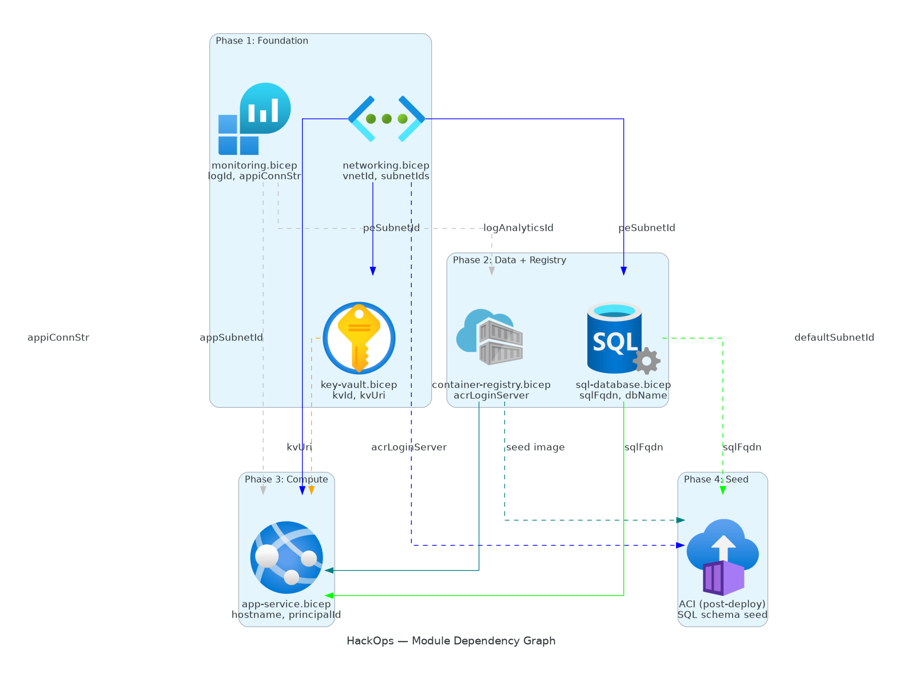
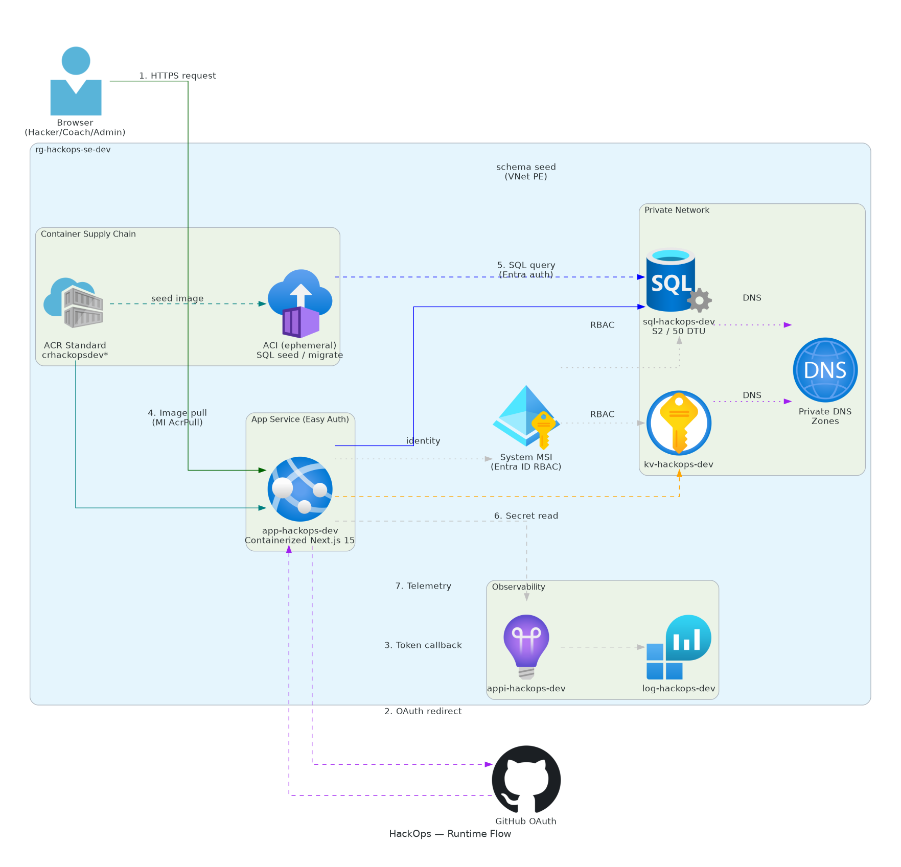

# 📀 Step 4: Implementation Plan - HackOps


<details open>
<summary><strong>📑 Implementation Contents</strong></summary>

- [📋 Overview](#-overview)
- [📦 Resource Inventory](#-resource-inventory)
- [🗂️ Module Structure](#-module-structure)
- [🔨 Implementation Tasks](#-implementation-tasks)
- [🚀 Deployment Phases](#-deployment-phases)
- [🔗 Dependency Graph](#-dependency-graph)
- [🔄 Runtime Flow Diagram](#-runtime-flow-diagram)
- [🏷️ Naming Conventions](#-naming-conventions)
- [🔐 Security Configuration](#-security-configuration)
- [🔑 Secret Propagation Model](#-secret-propagation-model)
- [📊 Policy Compliance Matrix](#-policy-compliance-matrix)
- [🏥 Operational Readiness](#-operational-readiness)
- [⏱️ Estimated Implementation Time](#-estimated-implementation-time)
- [🔒 Approval Gate](#-approval-gate)
- [References](#references)

</details>

> Generated by bicep-plan agent | 2026-02-26

| ⬅️ Previous                                                  | 📑 Index            | Next ➡️                                        |
| ------------------------------------------------------------ | ------------------- | ---------------------------------------------- |
| [04-governance-constraints.md](04-governance-constraints.md) | [README](README.md) | [04-preflight-check.md](04-preflight-check.md) |

## 📋 Overview

This implementation plan defines the Bicep infrastructure for
HackOps — an Azure hackathon management platform. The architecture
deploys a single-region PaaS stack with private networking:

- **Identity**: User-assigned managed identity (UAMI) deployed in Phase 1 — shared by SQL Entra admin, App Service, and ACI
- **Compute**: App Service (Linux, Containerized via ACR) with Easy Auth, autoscale, health probes
- **Database**: Azure SQL Database (S2, 50 DTU) with Private Endpoint + Entra ID only
- **Container Registry**: ACR Standard with digest-based deployment and supply chain verification
- **Container Instances**: ACI (VNet-integrated, ephemeral) for SQL schema seeding
- **Security**: Key Vault with Private Endpoint, all secrets via KV references (no plain-text propagation)
- **Networking**: VNet (/23) with 3 subnets, NSGs, Private DNS Zones
- **Observability**: Log Analytics + Application Insights + baseline alert rules + action groups

**Governance compliance**: 21 policies discovered, 0 deployment
blockers. 9 mandatory tags enforced on resource group (Deny).
See [04-governance-constraints.md](04-governance-constraints.md).

---

## 📦 Resource Inventory

| #   | Resource               | Type                                             | SKU (Dev)     | AVM Module                                           | Dependencies                   | Status  |
| --- | ---------------------- | ------------------------------------------------ | ------------- | ---------------------------------------------------- | ------------------------------ | ------- |
| 1   | Resource Group         | Microsoft.Resources/resourceGroups               | N/A           | N/A (az group create)                                | None                           | ⬜ Todo |
| 2   | User-Assigned MI       | Microsoft.ManagedIdentity/userAssignedIdentities | N/A           | ✅ `avm/res/managed-identity/user-assigned-identity` | RG                             | ⬜ Todo |
| 3   | Virtual Network        | Microsoft.Network/virtualNetworks                | N/A           | ✅ `avm/res/network/virtual-network`                 | RG                             | ⬜ Todo |
| 4   | NSG (×3)               | Microsoft.Network/networkSecurityGroups          | N/A           | ✅ `avm/res/network/network-security-group`          | RG                             | ⬜ Todo |
| 5   | Log Analytics          | Microsoft.OperationalInsights/workspaces         | Pay-as-you-go | ✅ `avm/res/operational-insights/workspace`          | RG                             | ⬜ Todo |
| 6   | Application Insights   | Microsoft.Insights/components                    | Pay-as-you-go | ✅ `avm/res/insights/component`                      | Log Analytics                  | ⬜ Todo |
| 7   | Alert Rules (×5)       | Microsoft.Insights/metricAlerts                  | N/A           | Native Bicep                                         | App Insights, Log Analytics    | ⬜ Todo |
| 8   | Action Group           | Microsoft.Insights/actionGroups                  | N/A           | Native Bicep                                         | RG                             | ⬜ Todo |
| 9   | Key Vault              | Microsoft.KeyVault/vaults                        | Standard      | ✅ `avm/res/key-vault/vault`                         | VNet (PE subnet)               | ⬜ Todo |
| 10  | Private DNS Zone (KV)  | Microsoft.Network/privateDnsZones                | N/A           | ❌ No AVM (native Bicep)                             | VNet                           | ⬜ Todo |
| 11  | SQL Server             | Microsoft.Sql/servers                            | N/A           | ✅ `avm/res/sql/server`                              | VNet (PE subnet), UAMI         | ⬜ Todo |
| 12  | SQL Database           | Microsoft.Sql/servers/databases                  | S2 (50 DTU)   | Via parent module                                    | SQL Server                     | ⬜ Todo |
| 13  | Private DNS Zone (SQL) | Microsoft.Network/privateDnsZones                | N/A           | ❌ No AVM (native Bicep)                             | VNet                           | ⬜ Todo |
| 14  | Container Registry     | Microsoft.ContainerRegistry/registries           | Standard      | ✅ `avm/res/container-registry/registry`             | RG                             | ⬜ Todo |
| 15  | App Service Plan       | Microsoft.Web/serverfarms                        | P1v4          | ✅ `avm/res/web/serverfarm`                          | RG                             | ⬜ Todo |
| 16  | Autoscale Setting      | Microsoft.Insights/autoscaleSettings             | N/A           | Native Bicep                                         | ASP                            | ⬜ Todo |
| 17  | App Service            | Microsoft.Web/sites                              | N/A           | ✅ `avm/res/web/site`                                | ASP, VNet, KV, APPI, ACR, UAMI | ⬜ Todo |
| 18  | PE (Key Vault)         | Microsoft.Network/privateEndpoints               | N/A           | Via Key Vault AVM module                             | KV, VNet                       | ⬜ Todo |
| 19  | PE (SQL)               | Microsoft.Network/privateEndpoints               | N/A           | Via SQL AVM module                                   | SQL, VNet                      | ⬜ Todo |

**Summary**: 19+ Azure resources across 8 Bicep modules.

---

## 🗂️ Module Structure

```text
infra/bicep/hackops/
├── main.bicep                   # Orchestrator — calls all modules
├── main.bicepparam              # Dev environment parameters
├── modules/
│   ├── identity.bicep           # User-assigned managed identity (UAMI)
│   ├── networking.bicep         # VNet, 3 subnets, 3 NSGs
│   ├── monitoring.bicep         # Log Analytics, App Insights, alerts, action groups
│   ├── key-vault.bicep          # Key Vault + Private Endpoint + DNS
│   ├── sql-database.bicep       # SQL Server + DB (S2) + PE + DNS + Entra admin (UAMI)
│   ├── container-registry.bicep # ACR Standard + diagnostics
│   └── app-service.bicep        # ASP (P1v4) + App Service (DOCKER @digest) + Easy Auth + autoscale + staging slot
└── deploy.ps1                   # Deployment script with what-if + rollback
```

| Module                   | AVM Source                                                  | Min Version | Purpose                                          |
| ------------------------ | ----------------------------------------------------------- | ----------- | ------------------------------------------------ |
| identity.bicep           | `br/public:avm/res/managed-identity/user-assigned-identity` | `0.4.0`     | Shared UAMI for SQL admin, App Service, ACI      |
| networking.bicep         | `br/public:avm/res/network/virtual-network`                 | `0.5.0`     | VNet with 3 subnets                              |
|                          | `br/public:avm/res/network/network-security-group`          | `0.5.0`     | NSGs for each subnet                             |
| monitoring.bicep         | `br/public:avm/res/operational-insights/workspace`          | `0.9.0`     | Central log workspace                            |
|                          | `br/public:avm/res/insights/component`                      | `0.4.0`     | APM and distributed tracing                      |
|                          | Native Bicep                                                | N/A         | Alert rules (5×) + action group                  |
| key-vault.bicep          | `br/public:avm/res/key-vault/vault`                         | `0.11.0`    | Secret management + Private Endpoint             |
| sql-database.bicep       | `br/public:avm/res/sql/server`                              | `0.12.0`    | SQL Server + DB (S2) + PE + Entra admin (UAMI)   |
| container-registry.bicep | `br/public:avm/res/container-registry/registry`             | `0.6.0`     | ACR Standard for container images                |
| app-service.bicep        | `br/public:avm/res/web/serverfarm`                          | `0.4.0`     | Linux App Service Plan (P1v4) + autoscale        |
|                          | `br/public:avm/res/web/site`                                | `0.12.0`    | Containerized Next.js + Easy Auth + VNet + slots |

---

## 🔨 Implementation Tasks

### Task 1: main.bicep (Orchestration)

**Purpose**: Entry point that declares parameters, generates the
unique suffix, and calls all modules in dependency order.

**Parameters**:

| Parameter          | Type   | Default           | Description                                |
| ------------------ | ------ | ----------------- | ------------------------------------------ |
| `environment`      | string | `'dev'`           | Deployment environment                     |
| `projectName`      | string | `'hackops'`       | Project identifier                         |
| `location`         | string | `'swedencentral'` | Azure region                               |
| `owner`            | string | Required          | Resource owner                             |
| `costCenter`       | string | `'hackops-dev'`   | Cost center for billing                    |
| `technicalContact` | string | Required          | Technical contact email                    |
| `imageDigest`      | string | Required          | Container image digest (`sha256:...`)      |
| `adminGithubIds`   | string | `''`              | Comma-separated GitHub user IDs            |
| `alertEmail`       | string | Required          | Email for alert action group notifications |

**Variables**:

- `uniqueSuffix = take(uniqueString(resourceGroup().id), 6)`
- `tags` — object with all 9 governance-required tags

**Modules Called** (in order):

1. `modules/identity.bicep`
2. `modules/networking.bicep`
3. `modules/monitoring.bicep`
4. `modules/key-vault.bicep`
5. `modules/sql-database.bicep`
6. `modules/container-registry.bicep`
7. `modules/app-service.bicep`

### Task 2: modules/identity.bicep

> [!IMPORTANT]
> **Challenger Fix #1**: User-assigned managed identity (UAMI) is created
> in Phase 1 before any consumer module. This eliminates the circular
> dependency where SQL Entra admin previously required the App Service
> system-assigned MI to exist first.

**Purpose**: Creates a shared UAMI used as SQL Entra admin, App Service
identity, ACI identity, and ACR pull identity. Decouples identity
lifecycle from resource deployment order.

**Resources**:

| Resource         | Name Pattern       | Purpose                                           |
| ---------------- | ------------------ | ------------------------------------------------- |
| User-Assigned MI | `id-hackops-{env}` | Shared identity for SQL admin, app, ACR pull, ACI |

**Key Configuration**:

- Created in Phase 1 (Foundation) before SQL or App Service
- Assigned as SQL Server Entra admin in `sql-database.bicep`
- Attached to App Service + staging slot in `app-service.bicep`
- Granted `AcrPull` role on ACR in `container-registry.bicep`
- Attached to ACI seed container in Phase 4
- Granted least-privilege `db_datareader` + `db_datawriter` SQL roles
  (App Service) and `db_owner` (ACI seeding, temporary)

**Outputs**: `uamiId`, `uamiPrincipalId`, `uamiClientId`

### Task 3: modules/networking.bicep

**Resources**:

| Resource         | Name Pattern         | Purpose                |
| ---------------- | -------------------- | ---------------------- |
| VNet             | `vnet-hackops-{env}` | /23 address space      |
| Subnet — App     | `snet-app-{env}`     | App Service VNet integ |
| Subnet — PE      | `snet-pe-{env}`      | Private Endpoints      |
| Subnet — Default | `snet-default-{env}` | General purpose / ACI  |
| NSG — App        | `nsg-app-{env}`      | Allow HTTPS inbound    |
| NSG — PE         | `nsg-pe-{env}`       | Deny all inbound       |
| NSG — Default    | `nsg-default-{env}`  | Deny all inbound       |

**Address Space**: `10.0.0.0/23` (512 addresses)

| Subnet  | CIDR            | Size | Delegation                  |
| ------- | --------------- | ---- | --------------------------- |
| App     | `10.0.0.0/25`   | 128  | `Microsoft.Web/serverFarms` |
| PE      | `10.0.0.128/26` | 64   | None (private endpoints)    |
| Default | `10.0.0.192/26` | 64   | None (ACI, general)         |

**Outputs**: `vnetId`, `appSubnetId`, `peSubnetId`, `defaultSubnetId`

### Task 4: modules/monitoring.bicep

**Resources**:

| Resource             | Name Pattern          | Purpose                        |
| -------------------- | --------------------- | ------------------------------ |
| Log Analytics        | `log-hackops-{env}`   | Central log sink               |
| Application Insights | `appi-hackops-{env}`  | APM, distributed tracing       |
| Action Group         | `ag-hackops-{env}`    | Alert notification target      |
| Alert: HTTP 5xx      | `alert-http5xx-{env}` | Server error rate > 5/5min     |
| Alert: Response Time | `alert-latency-{env}` | P95 latency > 2s               |
| Alert: CPU           | `alert-cpu-{env}`     | ASP CPU > 80% for 5min         |
| Alert: DTU           | `alert-dtu-{env}`     | SQL DTU > 80% for 5min         |
| Alert: Health        | `alert-health-{env}`  | Health check failures > 3/5min |

**Key Configuration**:

- Log Analytics: `retentionInDays: 30`, `dailyQuotaGb: 1`
- App Insights: Linked to Log Analytics workspace
- Action Group: Email to `alertEmail` parameter; webhook-ready for future Slack/Teams
- Alert rules: 5 baseline alerts with severity levels:
  - **HTTP 5xx** (Sev 1): `requests/failed` count > 5 in 5-min window
  - **Response Time** (Sev 2): `requests/duration` P95 > 2000ms in 5-min window
  - **CPU Pressure** (Sev 2): ASP `CpuPercentage` > 80% for 5min
  - **DTU Saturation** (Sev 1): SQL `dtu_consumption_percent` > 80% for 5min
  - **Health Probe** (Sev 0): `/api/health` failures > 3 in 5-min window

**Outputs**: `logAnalyticsId`, `appInsightsConnectionString`,
`appInsightsInstrumentationKey`, `actionGroupId`

### Task 5: modules/key-vault.bicep

**Resources**:

| Resource         | Name Pattern                      | Purpose                |
| ---------------- | --------------------------------- | ---------------------- |
| Key Vault        | `kv-hackops-{env}-{suffix}`       | Secret management      |
| Private Endpoint | `pe-kv-hackops-{env}`             | Private network access |
| Private DNS Zone | `privatelink.vaultcore.azure.net` | DNS resolution         |
| DNS Zone Link    | Link to VNet                      | DNS ↔ VNet             |

**Key Configuration**:

- `enableRbacAuthorization: true`
- `enablePurgeProtection: true`
- `softDeleteRetentionInDays: 90`
- `publicNetworkAccess: 'Disabled'`

**Outputs**: `keyVaultId`, `keyVaultUri`

### Task 6: modules/sql-database.bicep

**Resources**:

| Resource         | Name Pattern                       | Purpose                                 |
| ---------------- | ---------------------------------- | --------------------------------------- |
| SQL Server       | `sql-hackops-{env}-{suffix}`       | Logical SQL server (Entra admin = UAMI) |
| SQL Database     | `sqldb-hackops-{env}`              | S2 (50 DTU) application database        |
| Private Endpoint | `pe-sql-hackops-{env}`             | Private network access                  |
| Private DNS Zone | `privatelink.database.windows.net` | DNS resolution                          |
| DNS Zone Link    | Link to VNet                       | DNS ↔ VNet                              |

**Key Configuration** (governance-driven):

- `publicNetworkAccess: 'Disabled'`
- `azureADOnlyAuthentication: true` (no SQL auth — MCAPSGov Deny policy)
- **UAMI set as Entra admin** on SQL Server (receives `uamiPrincipalId`
  from `identity.bicep` — eliminates circular dependency with App Service)
- Private Endpoint in PE subnet
- SKU: `S2` tier (Standard, 50 DTU)
- `minimalTlsVersion: '1.2'`
- Diagnostic settings: send to Log Analytics workspace

**SQL Tables** (seeded via ACI, not defined in Bicep):

| Table           | Purpose                     |
| --------------- | --------------------------- |
| `hackathons`    | Hackathon events            |
| `teams`         | Team records                |
| `hackers`       | Hacker profiles             |
| `rubrics`       | Scoring rubrics (versioned) |
| `rubric_active` | Active rubric pointers      |
| `submissions`   | Evidence submissions        |
| `scores`        | Coach-entered scores        |
| `challenges`    | Challenge definitions       |
| `progression`   | Challenge progression state |
| `roles`         | User role assignments       |

**Outputs**: `sqlServerFqdn`, `sqlDatabaseName`, `sqlServerId`

### Task 7: modules/container-registry.bicep

**Resources**:

| Resource           | Name Pattern               | Purpose                     |
| ------------------ | -------------------------- | --------------------------- |
| Container Registry | `cr{project}{env}{suffix}` | ACR Standard image registry |

**Key Configuration**:

- SKU: `Standard`
- `adminUserEnabled: false` (use managed identity)
- Diagnostic settings linked to Log Analytics workspace
- `AcrPull` role assignment for **UAMI** (not system-assigned MI)

**Outputs**: `acrLoginServer`, `acrId`

### Task 8: modules/app-service.bicep

**Resources**:

| Resource          | Name Pattern                | Purpose                              |
| ----------------- | --------------------------- | ------------------------------------ |
| App Service Plan  | `asp-hackops-{env}`         | Linux P1v4 compute                   |
| Autoscale Setting | `as-hackops-{env}`          | CPU/memory-based scale-out/in        |
| App Service       | `app-hackops-{env}`         | Containerized Next.js 15 application |
| Staging Slot      | `app-hackops-{env}/staging` | Pre-production validation            |

**Key Configuration**:

> [!IMPORTANT]
> **Challenger Fix #3**: Container images deployed by immutable digest
> (`sha256:...`), not mutable tag. CI/CD pipeline resolves digest after
> Trivy scan + Notary v2 signature verification, passes it as `imageDigest`
> parameter. This prevents post-scan tag overwrite attacks.

- Linux, DOCKER runtime (`linuxFxVersion: 'DOCKER|${acrLoginServer}/hackops@${imageDigest}'`)
- P1v4 SKU (1 vCPU, 8 GB) — fallback to P1v3 if unavailable
- **User-assigned managed identity** (UAMI from `identity.bicep`) — NOT system-assigned
- VNet integration to app subnet
- `ftpsState: 'Disabled'` (audit compliance)
- `httpsOnly: true`, `minTlsVersion: '1.2'`
- `alwaysOn: true`
- Easy Auth with GitHub OAuth provider (client secret via Key Vault reference)
- ACR pull via UAMI (`acrUseManagedIdentityCreds: true`, `acrUserManagedIdentityID: uamiId`)

**Health Probe & Warm-up Configuration**:

| Setting                      | Value                  | Purpose                                   |
| ---------------------------- | ---------------------- | ----------------------------------------- |
| `healthCheckPath`            | `/api/health`          | Liveness probe — checks DB connectivity   |
| Warm-up path                 | `/api/health`          | Slot warm-up before swap                  |
| Warm-up timeout              | `300` seconds          | Max time for warm-up before swap proceeds |
| Health check ping interval   | `30` seconds (default) | Platform health evaluation frequency      |
| Unhealthy instance threshold | `3` consecutive fails  | Instance replaced after 3 failed pings    |

**Autoscale Rules** (on App Service Plan):

| Metric             | Operator    | Threshold | Scale Action | Cooldown |
| ------------------ | ----------- | --------- | ------------ | -------- |
| CPU %              | GreaterThan | 70%       | Scale out +1 | 5 min    |
| CPU %              | LessThan    | 30%       | Scale in -1  | 10 min   |
| Memory %           | GreaterThan | 80%       | Scale out +1 | 5 min    |
| Instance count min | —           | —         | 1            | —        |
| Instance count max | —           | —         | 3 (dev) / 10 | —        |

**Staging Slot Parity Enforcement**:

> Staging slot MUST mirror production slot configuration exactly.
> The following settings are enforced identically on both slots:

| Setting Category | Enforced Parity                                            |
| ---------------- | ---------------------------------------------------------- |
| Authentication   | Same Easy Auth config (GitHub OAuth, same allowed origins) |
| Managed Identity | Same UAMI attached                                         |
| Network          | Same VNet integration, same IP restrictions                |
| TLS / HTTPS      | Same `minTlsVersion`, `httpsOnly`, `ftpsState`             |
| Container        | Same ACR config (`acrUseManagedIdentityCreds`)             |
| App Settings     | Same KV references (staging reads from same Key Vault)     |
| Health Check     | Same `healthCheckPath` (`/api/health`)                     |

**Pre-swap validation**: Swap is blocked unless staging slot health
probe returns HTTP 200 for 5 consecutive checks (2.5 min window).

**App Settings** (all sensitive values via Key Vault references):

| Setting                                 | Source              | Transport                            |
| --------------------------------------- | ------------------- | ------------------------------------ |
| `SQL_SERVER`                            | Bicep output        | Plain (FQDN only)                    |
| `SQL_DATABASE`                          | Bicep output        | Plain (name only)                    |
| `KEY_VAULT_URI`                         | Bicep output        | Plain (URI only)                     |
| `APPLICATIONINSIGHTS_CONNECTION_STRING` | Key Vault reference | `@Microsoft.KeyVault(SecretUri=...)` |
| `GITHUB_OAUTH_CLIENT_SECRET`            | Key Vault reference | `@Microsoft.KeyVault(SecretUri=...)` |
| `GITHUB_OAUTH_CLIENT_ID`                | Key Vault reference | `@Microsoft.KeyVault(SecretUri=...)` |

**Outputs**: `appServiceId`, `appServiceDefaultHostname`,
`appServicePrincipalId`

### Task 9: deploy.ps1 (Deployment Script)

**Features**:

- Parameter validation (environment, location, owner, imageDigest format)
- **Image digest validation**: Rejects `latest` tags; requires `sha256:` prefix
- Resource group creation with 9 mandatory tags
- Bicep lint and build verification
- **Governance drift check**: Re-runs policy assignment query, compares
  against `04-governance-constraints.json` snapshot, blocks on material drift
- `az deployment group what-if` preview
- `az deployment group create` execution
- `imageDigest` and `adminGithubIds` parameter passthrough
- Output display (endpoints, resource IDs)

**Rollback Strategy**:

| Phase Failure             | Rollback Action                                   | Automation                                      |
| ------------------------- | ------------------------------------------------- | ----------------------------------------------- |
| Phase 1 (Foundation)      | Delete resource group — clean slate restart       | `az group delete --no-wait`                     |
| Phase 2 (Data + Registry) | Idempotent re-run; SQL PE cleanup if orphaned     | Re-run phase; manual PE cleanup if needed       |
| Phase 3 (Compute)         | Slot swap-back to previous image; redeploy module | `az webapp deployment slot swap --action reset` |
| Phase 4 (Seed)            | Delete ACI; re-run seed with corrected image      | `az container delete` + re-run                  |
| Post-swap regression      | Swap staging↔production (instant rollback)        | `az webapp deployment slot swap`                |

**Rollback decision tree**:

1. Check deployment state (`az deployment group show --query properties.provisioningState`)
2. If `Failed` → identify failed resource → check if idempotent re-run resolves
3. If persistent failure → execute phase-specific rollback from table above
4. Log rollback action to deployment summary artifact

---

## 🚀 Deployment Phases

> Deployment strategy: **Phased** — Foundation → Data + Registry → Compute → Seed

### Phase 1: Foundation (Identity + Networking + Monitoring + Key Vault)

| Order | Module           | Resources                           | Validation                          |
| ----- | ---------------- | ----------------------------------- | ----------------------------------- |
| 1     | identity.bicep   | User-assigned managed identity      | UAMI exists, principalId set        |
| 2     | networking.bicep | VNet, 3 subnets, 3 NSGs             | VNet exists, subnets listed         |
| 3     | monitoring.bicep | Log Analytics, App Insights, alerts | Workspace accessible, alerts active |
| 4     | key-vault.bicep  | Key Vault, PE, Private DNS Zone     | KV accessible via PE                |

**Approval Gate**: Verify foundation resources before proceeding.
**Rollback**: Delete resource group (clean slate).

### Phase 2: Data + Registry (SQL + ACR)

| Order | Module                   | Resources                                          | Validation                         |
| ----- | ------------------------ | -------------------------------------------------- | ---------------------------------- |
| 5     | sql-database.bicep       | SQL Server, DB (S2), PE, Private DNS, Entra (UAMI) | SQL accessible via PE, Entra login |
| 6     | container-registry.bicep | ACR Standard                                       | ACR login server reachable         |

**Approval Gate**: Verify SQL Database accessible via PE and
Entra admin login works (UAMI). Verify ACR is reachable.
**Rollback**: Idempotent re-run; manual PE cleanup if orphaned.

### Phase 3: Compute (App Service)

| Order | Module            | Resources                                                           | Validation                                 |
| ----- | ----------------- | ------------------------------------------------------------------- | ------------------------------------------ |
| 7     | app-service.bicep | ASP (P1v4), Autoscale, App Service (DOCKER@digest), Easy Auth, slot | App accessible via HTTPS, health probe 200 |

**Approval Gate**: Verify App Service can pull image from ACR
(by digest) and reach SQL Database via private endpoint using UAMI.
Health probe at `/api/health` returns HTTP 200.
**Rollback**: Slot swap-back to previous image; redeploy module.

### Phase 4: Seed (ACI — post-deployment)

| Order | Resource | Description                                                  | Validation                   |
| ----- | -------- | ------------------------------------------------------------ | ---------------------------- |
| 8     | ACI      | Ephemeral VNet-integrated container for SQL seed (uses UAMI) | Tables created, seed data OK |

> ACI is deployed post-Bicep via `az container create` or a
> separate Bicep module. VNet integration required since SQL
> is behind a Private Endpoint. ACI uses UAMI with temporary
> `db_owner` role, revoked to `db_datareader` + `db_datawriter`
> after seeding completes.

**Rollback**: Delete ACI container; re-run with corrected image.

### Phase Summary

| Phase | Resources | Est. Deploy Time | Approval Gate | Rollback Strategy       |
| ----- | --------- | ---------------- | ------------- | ----------------------- |
| 1     | 10        | ~6 min           | ✅            | Delete RG (clean slate) |
| 2     | 5         | ~6 min           | ✅            | Idempotent re-run       |
| 3     | 4         | ~5 min           | ✅            | Slot swap-back          |
| 4     | 1         | ~3 min           | ✅            | Delete ACI + re-run     |

---

## 🔗 Dependency Graph



Source: [04-dependency-diagram.py](./04-dependency-diagram.py)

> Each node maps to a module in the Module Structure table. Arrows
> indicate parameter dependencies (outputs from one module feed
> inputs of the next).

---

## 🔄 Runtime Flow Diagram



Source: [04-runtime-diagram.py](./04-runtime-diagram.py)

> Shows request flow through Easy Auth → App Service (container) →
> Azure SQL (via PE) and telemetry flow to Application Insights /
> Log Analytics. ACR provides container images; ACI seeds the database.

---

## 🏷️ Naming Conventions

| Resource               | Pattern                        | Dev Name                   |
| ---------------------- | ------------------------------ | -------------------------- |
| Resource Group         | `rg-{project}-se-{env}`        | `rg-hackops-se-dev`        |
| User-Assigned MI       | `id-{project}-{env}`           | `id-hackops-dev`           |
| Virtual Network        | `vnet-{project}-{env}`         | `vnet-hackops-dev`         |
| Subnet (App)           | `snet-app-{env}`               | `snet-app-dev`             |
| Subnet (PE)            | `snet-pe-{env}`                | `snet-pe-dev`              |
| Subnet (Default)       | `snet-default-{env}`           | `snet-default-dev`         |
| NSG (App)              | `nsg-app-{env}`                | `nsg-app-dev`              |
| NSG (PE)               | `nsg-pe-{env}`                 | `nsg-pe-dev`               |
| NSG (Default)          | `nsg-default-{env}`            | `nsg-default-dev`          |
| Log Analytics          | `log-{project}-{env}`          | `log-hackops-dev`          |
| Application Insights   | `appi-{project}-{env}`         | `appi-hackops-dev`         |
| Action Group           | `ag-{project}-{env}`           | `ag-hackops-dev`           |
| Key Vault              | `kv-{short}-{env}-{suffix}`    | `kv-hackops-dev-{6chars}`  |
| SQL Server             | `sql-{project}-{env}-{suffix}` | `sql-hackops-dev-{6chars}` |
| SQL Database           | `sqldb-{project}-{env}`        | `sqldb-hackops-dev`        |
| Container Registry     | `cr{project}{env}{suffix}`     | `crhackopsdev{6chars}`     |
| App Service Plan       | `asp-{project}-{env}`          | `asp-hackops-dev`          |
| Autoscale Setting      | `as-{project}-{env}`           | `as-hackops-dev`           |
| App Service            | `app-{project}-{env}`          | `app-hackops-dev`          |
| Private Endpoint (KV)  | `pe-kv-{project}-{env}`        | `pe-kv-hackops-dev`        |
| Private Endpoint (SQL) | `pe-sql-{project}-{env}`       | `pe-sql-hackops-dev`       |

> `{suffix}` = `take(uniqueString(resourceGroup().id), 6)` — generated
> once in `main.bicep` and passed to all modules.

---

## 🔐 Security Configuration

| Resource         | Security Setting       | Value                                      |
| ---------------- | ---------------------- | ------------------------------------------ |
| All resources    | TLS version            | `1.2` minimum                              |
| All resources    | Managed identity       | User-assigned MI (shared UAMI)             |
| App Service      | HTTPS only             | `true`                                     |
| App Service      | FTP state              | `Disabled`                                 |
| App Service      | Managed identity       | UAMI (`id-hackops-{env}`)                  |
| App Service      | Easy Auth              | GitHub OAuth (secret via KV reference)     |
| App Service      | ACR pull               | UAMI-based (`AcrPull` role)                |
| App Service      | Container image        | Deploy-by-digest (`sha256:...`)            |
| App Service      | Container verification | Notary v2 signature + Trivy scan in CI/CD  |
| App Service      | Health probe           | `/api/health` (30s interval, 3-fail evict) |
| App Service      | Autoscale              | CPU 70%/30%, Mem 80%, 1–3 instances (dev)  |
| Staging Slot     | Parity enforcement     | All settings mirrored from production      |
| Staging Slot     | Pre-swap gate          | 5× consecutive health probe 200s required  |
| SQL Server       | Public network access  | `Disabled`                                 |
| SQL Server       | Authentication         | Entra ID only (UAMI as admin)              |
| SQL Server       | Entra admin            | UAMI (`id-hackops-{env}`)                  |
| SQL Database     | SKU                    | S2 (50 DTU)                                |
| SQL Database     | Minimal TLS            | `1.2`                                      |
| SQL Database     | Diagnostics            | Log Analytics workspace                    |
| ACR              | Admin user             | `Disabled`                                 |
| ACR              | Pull access            | UAMI-based (`AcrPull` role)                |
| ACR              | Diagnostics            | Log Analytics workspace                    |
| Key Vault        | Authorization model    | RBAC                                       |
| Key Vault        | Purge protection       | Enabled                                    |
| Key Vault        | Public network access  | `Disabled`                                 |
| Key Vault        | Soft delete retention  | 90 days                                    |
| NSG (PE subnet)  | Inbound rule           | Deny all                                   |
| NSG (App subnet) | Inbound rule           | Allow HTTPS (443) only                     |

---

## 🔑 Secret Propagation Model

> [!IMPORTANT]
> **Invariant**: No secret or connection string is ever passed as a
> plain-text Bicep parameter, module output, or app setting value.
> All sensitive values flow through Key Vault references at runtime.

### Secret Flow Rules

1. **Bicep parameters**: Only non-sensitive values (FQDNs, resource names, URIs)
   may be passed between modules. Use `@secure()` decorator if a parameter
   must temporarily hold a sensitive value during deployment.
2. **Key Vault storage**: All runtime secrets are stored in Key Vault at
   deployment time or via external process (e.g., GitHub OAuth setup script).
3. **App Service consumption**: Sensitive app settings use
   `@Microsoft.KeyVault(SecretUri=...)` syntax — the platform resolves
   secrets at runtime, never exposing them in deployment logs or config API.
4. **ACI consumption**: Seed container fetches connection details from
   Key Vault via UAMI at runtime.

### Secret Inventory

| Secret                         | Stored In     | Consumed By          | Rotation               |
| ------------------------------ | ------------- | -------------------- | ---------------------- |
| GitHub OAuth Client ID         | Key Vault     | App Service (KV ref) | On app re-registration |
| GitHub OAuth Client Secret     | Key Vault     | App Service (KV ref) | 90-day expiry alert    |
| App Insights Connection String | Key Vault     | App Service (KV ref) | Auto (infra)           |
| SQL Connection (Entra token)   | N/A (managed) | App Service UAMI     | Auto (token)           |
| ACR Pull (Entra token)         | N/A (managed) | App Service UAMI     | Auto (token)           |

### What is NOT a secret (safe as plain params/outputs)

- SQL Server FQDN (`sql-hackops-dev-{suffix}.database.windows.net`)
- SQL Database name (`sqldb-hackops-dev`)
- Key Vault URI (`https://kv-hackops-dev-{suffix}.vault.azure.net`)
- ACR login server (`crhackopsdev{suffix}.azurecr.io`)
- App Service hostname

---

## 📊 Policy Compliance Matrix

> [!IMPORTANT]
> **Challenger Fix #2**: Full traceability from each of the 21 discovered
> policy assignments to the specific Bicep property path, owning module,
> and validation method. This eliminates the compliance evidence gap
> identified in adversarial review.

### Deny Policies (6 assignments)

| #   | Policy                           | Scope | Blocks HackOps?      | Bicep Property Path                                   | Module             | Validation                           |
| --- | -------------------------------- | ----- | -------------------- | ----------------------------------------------------- | ------------------ | ------------------------------------ |
| 1   | Block Azure RM Resource Creation | MG    | No (Classic only)    | N/A                                                   | N/A                | No classic resources in plan         |
| 2   | MCAPSGov — VM SKU Deny           | MG    | No (VMs not used)    | N/A                                                   | N/A                | No VMs in plan                       |
| 3   | MCAPSGov — AKS Node Limit        | MG    | No (AKS not used)    | N/A                                                   | N/A                | No AKS in plan                       |
| 4   | MCAPSGov — OpenAI Capacity       | MG    | No (OpenAI not used) | N/A                                                   | N/A                | No OpenAI in plan                    |
| 5   | MCAPSGov — SQL AD-only           | MG    | **Yes — COMPLIANT**  | `properties.administrators.azureADOnlyAuthentication` | sql-database.bicep | Set `true`; what-if validates        |
| 6   | JV-Enforce RG Tags v3            | MG    | **Yes — COMPLIANT**  | `tags['environment']` + 8 more                        | main.bicep (RG)    | 9 tags in `az group create`; what-if |

### Modify Policies (3 assignments)

| #   | Policy                       | Scope | Impact on HackOps      | Auto-Applied Change                 | Module         | Post-Deploy Check                        |
| --- | ---------------------------- | ----- | ---------------------- | ----------------------------------- | -------------- | ---------------------------------------- |
| 7   | JV — Inherit Tags from RG    | MG    | Beneficial (auto-tags) | 9 tags copied from RG to children   | N/A (platform) | `az tag list` on child resources         |
| 8   | CosmosDB_LocalAuth_Modify    | MG    | N/A (Cosmos not used)  | Would set `disableLocalAuth: true`  | N/A            | N/A — Cosmos DB not in architecture      |
| 9   | StorageAccount_BlobAnonymous | MG    | N/A (Storage not used) | Would disable blob anonymous access | N/A            | N/A — no Storage account in architecture |

### Audit Policies (5 assignments/initiatives)

| #   | Policy                      | Scope | HackOps Compliance     | Bicep Property Path               | Module            | Evidence                               |
| --- | --------------------------- | ----- | ---------------------- | --------------------------------- | ----------------- | -------------------------------------- |
| 10  | AppService_FTPSOnly_Audit   | MG    | **COMPLIANT**          | `properties.siteConfig.ftpsState` | app-service.bicep | Set `Disabled`; what-if validates      |
| 11  | Azure Security Benchmark v1 | MG    | COMPLIANT (audit-only) | Multiple (TLS, HTTPS, PE, MI)     | All modules       | TLS 1.2, HTTPS-only, PE, MI throughout |
| 12  | EU GDPR 2016/679            | Sub   | COMPLIANT (audit-only) | `location` = swedencentral        | main.bicep        | All resources in EU region             |
| 13  | PCI DSS v4                  | Sub   | COMPLIANT (audit-only) | N/A (no payment data)             | N/A               | No cardholder data processed           |
| 14  | MCAPSGov Audit Policies     | MG    | COMPLIANT (audit-only) | TLS, diagnostics                  | All modules       | TLS 1.2 + diagnostic settings          |

### DeployIfNotExists Policies (2 assignments)

| #   | Policy                           | Scope | Impact                | Auto-Deployed Resource             | Module | Post-Deploy Check                   |
| --- | -------------------------------- | ----- | --------------------- | ---------------------------------- | ------ | ----------------------------------- |
| 15  | MCAPSGov Deploy/Modify (VM ext.) | MG    | N/A (VMs not used)    | Would deploy MI + guest ext on VMs | N/A    | N/A — no VMs                        |
| 16  | MCAPSGov Deploy/Modify (Cosmos)  | MG    | N/A (Cosmos not used) | Would disable Cosmos local auth    | N/A    | N/A — Cosmos DB not in architecture |

### MFA / Access Policies (2 assignments)

| #   | Policy         | Scope | Impact                               | Validation                                   |
| --- | -------------- | ----- | ------------------------------------ | -------------------------------------------- |
| 17  | sys.mfa-write  | MG    | MFA for manual deploys; SP exempt    | CI/CD service principal; human MFA in portal |
| 18  | sys.mfa-delete | MG    | MFA for resource deletion; SP exempt | CI/CD service principal; human MFA in portal |

### Remaining Assignments (3 — scoped to other RGs)

| #   | Policy                        | Scope           | Impact     | Notes                                  |
| --- | ----------------------------- | --------------- | ---------- | -------------------------------------- |
| 19  | ArcBox-related policy set     | Sub (ArcBox RG) | No impact  | Scoped to `rg-arcbox*` resource groups |
| 20  | ASC Default                   | Sub             | Audit-only | Microsoft Defender for Cloud baseline  |
| 21  | Defender for Cloud initiative | Sub             | Audit-only | Security recommendations               |

**Total: 21/21 policies mapped** — 0 unaddressed, 0 blockers.

---

## 🏥 Operational Readiness

### Alert Rules Summary

| Alert Name       | Metric                        | Threshold | Window | Severity | Action          |
| ---------------- | ----------------------------- | --------- | ------ | -------- | --------------- |
| HTTP 5xx Errors  | `requests/failed`             | > 5       | 5 min  | Sev 1    | Email + webhook |
| Response Latency | `requests/duration` P95       | > 2000ms  | 5 min  | Sev 2    | Email           |
| CPU Pressure     | ASP `CpuPercentage`           | > 80%     | 5 min  | Sev 2    | Email           |
| DTU Saturation   | SQL `dtu_consumption_percent` | > 80%     | 5 min  | Sev 1    | Email + webhook |
| Health Probe     | `/api/health` failures        | > 3       | 5 min  | Sev 0    | Email + webhook |

### Autoscale Configuration

| Parameter        | Dev Value | Production Value |
| ---------------- | --------- | ---------------- |
| Min instances    | 1         | 2                |
| Max instances    | 3         | 10               |
| Scale-out CPU    | > 70%     | > 70%            |
| Scale-in CPU     | < 30%     | < 30%            |
| Scale-out Memory | > 80%     | > 80%            |
| Cooldown (out)   | 5 min     | 5 min            |
| Cooldown (in)    | 10 min    | 10 min           |

### Health Check & Slot Warm-up

- **Health endpoint**: `/api/health` — checks DB connectivity,
  Key Vault reachability, returns `{ status: 'healthy' }`
- **Health check interval**: 30 seconds (Azure platform default)
- **Instance eviction**: After 3 consecutive failed health checks
- **Slot warm-up**: Platform sends requests to `/api/health` on
  staging slot before swap; swap blocked until 5× consecutive 200s
- **Swap strategy**: Manual approval (no auto-swap); instant
  rollback via reverse swap if post-swap regression detected

---

## ⏱️ Estimated Implementation Time

| Task                      | Estimated Duration |
| ------------------------- | ------------------ |
| main.bicep                | ~15 minutes        |
| identity.bicep            | ~10 minutes        |
| networking.bicep          | ~20 minutes        |
| monitoring.bicep + alerts | ~25 minutes        |
| key-vault.bicep           | ~15 minutes        |
| sql-database.bicep        | ~25 minutes        |
| container-registry.bicep  | ~15 minutes        |
| app-service.bicep         | ~35 minutes        |
| deploy.ps1                | ~20 minutes        |
| main.bicepparam           | ~5 minutes         |
| Testing & validation      | ~25 minutes        |
| **Total**                 | **~3.5 hours**     |

---

## 🔒 Approval Gate

> [!IMPORTANT]
> **📋 Implementation Plan Ready**
>
> | Metric                           | Value                                     |
> | -------------------------------- | ----------------------------------------- |
> | Azure resources planned          | 19+                                       |
> | Bicep modules to create          | 7 + orchestrator                          |
> | Governance constraints addressed | ✅ All 21 policies (mapped)               |
> | CAF naming conventions applied   | ✅ All resources                          |
> | Deployment strategy              | Phased (4 phases)                         |
> | Adversarial reviews completed    | 2 (3 must-fix resolved)                   |
> | Supply chain controls            | Deploy-by-digest + Notary v2              |
> | Operational readiness            | 5 alert rules + autoscale + health probes |
>
> - [ ] **Approved** — proceed to bicep-code
> - **Approver**: **\*\***\_\_\_**\*\***
> - **Date**: **\*\***\_\_\_**\*\***
>
> Reply **"approve"** to proceed to bicep-code, or provide feedback.

---

## References

> [!NOTE]
> 📚 The following Microsoft Learn resources inform this implementation.

| Topic                  | Link                                                                                                                          |
| ---------------------- | ----------------------------------------------------------------------------------------------------------------------------- |
| Azure Verified Modules | [AVM Index](https://aka.ms/avm/index)                                                                                         |
| Bicep Best Practices   | [Documentation](https://learn.microsoft.com/azure/azure-resource-manager/bicep/best-practices)                                |
| CAF Naming Conventions | [Naming Rules](https://learn.microsoft.com/azure/cloud-adoption-framework/ready/azure-best-practices/resource-naming)         |
| Resource Abbreviations | [Abbreviations](https://learn.microsoft.com/azure/cloud-adoption-framework/ready/azure-best-practices/resource-abbreviations) |
| Azure SQL with PE      | [Setup Guide](https://learn.microsoft.com/azure/azure-sql/database/private-endpoint-overview)                                 |
| Azure SQL Entra Auth   | [Configuration](https://learn.microsoft.com/azure/azure-sql/database/authentication-aad-overview)                             |
| App Service Easy Auth  | [Configuration](https://learn.microsoft.com/azure/app-service/overview-authentication-authorization)                          |
| ACR with App Service   | [Tutorial](https://learn.microsoft.com/azure/app-service/tutorial-custom-container)                                           |

---

_Plan generated by bicep-plan agent following Azure Well-Architected Framework guidelines._

---

<div align="center">

| ⬅️ [04-governance-constraints.md](04-governance-constraints.md) | 🏠 [Project Index](README.md) | ➡️ [04-preflight-check.md](04-preflight-check.md) |
| --------------------------------------------------------------- | ----------------------------- | ------------------------------------------------- |

</div>
