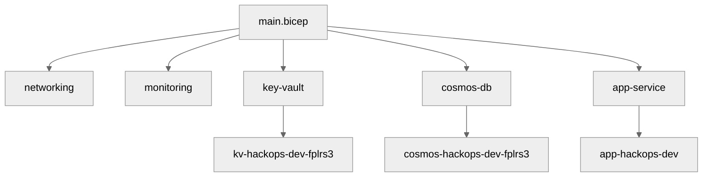

# 💻 Step 5: Implementation Reference - hackops


<details open>
<summary><strong>📑 Implementation Reference</strong></summary>

- [📁 Bicep Templates Location](#-bicep-templates-location)
- [🗂️ File Structure](#️-file-structure)
- [✅ Validation Status](#-validation-status)
- [🏗️ Resources Created](#️-resources-created)
- [🚀 Deployment Instructions](#-deployment-instructions)
- [📝 Key Implementation Notes](#-key-implementation-notes)

</details>

> Generated by bicep-code agent | 2026-02-26

| ⬅️ Previous                                    | 📑 Index            | Next ➡️                                              |
| ---------------------------------------------- | ------------------- | ---------------------------------------------------- |
| [04-preflight-check.md](04-preflight-check.md) | [README](README.md) | [06-deployment-summary.md](06-deployment-summary.md) |

## 📁 Bicep Templates Location

📁 **Code Location**: [`infra/bicep/hackops/`](../../infra/bicep/hackops/)

## 🗂️ File Structure

```text
infra/bicep/hackops/
├── main.bicep
├── main.bicepparam
├── deploy.ps1
└── modules/
		├── networking.bicep
		├── monitoring.bicep
		├── key-vault.bicep
		├── cosmos-db.bicep
		└── app-service.bicep
```

| File                        | Purpose                                       | AVM Modules Used                                                        |
| --------------------------- | --------------------------------------------- | ----------------------------------------------------------------------- |
| `main.bicep`                | Orchestrator — parameters, tags, module calls | —                                                                       |
| `main.bicepparam`           | Dev environment parameter values              | —                                                                       |
| `modules/networking.bicep`  | VNet, subnets, NSGs                           | `network/virtual-network:0.5.0`, `network/network-security-group:0.5.0` |
| `modules/monitoring.bicep`  | Log Analytics, App Insights                   | `operational-insights/workspace:0.9.0`, `insights/component:0.4.0`      |
| `modules/key-vault.bicep`   | Key Vault + private endpoint + DNS            | `key-vault/vault:0.11.0`                                                |
| `modules/cosmos-db.bicep`   | Cosmos DB + database/containers + PE + DNS    | `document-db/database-account:0.10.0`                                   |
| `modules/app-service.bicep` | App Service Plan + Web App + VNet integration | `web/serverfarm:0.4.0`, `web/site:0.12.0`                               |

## ✅ Validation Status

| Check         | Result | Details                              |
| ------------- | ------ | ------------------------------------ |
| `bicep build` | ✅     | Passed with 0 errors                 |
| `bicep lint`  | ✅     | Passed with 0 warnings               |
| `what-if`     | ✅     | Successful preview before deployment |

| Signal | Meaning                   |
| ------ | ------------------------- |
| ✅     | Validated and ready       |
| ⚠️     | Requires follow-up review |
| ❌     | Blocking issue            |

## 🏗️ Resources Created

| Resource     | Bicep Type                                 | Module              |
| ------------ | ------------------------------------------ | ------------------- |
| VNet         | `Microsoft.Network/virtualNetworks`        | `networking.bicep`  |
| Key Vault    | `Microsoft.KeyVault/vaults`                | `key-vault.bicep`   |
| Cosmos DB    | `Microsoft.DocumentDB/databaseAccounts`    | `cosmos-db.bicep`   |
| Workspace    | `Microsoft.OperationalInsights/workspaces` | `monitoring.bicep`  |
| App Insights | `Microsoft.Insights/components`            | `monitoring.bicep`  |
| ASP + App    | `Microsoft.Web/serverfarms` / `sites`      | `app-service.bicep` |



## 🚀 Deployment Instructions

<details>
<summary><strong>🟢 PowerShell</strong></summary>

```powershell
cd infra/bicep/hackops
./deploy.ps1 -Environment dev -Location centralus
```

</details>

<details>
<summary><strong>🔍 What-If Preview</strong></summary>

```powershell
./deploy.ps1 -WhatIf
```

</details>

<details>
<summary><strong>🚀 Azure CLI</strong></summary>

```bash
az deployment group create \
	--resource-group rg-hackops-us-dev \
	--template-file infra/bicep/hackops/main.bicep \
	--parameters infra/bicep/hackops/main.bicepparam
```

</details>

## 📝 Key Implementation Notes

| Note                                              | Impact             | Reference                   |
| ------------------------------------------------- | ------------------ | --------------------------- |
| Uses AVM modules for all supported resource types | Standardization    | `modules/*.bicep`           |
| Uses RG-based unique suffixing for global names   | Name uniqueness    | `main.bicep`                |
| Cosmos local auth explicitly disabled             | Security baseline  | `modules/cosmos-db.bicep`   |
| App Service enforces HTTPS and TLS 1.2            | Security baseline  | `modules/app-service.bicep` |
| Private DNS zones modeled with raw Bicep (no AVM) | Required exception | `modules/*`                 |

---

_Implementation reference generated from Bicep templates._

---

<div align="center">

| ⬅️ [04-preflight-check.md](04-preflight-check.md) | 🏠 [Project Index](README.md) | ➡️ [06-deployment-summary.md](06-deployment-summary.md) |
| ------------------------------------------------- | ----------------------------- | ------------------------------------------------------- |

</div>
