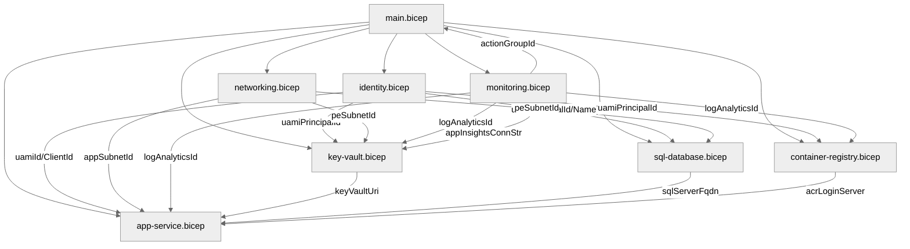

# 💻 Step 5: Implementation Reference - hackops


<details open>
<summary><strong>📑 Implementation Reference</strong></summary>

- [📁 Bicep Templates Location](#-bicep-templates-location)
- [🗂️ File Structure](#️-file-structure)
- [✅ Validation Status](#-validation-status)
- [🏗️ Resources Created](#️-resources-created)
- [🚀 Deployment Instructions](#-deployment-instructions)
- [📝 Key Implementation Notes](#-key-implementation-notes)

</details>

> Generated by bicep-code agent | 2025-07-25 | Updated 2025-07-26 — parameterised all hardcoded values, uniqueSuffix on all resources, multi-deployer/multi-env support

| ⬅️ Previous                                    | 📑 Index            | Next ➡️                                              |
| ---------------------------------------------- | ------------------- | ---------------------------------------------------- |
| [04-preflight-check.md](04-preflight-check.md) | [README](README.md) | [06-deployment-summary.md](06-deployment-summary.md) |

## 📁 Bicep Templates Location

📁 **Code Location**: [`infra/bicep/hackops/`](../../infra/bicep/hackops/)

## 🗂️ File Structure

```text
infra/bicep/hackops/
├── main.bicep              # Orchestrator — phased deployment, alerts, uniqueSuffix
├── main.bicepparam         # Dev environment params (readEnvironmentVariable for secrets)
├── deploy.ps1              # PowerShell deployment script with phase + -AutoApprove
└── modules/
    ├── identity.bicep      # User-Assigned Managed Identity (UAMI)
    ├── networking.bicep    # VNet, subnets (app/pe/default), NSGs — CIDRs parameterised
    ├── monitoring.bicep    # Log Analytics, App Insights, Action Group — retention parameterised
    ├── key-vault.bicep     # Key Vault + PE + DNS + UAMI RBAC
    ├── sql-database.bicep  # SQL Server + DB + PE + DNS + Entra admin — SKU parameterised
    ├── container-registry.bicep  # ACR + UAMI AcrPull RBAC — SKU parameterised
    └── app-service.bicep   # ASP + App + staging slot + autoscale — SKU & thresholds parameterised
```

| File                               | Purpose                                           | AVM Modules Used                                                        |
| ---------------------------------- | ------------------------------------------------- | ----------------------------------------------------------------------- |
| `main.bicep`                       | Orchestrator — phases, tags, alerts, uniqueSuffix | —                                                                       |
| `main.bicepparam`                  | Dev env params + `readEnvironmentVariable()`      | —                                                                       |
| `modules/identity.bicep`           | Shared UAMI for all services                      | `managed-identity/user-assigned-identity:0.4.0`                         |
| `modules/networking.bicep`         | VNet /23 + 3 subnets + 3 NSGs                     | `network/virtual-network:0.5.0`, `network/network-security-group:0.5.0` |
| `modules/monitoring.bicep`         | Log Analytics, App Insights, AG                   | `operational-insights/workspace:0.9.0`, `insights/component:0.4.0`      |
| `modules/key-vault.bicep`          | Key Vault + PE + DNS + UAMI RBAC                  | `key-vault/vault:0.11.0`                                                |
| `modules/sql-database.bicep`       | Azure SQL + PE + DNS + Entra-only auth            | `sql/server:0.12.0`                                                     |
| `modules/container-registry.bicep` | ACR Standard + UAMI AcrPull                       | `container-registry/registry:0.6.0`                                     |
| `modules/app-service.bicep`        | ASP + App + slot + autoscale                      | `web/serverfarm:0.4.0`, `web/site:0.12.0`                               |

## ✅ Validation Status

| Check         | Result | Details                                                                                                             |
| ------------- | ------ | ------------------------------------------------------------------------------------------------------------------- |
| `bicep build` | ✅     | 0 errors, 17 warnings (14 BCP318 — expected for conditional phased modules, 2 BCP334 — ACR name length, 1 DNS zone) |
| `bicep lint`  | ✅     | Same warnings as build — all expected/cosmetic                                                                      |
| `what-if`     | ⚠️     | Not yet run — requires Azure subscription                                                                           |

## 🏗️ Resources Created

| Resource             | Bicep Type                                         | Module                     | Phase      |
| -------------------- | -------------------------------------------------- | -------------------------- | ---------- |
| UAMI                 | `Microsoft.ManagedIdentity/userAssignedIdentities` | `identity.bicep`           | Foundation |
| VNet                 | `Microsoft.Network/virtualNetworks`                | `networking.bicep`         | Foundation |
| NSGs (×3)            | `Microsoft.Network/networkSecurityGroups`          | `networking.bicep`         | Foundation |
| Log Analytics        | `Microsoft.OperationalInsights/workspaces`         | `monitoring.bicep`         | Foundation |
| App Insights         | `Microsoft.Insights/components`                    | `monitoring.bicep`         | Foundation |
| Action Group         | `Microsoft.Insights/actionGroups`                  | `monitoring.bicep`         | Foundation |
| Key Vault            | `Microsoft.KeyVault/vaults`                        | `key-vault.bicep`          | Foundation |
| KV Private Endpoint  | `Microsoft.Network/privateEndpoints`               | `key-vault.bicep`          | Foundation |
| KV DNS Zone          | `Microsoft.Network/privateDnsZones`                | `key-vault.bicep`          | Foundation |
| SQL Server           | `Microsoft.Sql/servers`                            | `sql-database.bicep`       | Data       |
| SQL Database         | `Microsoft.Sql/servers/databases`                  | `sql-database.bicep`       | Data       |
| SQL Private Endpoint | `Microsoft.Network/privateEndpoints`               | `sql-database.bicep`       | Data       |
| SQL DNS Zone         | `Microsoft.Network/privateDnsZones`                | `sql-database.bicep`       | Data       |
| ACR                  | `Microsoft.ContainerRegistry/registries`           | `container-registry.bicep` | Data       |
| App Service Plan     | `Microsoft.Web/serverfarms`                        | `app-service.bicep`        | Compute    |
| App Service          | `Microsoft.Web/sites`                              | `app-service.bicep`        | Compute    |
| Staging Slot         | `Microsoft.Web/sites/slots`                        | `app-service.bicep`        | Compute    |
| Autoscale            | `Microsoft.Insights/autoscaleSettings`             | `app-service.bicep`        | Compute    |
| Alert: HTTP 5xx      | `Microsoft.Insights/metricAlerts`                  | `main.bicep`               | Compute    |
| Alert: Response Time | `Microsoft.Insights/metricAlerts`                  | `main.bicep`               | Compute    |
| Alert: CPU           | `Microsoft.Insights/metricAlerts`                  | `main.bicep`               | Compute    |
| Alert: DTU           | `Microsoft.Insights/metricAlerts`                  | `main.bicep`               | Compute    |
| Alert: Health Check  | `Microsoft.Insights/metricAlerts`                  | `main.bicep`               | Compute    |



## 🚀 Deployment Instructions

### Environment Variables (required for multi-deployer support)

Before running `deploy.ps1`, each deployer must set these environment variables.
The `.bicepparam` file reads them via `readEnvironmentVariable()`:

```bash
export HACKOPS_OWNER="your-name"
export HACKOPS_CONTACT="your@email.com"
export HACKOPS_ALERT_EMAIL="alerts@email.com"
export HACKOPS_GITHUB_OAUTH_CLIENT_ID="Iv1.abc123"
```

<details>
<summary><strong>🟢 Full Deploy (all phases)</strong></summary>

```powershell
cd infra/bicep/hackops
./deploy.ps1 `
    -Owner "your-name" `
    -TechnicalContact "your@email.com" `
    -AlertEmail "alerts@email.com" `
    -GitHubOAuthClientId "Iv1.abc123"
```

</details>

<details>
<summary><strong>🟢 Full Deploy — Fully Automated (no prompts)</strong></summary>

```powershell
cd infra/bicep/hackops
./deploy.ps1 `
    -Owner "your-name" `
    -TechnicalContact "your@email.com" `
    -AlertEmail "alerts@email.com" `
    -GitHubOAuthClientId "Iv1.abc123" `
    -AutoApprove
```

</details>

<details>
<summary><strong>🔄 Phased Deployment</strong></summary>

```powershell
# Phase 1: Foundation (identity, networking, monitoring, key vault)
./deploy.ps1 -Phase foundation -Owner "your-name" -TechnicalContact "your@email.com" -AlertEmail "alerts@email.com" -GitHubOAuthClientId "Iv1.abc123"

# Phase 2: Data (SQL, ACR)
./deploy.ps1 -Phase data -Owner "your-name" -TechnicalContact "your@email.com" -AlertEmail "alerts@email.com" -GitHubOAuthClientId "Iv1.abc123"

# Phase 3: Compute (App Service, alerts)
./deploy.ps1 -Phase compute -Owner "your-name" -TechnicalContact "your@email.com" -AlertEmail "alerts@email.com" -GitHubOAuthClientId "Iv1.abc123" -ImageDigest "sha256:..."

# Or all phases automated (no confirmation prompts):
./deploy.ps1 -Phase all -AutoApprove -Owner "your-name" -TechnicalContact "your@email.com" -AlertEmail "alerts@email.com" -GitHubOAuthClientId "Iv1.abc123"
```

</details>

<details>
<summary><strong>🔍 What-If Preview</strong></summary>

```powershell
./deploy.ps1 -Phase all -Owner "your-name" -TechnicalContact "your@email.com" -AlertEmail "alerts@email.com" -GitHubOAuthClientId "Iv1.abc123" -WhatIf
```

</details>

<details>
<summary><strong>🚀 Azure CLI (direct)</strong></summary>

```bash
az deployment group create \
  --resource-group rg-hackops-dev \
  --template-file infra/bicep/hackops/main.bicep \
  --parameters infra/bicep/hackops/main.bicepparam
```

</details>

## 📝 Key Implementation Notes

| Note                                                               | Impact                   | Reference                               |
| ------------------------------------------------------------------ | ------------------------ | --------------------------------------- |
| **Zero hardcoded values** — all SKUs, CIDRs, thresholds are params | Multi-env flexibility    | `main.bicep` params + `main.bicepparam` |
| **uniqueSuffix on ALL resources** — except resource group          | Multi-deployer safety    | `main.bicep` → all modules              |
| **readEnvironmentVariable()** — deployer-specific values from env  | Multi-deployer support   | `main.bicepparam`                       |
| **-AutoApprove flag** — skip confirmation prompts in CI/CD         | Full automation          | `deploy.ps1`                            |
| **UAMI identity model** — shared identity for all RBAC             | Eliminates circular deps | `identity.bicep → all modules`          |
| **Deploy-by-digest** — `DOCKER\|acr/hackops@sha256:...`            | Immutable deployments    | `app-service.bicep`                     |
| **Phased deployment** — foundation → data → compute                | Incremental rollout      | `main.bicep` phase parameter            |
| **Key Vault references** — `@Microsoft.KeyVault(SecretUri=...)`    | No plain-text secrets    | `app-service.bicep`                     |
| **Post-deploy KV ref identity** — set via `az webapp update`       | UAMI for KV resolution   | `deploy.ps1`                            |
| **9 governance tags** — enforced by Deny policy                    | Policy compliance        | `main.bicep` tags variable              |
| **Autoscale** — CPU/Memory thresholds parameterised                | Tunable per environment  | `app-service.bicep`                     |
| **5 metric alerts** — HTTP 5xx, latency, CPU, DTU, health          | Proactive monitoring     | `main.bicep`                            |
| **Entra-only SQL auth** — UAMI as server admin                     | No SQL passwords         | `sql-database.bicep`                    |
| **Private endpoints** — Key Vault + SQL Server                     | Data plane isolation     | `key-vault.bicep`, `sql-database.bicep` |
| **AVM modules** — 10 Azure Verified Modules used                   | Standardisation          | All modules                             |

### Governance Compliance Mapping

| Policy (Deny)               | Resource         | Bicep Property              | Value Set       |
| --------------------------- | ---------------- | --------------------------- | --------------- |
| JV-Enforce HTTPS Only       | App Service      | `httpsOnly`                 | `true`          |
| JV-Enforce TLS 1.2          | App Service, SQL | `minTlsVersion`             | `'1.2'`         |
| JV-Enforce KV PE            | Key Vault        | `privateEndpoints`          | PE configured   |
| JV-Enforce SQL AD Auth      | SQL Server       | `azureADOnlyAuthentication` | `true`          |
| JV-Enforce RG Tags v3       | All resources    | `tags` (9 tags)             | All 9 present   |
| JV-Enforce Managed Identity | App Service      | `managedIdentities`         | UAMI configured |

### Configurable Infrastructure Parameters

All values below were previously hardcoded and are now parameterised for multi-environment support.
Override in `main.bicepparam` or via `az deployment group create --parameters`.

| Parameter                          | Default         | Module(s) Affected         | Purpose                          |
| ---------------------------------- | --------------- | -------------------------- | -------------------------------- |
| `vnetAddressPrefix`                | `10.0.0.0/23`   | `networking.bicep`         | VNet address space               |
| `appSubnetPrefix`                  | `10.0.0.0/25`   | `networking.bicep`         | App Service delegated subnet     |
| `peSubnetPrefix`                   | `10.0.0.128/26` | `networking.bicep`         | Private endpoint subnet          |
| `defaultSubnetPrefix`              | `10.0.0.192/26` | `networking.bicep`         | ACI / general purpose subnet     |
| `aspSkuName`                       | `P1v4`          | `app-service.bicep`        | App Service Plan SKU             |
| `sqlSkuName`                       | `S2`            | `sql-database.bicep`       | SQL Database SKU name            |
| `sqlSkuTier`                       | `Standard`      | `sql-database.bicep`       | SQL Database SKU tier            |
| `sqlMaxSizeBytes`                  | `268435456000`  | `sql-database.bicep`       | SQL Database max size (250 GB)   |
| `acrSku`                           | `Standard`      | `container-registry.bicep` | ACR SKU (Basic/Standard/Premium) |
| `logRetentionDays`                 | `30`            | `monitoring.bicep`         | Log Analytics retention          |
| `logDailyQuotaGb`                  | `1`             | `monitoring.bicep`         | Log Analytics daily quota        |
| `autoscaleMinInstances`            | `1`             | `app-service.bicep`        | Autoscale minimum instances      |
| `autoscaleMaxInstances`            | `3`             | `app-service.bicep`        | Autoscale maximum instances      |
| `autoscaleCpuScaleOutThreshold`    | `70`            | `app-service.bicep`        | CPU % to scale out               |
| `autoscaleCpuScaleInThreshold`     | `30`            | `app-service.bicep`        | CPU % to scale in                |
| `autoscaleMemoryScaleOutThreshold` | `80`            | `app-service.bicep`        | Memory % to scale out            |

### Resource Naming Convention

All resources follow CAF naming with `uniqueSuffix` derived from `uniqueString(resourceGroup().id)`:

| Resource         | Name Pattern                                         |
| ---------------- | ---------------------------------------------------- |
| Resource Group   | `rg-{project}-{env}` (no suffix — human-friendly)    |
| UAMI             | `id-{project}-{env}-{suffix}`                        |
| VNet             | `vnet-{project}-{env}-{suffix}`                      |
| NSGs             | `nsg-{subnet}-{project}-{env}-{suffix}`              |
| Log Analytics    | `log-{project}-{env}-{suffix}`                       |
| App Insights     | `appi-{project}-{env}-{suffix}`                      |
| Action Group     | `ag-{project}-{env}-{suffix}`                        |
| Key Vault        | `kv-{project}-{env}-{suffix}` (≤24 chars via take()) |
| SQL Server       | `sql-{project}-{env}-{suffix}`                       |
| ACR              | `cr{project}{env}{suffix}` (no hyphens)              |
| App Service Plan | `asp-{project}-{env}-{suffix}`                       |
| App Service      | `app-{project}-{env}-{suffix}`                       |
| Metric Alerts    | `alert-{type}-{project}-{env}-{suffix}`              |

### Secret Propagation Model

| Secret                         | Storage     | Reference Method                     |
| ------------------------------ | ----------- | ------------------------------------ |
| App Insights Connection String | Key Vault   | `@Microsoft.KeyVault(SecretUri=...)` |
| GitHub OAuth Client ID         | Key Vault   | `@Microsoft.KeyVault(SecretUri=...)` |
| GitHub OAuth Client Secret     | Key Vault   | `@Microsoft.KeyVault(SecretUri=...)` |
| SQL Server FQDN                | App Setting | Direct (non-sensitive)               |
| SQL Database Name              | App Setting | Direct (non-sensitive)               |

---

_Implementation reference generated from Bicep templates._

---

<div align="center">

| ⬅️ [04-preflight-check.md](04-preflight-check.md) | 🏠 [Project Index](README.md) | ➡️ [06-deployment-summary.md](06-deployment-summary.md) |
| ------------------------------------------------- | ----------------------------- | ------------------------------------------------------- |

</div>
