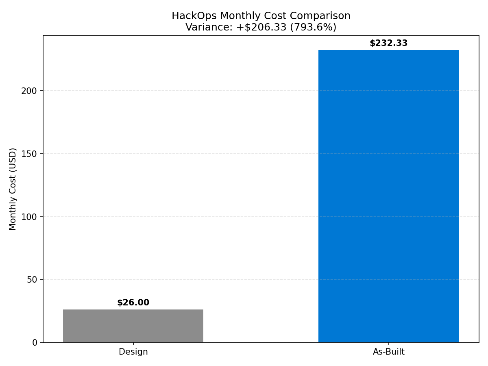
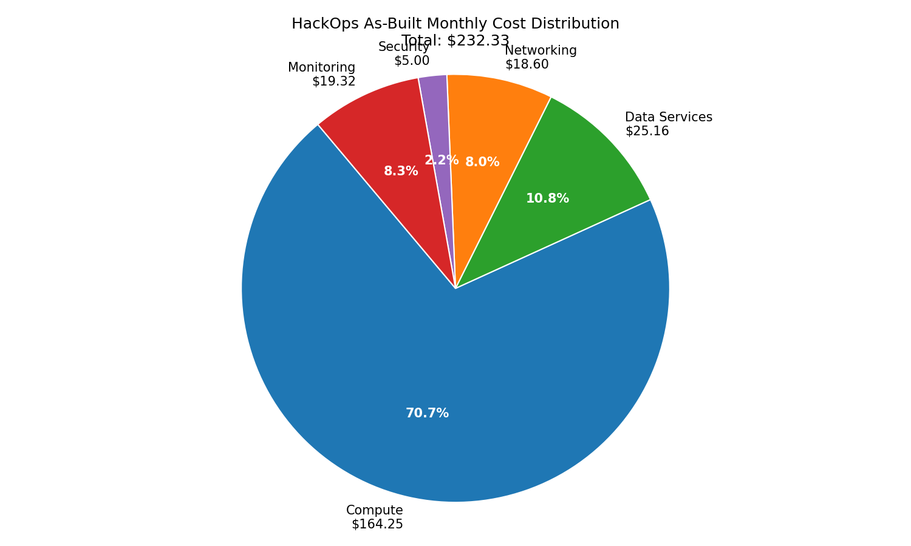
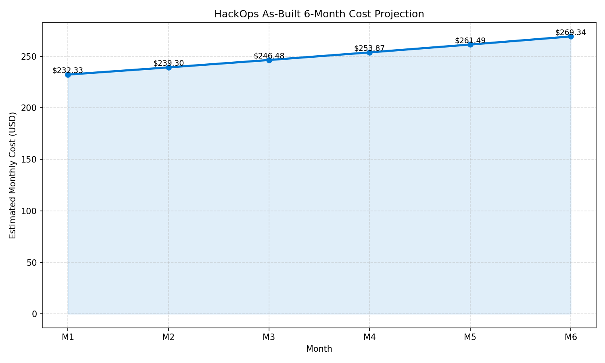

# 💰 As-Built Cost Estimate: hackops


<details open>
<summary><strong>📑 As-Built Cost Contents</strong></summary>

- [💵 Cost At-a-Glance](#-cost-at-a-glance)
- [✅ Decision Summary](#-decision-summary)
- [🔁 Requirements → Cost Mapping](#-requirements--cost-mapping)
- [📊 Top 5 Cost Drivers](#-top-5-cost-drivers)
- [🏛️ Architecture Overview](#️-architecture-overview)
- [🧾 What We Are Not Paying For (Yet)](#-what-we-are-not-paying-for-yet)
- [⚠️ Cost Risk Indicators](#️-cost-risk-indicators)
- [🎯 Quick Decision Matrix](#-quick-decision-matrix)
- [💰 Savings Opportunities](#-savings-opportunities)
- [🧾 Detailed Cost Breakdown](#-detailed-cost-breakdown)
- [References](#references)

</details>

> Generated by as-built agent | 2026-02-26

<div align="center">

| ⬅️ Previous                                        | 📑 Index            | Next ➡️ |
| -------------------------------------------------- | ------------------- | ------- |
| [07-compliance-matrix.md](07-compliance-matrix.md) | [README](README.md) | —       |

</div>

**Generated**: 2026-02-26
**Source**: cost-estimate-subagent (MCP-backed)
**Region**: centralus
**Environment**: Development
**MCP Tools Used**: cost-estimate-subagent
**IaC Reference**: `infra/bicep/hackops/`

## 💵 Cost At-a-Glance

| Signal | Meaning                                    |
| ------ | ------------------------------------------ |
| ✅     | Cost posture acceptable                    |
| ⚠️     | Cost risk to monitor                       |
| ❌     | Cost threshold breached / immediate action |

> **Monthly Total: ~$232.33** | Annual: ~$2,787.96
>
> ```text
> Budget: No fixed budget | Utilization: N/A
> ```
>
> | Status            | Indicator                  |
> | ----------------- | -------------------------- |
> | Cost Trend        | ➡️ Stable growth scenario  |
> | Savings Available | 💰 ~$828/year identified   |
> | Compliance        | ✅ Policy-aligned baseline |

## ✅ Decision Summary

- ✅ Implemented: Full app + data + security + monitoring stack in `centralus`
- ⏳ Deferred: Multi-region failover, formal reservation strategy, advanced alert optimization
- 🔁 Redesign Trigger: Sustained RU pressure, higher traffic, or stricter SLA targets

**Confidence**: Medium | **Expected Variance**: ±20% (usage-variable SQL/Logs/PrivateLink assumptions)

### Design vs As-Built Summary

| Metric           | Design Estimate | As-Built  | Variance   | Status |
| ---------------- | --------------- | --------- | ---------- | ------ |
| Monthly Estimate | $26.00          | $232.33   | +$206.33   | ⚠️     |
| Annual Estimate  | $312.00         | $2,787.96 | +$2,475.96 | ⚠️     |



## 🔁 Requirements → Cost Mapping

| Requirement                    | Architecture Decision                   | Cost Impact    | Mandatory |
| ------------------------------ | --------------------------------------- | -------------- | --------- |
| Always-on SSR web performance  | App Service Plan B1 with capacity 3     | +$164.25/month | Yes       |
| Private data-plane access      | 2 Private Endpoints + private DNS zones | +$18.60/month  | Yes       |
| Managed observability baseline | Log Analytics + App Insights            | +$19.32/month  | Yes       |

## 📊 Top 5 Cost Drivers

| Rank | Resource                           | Monthly Cost | % of Total | Trend | Optimization                       |
| ---- | ---------------------------------- | ------------ | ---------- | ----- | ---------------------------------- |
| 1️⃣   | App Service Plan B1 (x3)           | $164.25      | 70.7%      | ➡️    | Scheduled scale-down               |
| 2️⃣   | Data Services (SQL Database)       | $25.16       | 10.8%      | ↗️    | Query/index tuning                 |
| 3️⃣   | Monitoring ingestion               | $19.32       | 8.3%       | ↗️    | Sampling/filtering                 |
| 4️⃣   | Networking (PE + DNS + processing) | $18.60       | 8.0%       | ➡️    | Reduce private data transfer       |
| 5️⃣   | Security (KV ops + premium keys)   | $5.00        | 2.2%       | ➡️    | Right-size key operation frequency |

> 💡 **Quick Win**: Reduce off-peak App Service capacity from 3 to 2 workers.

<details>
<summary><strong>Cost Driver Details</strong></summary>

#### 1️⃣ App Service Plan

| Aspect            | Detail                                   |
| ----------------- | ---------------------------------------- |
| Current SKU       | B1 (Linux), capacity 3                   |
| Monthly Cost      | $164.25                                  |
| Cost Breakdown    | Compute-dominated recurring cost         |
| Optimization      | Schedule or automate off-peak scale-down |
| Potential Savings | ~$657/year                               |

</details>

## 🏛️ Architecture Overview

### Cost Distribution

| Category         | Monthly Cost (USD) | Share |
| ---------------- | -----------------: | ----: |
| 💻 Compute       |             164.25 | 70.7% |
| 💾 Data Services |              25.16 | 10.8% |
| 🌐 Networking    |              18.60 |  8.0% |
| 🔐 Security      |               5.00 |  2.2% |
| 📊 Monitoring    |              19.32 |  8.3% |



### Month-over-Month Projection



### Key Design Decisions Affecting Cost

| Decision                        | Cost Impact         | Business Rationale                        | Status             |
| ------------------------------- | ------------------- | ----------------------------------------- | ------------------ |
| App Service plan capacity 3     | +$164.25/month      | Handle event bursts and avoid cold impact | Required currently |
| SQL Database serverless         | Variable usage cost | Lower baseline vs provisioned DTU         | Required           |
| Private endpoints on data plane | +network baseline   | Security and policy compliance            | Required           |

## 🧾 What We Are Not Paying For (Yet)

- Multi-region active-active deployment
- DDoS Standard and advanced perimeter services
- Reserved instances/savings plan commitments
- Premium caching and edge acceleration tiers

## ⚠️ Cost Risk Indicators

| Resource                 | Risk Level | Issue                                 | Mitigation                        |
| ------------------------ | ---------- | ------------------------------------- | --------------------------------- |
| App Service Plan (B1 x3) | 🟠 Medium  | Overprovisioned for non-event windows | Schedule downscale                |
| SQL Database Serverless  | 🟡 Medium  | DTU burst variability during events   | Monitor DTU and tune queries      |
| Log Analytics            | 🟡 Medium  | Ingestion drift over time             | Sampling and retention governance |

> **⚠️ Watch Item**: App Service plan capacity is the dominant and most controllable cost lever.

## 🎯 Quick Decision Matrix

| Requirement                 | Additional Cost                     | SKU Change                             | Verdict    | Notes                            |
| --------------------------- | ----------------------------------- | -------------------------------------- | ---------- | -------------------------------- |
| Higher availability SLA     | +$ (depending on region redundancy) | Add secondary-region stack             | 🟡 Monitor | Requires architecture expansion  |
| Lower baseline spend        | -$54.75/month approximate           | B1 capacity 3 → 2                      | 🟢 Go      | Suitable outside event windows   |
| Higher sustained throughput | +$ variable                         | SQL Database tuning or higher DTU tier | 🟡 Monitor | Trigger by observed DTU pressure |

## 💰 Savings Opportunities

> ### Total Potential Savings: ~$828/year
>
> | Strategy                        | Commitment | Monthly Savings | Annual Savings | % Reduction |
> | ------------------------------- | ---------- | --------------- | -------------- | ----------- |
> | Scheduled App Service downscale | N/A        | ~$54.75         | ~$657          | 23.6%       |
> | Log ingestion optimization      | N/A        | ~$7.00          | ~$84           | 3.0%        |
> | SQL Database query/index tuning | N/A        | ~$7.25          | ~$87           | 3.1%        |

## 🧾 Detailed Cost Breakdown

### IaC / Pricing Coverage

| Signal             | Value                                                               | Status |
| ------------------ | ------------------------------------------------------------------- | ------ |
| Templates scanned  | 6                                                                   | ✅     |
| Resources detected | 19 (RG view) + child resources                                      | ✅     |
| Resources priced   | Major billable categories covered                                   | ✅     |
| Unpriced resources | Minor meter-level uncertainties (PrivateLink/SQL storage precision) | ⚠️     |

### Line Items

| Category         | Service                     | SKU / Meter             | Quantity / Units         | Est. Monthly |
| ---------------- | --------------------------- | ----------------------- | ------------------------ | ------------ |
| 💻 Compute       | Azure App Service Plan      | B1 Linux                | 3 instances x 730h       | $164.25      |
| 💾 Data Services | SQL Database serverless     | Serverless usage        | Assumed low/variable     | $17.66       |
| 💾 Data Services | SQL Database storage        | data storage            | ~30 GB assumption        | $7.50        |
| 🔐 Security      | Key Vault premium keys      | Premium key versions    | 2 active key versions    | $2.00        |
| 🔐 Security      | Key Vault operations        | Advanced key operations | ~200K ops/month          | $3.00        |
| 📊 Monitoring    | Log Analytics ingestion     | PerGB2018               | ~12 GB/month assumption  | $19.32       |
| 🌐 Networking    | Private Endpoints           | Hourly                  | 2 endpoints              | $14.60       |
| 🌐 Networking    | Private endpoint processing | Data transfer           | ~100 GB/month assumption | $1.00        |
| 🌐 Networking    | Private DNS zones + queries | Zone + query meters     | 2 zones + ~5M queries    | $3.00        |

### Notes

- All dollar amounts are taken from cost-estimate-subagent output and integrated without manual recalculation.
- Variance versus early design estimate reflects real deployed scale (`asp-hackops-dev` capacity 3) and explicit usage assumptions.

---

## References

| Topic                    | Link                                                                                                                   |
| ------------------------ | ---------------------------------------------------------------------------------------------------------------------- |
| Azure Pricing Calculator | [Calculator](https://azure.microsoft.com/pricing/calculator/)                                                          |
| Cost Management          | [Overview](https://learn.microsoft.com/azure/cost-management-billing/costs/overview-cost-management)                   |
| Reserved Instances       | [Reservations](https://learn.microsoft.com/azure/cost-management-billing/reservations/save-compute-costs-reservations) |
| WAF Cost Optimization    | [Checklist](https://learn.microsoft.com/azure/well-architected/cost-optimization/checklist)                            |

---

<div align="center">

| ⬅️ [07-compliance-matrix.md](07-compliance-matrix.md) | 🏠 [Project Index](README.md) | ➡️ — |
| ----------------------------------------------------- | ----------------------------- | ---- |

</div>
