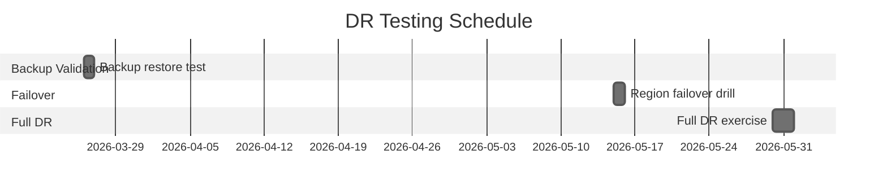

# 🛡️ Backup and Disaster Recovery Plan: hackops


<details open>
<summary><strong>📑 DR Plan Contents</strong></summary>

- [📋 Executive Summary](#-executive-summary)
- [🎯 1. Recovery Objectives](#-1-recovery-objectives)
- [💾 2. Backup Strategy](#-2-backup-strategy)
- [🌍 3. Disaster Recovery Procedures](#-3-disaster-recovery-procedures)
- [🧪 4. Testing Schedule](#-4-testing-schedule)
- [📢 5. Communication Plan](#-5-communication-plan)
- [👥 6. Roles and Responsibilities](#-6-roles-and-responsibilities)
- [🔗 7. Dependencies](#-7-dependencies)
- [📖 8. Recovery Runbooks](#-8-recovery-runbooks)
- [📎 9. Appendix](#-9-appendix)
- [References](#references)

</details>

> Generated by as-built agent | 2026-02-26

<div align="center">

| ⬅️ Previous                                          | 📑 Index            | Next ➡️                                            |
| ---------------------------------------------------- | ------------------- | -------------------------------------------------- |
| [07-resource-inventory.md](07-resource-inventory.md) | [README](README.md) | [07-compliance-matrix.md](07-compliance-matrix.md) |

</div>

**Generated**: 2026-02-26
**Version**: 1.0
**Environment**: dev
**Primary Region**: centralus
**Secondary Region**: none (not implemented)

---

## 📋 Executive Summary

> [!IMPORTANT]
> This document defines the backup strategy and disaster recovery procedures for hackops.

| Metric           | Current                              | Target                                 |
| ---------------- | ------------------------------------ | -------------------------------------- |
| **RPO**          | ≤ 1 hour for Cosmos operational data | ≤ 1 hour                               |
| **RTO**          | 4–8 hours (redeploy + restore path)  | ≤ 8 hours                              |
| **Availability** | Single-region dev baseline           | Improve to multi-region for production |

---

## 🎯 1. Recovery Objectives

### 1.1 Recovery Time Objective (RTO)

| Tier         | RTO Target | Services                             |
| ------------ | ---------- | ------------------------------------ |
| 🔴 Critical  | 4 hours    | App Service, Cosmos DB               |
| 🟠 Important | 8 hours    | Key Vault, DNS, Monitoring           |
| 🟢 Standard  | 24 hours   | Non-critical observability artifacts |

### 1.2 Recovery Point Objective (RPO)

| Data Type                             | RPO Target | Backup Strategy                            |
| ------------------------------------- | ---------- | ------------------------------------------ |
| Hackathon transactional data (Cosmos) | ≤ 1 hour   | Cosmos DB continuous backup (30 days tier) |
| Secrets/configuration references      | ≤ 24 hours | Key Vault soft-delete + IaC reconstruction |
| Infrastructure configuration          | ≤ 1 hour   | Git + Bicep in repository                  |

```mermaid
%%{init: {'theme':'neutral'}}%%
gantt
    title RPO / RTO Targets by Tier
    dateFormat HH:mm
    axisFormat %H:%M
    section Critical
        RPO :crit, rpo1, 00:00, 1h
        RTO :crit, rto1, 00:00, 4h
    section Important
        RPO :rpo2, 00:00, 4h
        RTO :rto2, 00:00, 8h
    section Standard
        RPO :rpo3, 00:00, 24h
        RTO :rto3, 00:00, 24h
```



---

## 💾 2. Backup Strategy

<details>
<summary><strong>💾 Azure Cosmos DB</strong></summary>

| Setting        | Configuration                                    |
| -------------- | ------------------------------------------------ |
| Backup Type    | Continuous                                       |
| Tier           | Continuous30Days                                 |
| Region         | Central US                                       |
| Restore Method | Point-in-time restore / account restore workflow |

**Verification Command:**

```bash
az cosmosdb show -g rg-hackops-us-dev -n cosmos-hackops-dev-fplrs3 --query backupPolicy
```

</details>

<details>
<summary><strong>🔐 Azure Key Vault</strong></summary>

| Setting          | Configuration                                                |
| ---------------- | ------------------------------------------------------------ |
| Soft Delete      | Enabled                                                      |
| Purge Protection | Enabled                                                      |
| Recovery Method  | Secret/key recovery via vault recovery + IaC reconfiguration |

</details>

---

## 🌍 3. Disaster Recovery Procedures

<details>
<summary><strong>🌍 Region Failover</strong></summary>

### 3.1 Failover Procedure

1. Declare incident and capture outage context.
2. Deploy infrastructure to designated fallback region using `main.bicep` with region override.
3. Restore Cosmos data using continuous backup restore workflow.
4. Reconfigure app settings and DNS cutover.
5. Validate critical user journeys.

</details>

<details>
<summary><strong>↩️ Failback Procedure</strong></summary>

### 3.2 Failback Procedure

1. Stabilize original region services.
2. Resynchronize data and configuration.
3. Execute controlled DNS/app cutback.
4. Validate health and close incident with postmortem.

</details>

---

## 🧪 4. Testing Schedule

| Test Type                | Frequency | Last Test  | Next Test  |
| ------------------------ | --------- | ---------- | ---------- |
| Backup policy validation | Monthly   | 2026-02-26 | 2026-03-26 |
| Cosmos restore drill     | Quarterly | Not run    | 2026-05-15 |
| Full DR tabletop         | Quarterly | Not run    | 2026-05-30 |



---

## 📢 5. Communication Plan

| Audience         | Channel                      | Template                            |
| ---------------- | ---------------------------- | ----------------------------------- |
| Engineering Team | Teams/Slack incident channel | Sev incident template               |
| Leadership       | Email + Teams                | Executive incident summary          |
| Stakeholders     | Project channel              | Status update every 60 minutes (P1) |

---

## 👥 6. Roles and Responsibilities

| Role                 | Team             | Responsibility                               |
| -------------------- | ---------------- | -------------------------------------------- |
| Incident Commander   | InfraOps         | Incident coordination and decision gates     |
| Platform Engineer    | InfraOps         | Infrastructure recovery execution            |
| Application Engineer | HackOps App Team | Application validation and functional checks |
| Security Reviewer    | Security/GRC     | Compliance and control impact validation     |

---

## 🔗 7. Dependencies

| Dependency                           | Impact                                    | Mitigation                                        |
| ------------------------------------ | ----------------------------------------- | ------------------------------------------------- |
| Azure regional service availability  | Recovery blocked if fallback not prepared | Maintain pre-approved fallback region and scripts |
| GitHub repository and CI credentials | Slows redeploy                            | Keep break-glass deployment path documented       |
| DNS change propagation               | User access delay                         | Use low TTL and pre-planned cutover process       |

---

## 📖 8. Recovery Runbooks

| Scenario                     | Runbook     | Owner               |
| ---------------------------- | ----------- | ------------------- |
| App outage in primary region | Section 8.1 | InfraOps            |
| Cosmos data corruption       | Section 8.2 | InfraOps + App Team |

<details>
<summary><strong>📖 Runbook: App Service Regional Outage</strong></summary>

**Trigger**: App Service unavailable for >15 minutes with confirmed regional impact.
**Estimated Duration**: 2–4 hours.

1. Create target DR resource group in fallback region.
2. Deploy Bicep templates with fallback location parameter.
3. Rehydrate app settings and identity references.
4. Execute health checks and endpoint validation.

**Validation**:

```bash
az webapp show -g <dr-rg> -n <dr-app> --query state
```

</details>

---

## 📎 9. Appendix

<details>
<summary>📋 Detailed Recovery Procedures</summary>

- Deployment entrypoint: `infra/bicep/hackops/main.bicep`
- Current production-like deployment: `rg-hackops-us-dev` (`centralus`)
- Critical endpoints:
  - `https://app-hackops-dev.azurewebsites.net`
  - `https://cosmos-hackops-dev-fplrs3.documents.azure.com:443/`
  - `https://kv-hackops-dev-fplrs3.vault.azure.net/`

</details>

---

## References

> [!NOTE]
> 📚 The following Microsoft Learn resources provide DR guidance.

| Topic                 | Link                                                                                            |
| --------------------- | ----------------------------------------------------------------------------------------------- |
| Azure Backup Overview | [Backup Overview](https://learn.microsoft.com/azure/backup/backup-overview)                     |
| Backup Best Practices | [Best Practices](https://learn.microsoft.com/azure/backup/backup-best-practices)                |
| RTO/RPO Guidance      | [Reliability Metrics](https://learn.microsoft.com/azure/well-architected/reliability/metrics)   |
| Site Recovery         | [ASR Overview](https://learn.microsoft.com/azure/site-recovery/site-recovery-overview)          |
| Business Continuity   | [DR Planning](https://learn.microsoft.com/azure/well-architected/reliability/disaster-recovery) |

---

_Backup and DR plan generated from infrastructure artifacts and deployed resource state._

---

<div align="center">

| ⬅️ [07-resource-inventory.md](07-resource-inventory.md) | 🏠 [Project Index](README.md) | ➡️ [07-compliance-matrix.md](07-compliance-matrix.md) |
| ------------------------------------------------------- | ----------------------------- | ----------------------------------------------------- |

</div>
