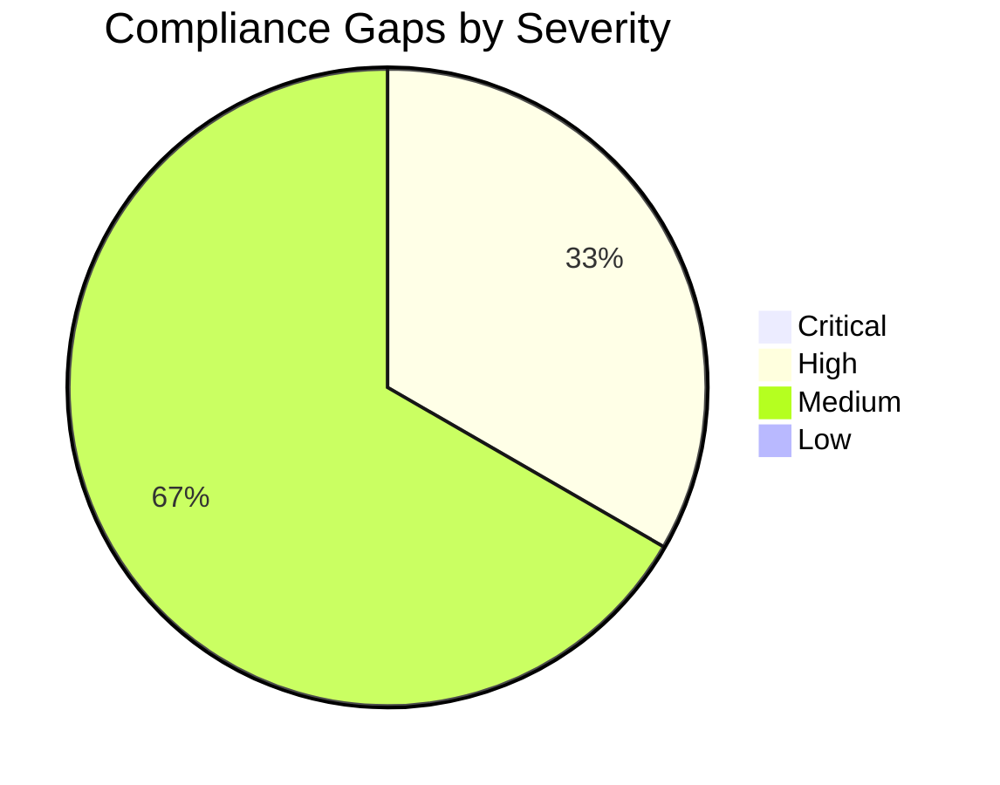
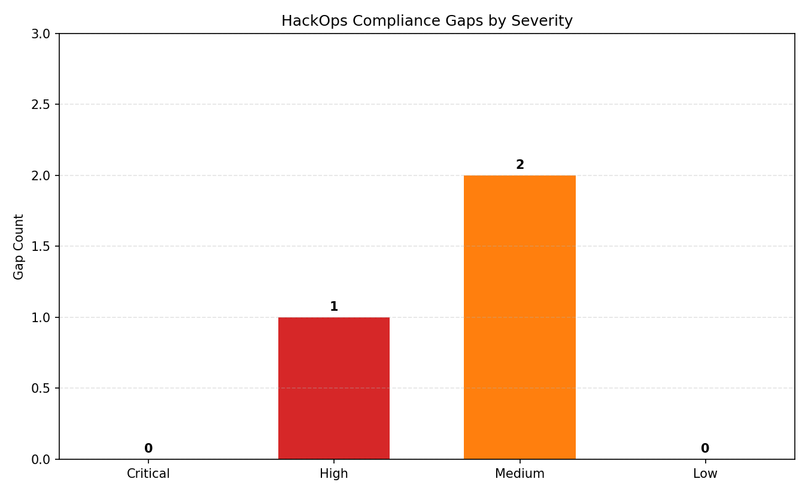

# ⚖️ Compliance Matrix: hackops

<strong>📑 Compliance Contents</strong>

- [📋 Executive Summary](#-executive-summary)
- [🗺️ 1. Control Mapping](#️-1-control-mapping)
- [🔍 2. Gap Analysis](#-2-gap-analysis)
- [📁 3. Evidence Collection](#-3-evidence-collection)
- [📝 4. Audit Trail](#-4-audit-trail)
- [🔧 5. Remediation Tracker](#-5-remediation-tracker)
- [📎 6. Appendix](#-6-appendix)
- [References](#references)

> Generated by as-built agent | 2026-02-26

| ⬅️ Previous                                  | 📑 Index            | Next ➡️                                          |
| -------------------------------------------- | ------------------- | ------------------------------------------------ |
| [07-backup-dr-plan.md](07-backup-dr-plan.md) | [README](README.md) | [07-ab-cost-estimate.md](07-ab-cost-estimate.md) |

**Generated**: 2026-02-26
**Version**: 1.0
**Environment**: dev
**Primary Compliance Framework**: Azure Security Baseline + internal policy controls

---

## 📋 Executive Summary

| Signal | Meaning                             |
| ------ | ----------------------------------- |
| ✅     | Control implemented and evidenced   |
| ⚠️     | Gap exists with remediation planned |
| ❌     | Control missing or failed           |

> [!IMPORTANT]
> This compliance matrix maps the hackops security controls to Azure baseline and project governance requirements.

| Compliance Area    | Coverage | Status |
| ------------------ | -------- | ------ |
| Network Security   | 90%      | ✅     |
| Data Protection    | 95%      | ✅     |
| Access Control     | 90%      | ✅     |
| Monitoring & Audit | 80%      | ⚠️     |
| Incident Response  | 70%      | ⚠️     |
| Overall            | 85%      | ✅     |

---

## 🗺️ 1. Control Mapping

### Requirement 1: Network and Data Plane Isolation

| Control | Requirement                 | Implementation                                                | Status |
| ------- | --------------------------- | ------------------------------------------------------------- | ------ |
| NS-1    | Isolate critical data plane | SQL Database and Key Vault private endpoints in `snet-pe-dev` | ✅     |
| NS-2    | Restrict public exposure    | `publicNetworkAccess: Disabled` on SQL Database and Key Vault | ✅     |
| NS-3    | Controlled subnet policy    | Dedicated subnet delegation and NSGs                          | ✅     |

<strong>📎 Evidence</strong>

**Evidence Location**: Azure CLI runtime snapshots from deployed resources

| Evidence Item                             | Type                  | Date Collected |
| ----------------------------------------- | --------------------- | -------------- |
| `az sql db show` output                   | Runtime configuration | 2026-02-26     |
| `az keyvault show` output                 | Runtime configuration | 2026-02-26     |
| `az network private-endpoint list` output | Runtime configuration | 2026-02-26     |

### Requirement 2: Identity and Access Security

| Control | Requirement                              | Implementation                                              | Status |
| ------- | ---------------------------------------- | ----------------------------------------------------------- | ------ |
| IM-1    | Managed identity for app-to-service auth | System-assigned MI on `app-hackops-dev`                     | ✅     |
| IM-2    | Secret management hardening              | Key Vault RBAC mode enabled, purge protection enabled       | ✅     |
| IM-3    | Strong auth design                       | Easy Auth + GitHub OAuth design in ADR and app architecture | ⚠️     |

### Requirement 3: Cryptography and Transport

| Control | Requirement             | Implementation                           | Status |
| ------- | ----------------------- | ---------------------------------------- | ------ |
| DP-1    | Encrypt data in transit | TLS 1.2 enforced on app and SQL Database | ✅     |
| DP-2    | HTTPS-only frontdoor    | App Service `httpsOnly: true`            | ✅     |

---

## 🔍 2. Gap Analysis

| Gap                                                                                   | Severity | Risk Level | Remediation                                                    | Timeline |
| ------------------------------------------------------------------------------------- | -------- | ---------- | -------------------------------------------------------------- | -------- |
| Formal DR failover testing not yet executed                                           | 🟠       | Medium     | Run quarterly failover and restore drills                      | 30 days  |
| Alert thresholds and incident runbooks not fully tuned                                | 🟡       | Medium     | Configure baseline alert rules and action groups               | 30 days  |
| Authentication runtime evidence not captured in this run (CLI extension interruption) | 🟡       | Low        | Capture `authsettingsV2` ARM snapshot in next validation cycle | 14 days  |

---

## 📁 3. Evidence Collection

<strong>📁 Evidence Items</strong>

| Control                | Evidence Type | Location                                                                            | Last Collected |
| ---------------------- | ------------- | ----------------------------------------------------------------------------------- | -------------- |
| Network isolation      | CLI export    | `az network private-endpoint list`                                                  | 2026-02-26     |
| Data protection        | CLI export    | `az sql db show`                                                                    | 2026-02-26     |
| Key management         | CLI export    | `az keyvault show`                                                                  | 2026-02-26     |
| Monitoring posture     | CLI export    | `az monitor log-analytics workspace show`, `az monitor app-insights component show` | 2026-02-26     |
| Deployment attestation | Artifact      | `06-deployment-summary.md`                                                          | 2026-02-26     |

---

## 📝 4. Audit Trail

| Date       | Auditor        | Finding                                                  | Status | Commit |
| ---------- | -------------- | -------------------------------------------------------- | ------ | ------ |
| 2026-02-26 | as-built agent | Step 7 compliance baseline generated from deployed state | Draft  | N/A    |

---

## 🔧 5. Remediation Tracker

| Finding                                                      | Owner         | Due Date   | Status  |
| ------------------------------------------------------------ | ------------- | ---------- | ------- |
| Execute DR restore/failover drill                            | Platform Ops  | 2026-03-30 | ⬜ Todo |
| Define and enable P1/P2 alert rules and action groups        | Platform Team | 2026-03-20 | ⬜ Todo |
| Capture and archive `authsettingsV2` proof for audit package | Security/GRC  | 2026-03-12 | ⬜ Todo |

---

## 📎 6. Appendix

### A. Compliance Framework Reference

This matrix maps to Azure Security Benchmark control families (NS, IM, DP, LT) and project governance findings in `04-governance-constraints.md`.

### B. Azure Security Baseline Mapping

- NS-1/NS-2: Private endpoints and restricted public network access
- IM-1/IM-2: Managed identity and Key Vault RBAC usage
- DP-1: TLS baseline enforcement
- LT-1: Log Analytics + Application Insights integration

---

## References

> [!NOTE]
> 📚 The following Microsoft Learn resources provide compliance guidance.

| Topic                              | Link                                                                                                                        |
| ---------------------------------- | --------------------------------------------------------------------------------------------------------------------------- |
| Microsoft Cloud Security Benchmark | [MCSB Overview](https://learn.microsoft.com/security/benchmark/azure/overview)                                              |
| Azure Compliance Offerings         | [Compliance](https://learn.microsoft.com/azure/compliance/)                                                                 |
| Azure Policy                       | [Policy Overview](https://learn.microsoft.com/azure/governance/policy/overview)                                             |
| Regulatory Compliance              | [Built-in Policies](https://learn.microsoft.com/azure/governance/policy/samples/built-in-initiatives#regulatory-compliance) |

---

_Compliance matrix generated from infrastructure artifacts and deployed resource state._

---

| ⬅️ [07-backup-dr-plan.md](07-backup-dr-plan.md) | 🏠 [Project Index](README.md) | ➡️ [07-ab-cost-estimate.md](07-ab-cost-estimate.md) |
| ----------------------------------------------- | ----------------------------- | --------------------------------------------------- |

