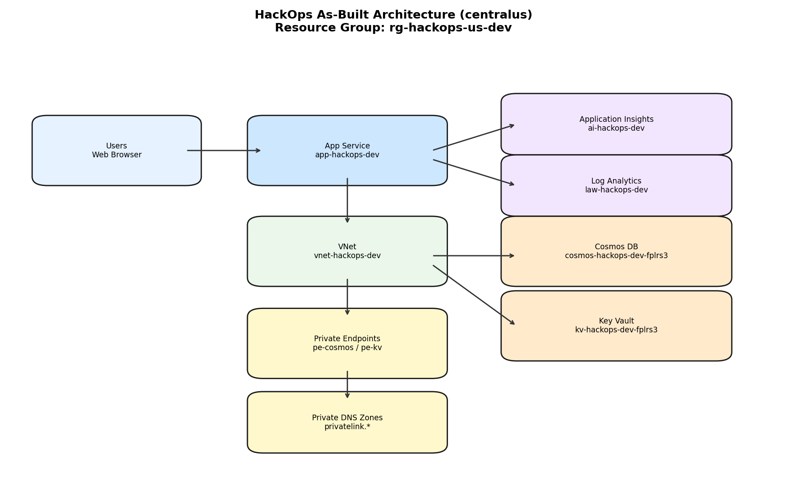

# 📐 Azure Design Document: hackops

<strong>📑 Design Contents</strong>

- [📝 1. Introduction](#-1-introduction)
- [🏛️ 2. Azure Architecture Overview](#-2-azure-architecture-overview)
- [🌐 3. Networking](#-3-networking)
- [💾 4. Storage](#-4-storage)
- [💻 5. Compute](#-5-compute)
- [👤 6. Identity & Access](#-6-identity--access)
- [🔐 7. Security & Compliance](#-7-security--compliance)
- [🔄 8. Backup & Disaster Recovery](#-8-backup--disaster-recovery)
- [📊 9. Management & Monitoring](#-9-management--monitoring)
- [📎 10. Appendix](#-10-appendix)
- [References](#references)

> Generated by as-built agent | 2026-02-26

| ⬅️ Previous                                            | 📑 Index            | Next ➡️                                              |
| ------------------------------------------------------ | ------------------- | ---------------------------------------------------- |
| [07-documentation-index.md](07-documentation-index.md) | [README](README.md) | [07-operations-runbook.md](07-operations-runbook.md) |

**Version**: 1.0
**Date**: 2026-02-26
**Author**: Generated by As-Built Agent
**Status**: Draft

---

## 📝 1. Introduction

| Signal | Meaning                                   |
| ------ | ----------------------------------------- |
| ✅     | Implemented and verified                  |
| ⚠️     | Partially implemented or follow-up needed |
| ❌     | Not implemented / failed control          |

### 1.1 Document Purpose

This design document provides comprehensive technical documentation for the hackops
Azure infrastructure as deployed in `centralus`. It serves as a reference for operations,
security review, and future implementation changes.

**Intended Audience:**

- Solution Architects
- Operations/SRE Teams
- Security & Compliance Teams
- Development Teams

### 1.2 Project Overview

HackOps is an Azure-hosted hackathon management platform using Next.js 15 on App Service,
Azure SQL Database (serverless), Key Vault, private networking, and Azure Monitor.

**Business Objectives:**

- Provide reliable hackathon administration and scoring workflows
- Protect event data using private networking and managed identity patterns
- Keep non-production operating costs low while retaining production-ready architecture

### 1.3 Design Objectives

| Objective    | Target                                          | Implementation                                     |
| ------------ | ----------------------------------------------- | -------------------------------------------------- |
| Availability | Single-region dev reliability                   | App Service + managed PaaS services in `centralus` |
| Performance  | <2s leaderboard SSR at expected load            | Always-on Linux App Service + Azure SQL Database   |
| Security     | Private data plane and strong identity controls | Key Vault/SQL private endpoints, TLS1.2, RBAC      |
| Scalability  | Support bursty event traffic                    | Azure SQL Database and scalable App Service plan   |

### 1.4 Constraints & Assumptions

**Constraints:**

- Deployed as a single-region environment (`centralus`)
- Authentication strategy is tied to App Service Easy Auth design intent

**Assumptions:**

- Event workloads remain bursty with modest average utilization
- Private endpoint DNS resolution remains healthy through private DNS links

### 1.5 Stakeholders

| Role              | Team             | Responsibility                           |
| ----------------- | ---------------- | ---------------------------------------- |
| Platform Owner    | Platform Ops     | Infrastructure lifecycle and standards   |
| Application Owner | HackOps App Team | Feature delivery and runtime correctness |
| Security Reviewer | Security/GRC     | Control verification and remediation     |

---

## 🏛️ 2. Azure Architecture Overview

### 2.1 Architecture Diagram

Source: [07-ab-diagram.py](./07-ab-diagram.py)

### 2.2 Resource Summary

| Category   | Count |
| ---------- | ----- |
| Compute    | 2     |
| Networking | 13    |
| Data       | 12    |
| Security   | 1     |

---

## 🌐 3. Networking

Source: [07-ab-diagram.py](./07-ab-diagram.py)

`vnet-hackops-dev` (`10.0.0.0/16`) contains:

- `snet-app-dev` (`10.0.1.0/24`) delegated to `Microsoft.Web/serverFarms`
- `snet-pe-dev` (`10.0.2.0/24`) for private endpoints (`pe-kv-hackops-dev`, `pe-sql-hackops-dev`)
- `snet-default-dev` (`10.0.0.0/24`) reserved/general

Private DNS zones:

- `privatelink.vaultcore.azure.net`
- `privatelink.database.windows.net`

Each zone is linked to the VNet via a dedicated `virtualNetworkLink`.

---

## 💾 4. Storage

Primary data store is `sql-hackops-dev` (Azure SQL Database) with database
`hackops-db` and 10 tables (`hackathons`, `teams`, `hackers`, `rubrics`, `rubric-active`,
`submissions`, `scores`, `challenges`, `progression`, `roles`).

Data-protection controls in deployed state:

- `publicNetworkAccess: Disabled`
- `disableLocalAuth: true`
- `minimalTlsVersion: Tls12`
- Private endpoint connection status: approved

---

## 💻 5. Compute

Compute tier:

- App Service Plan: `asp-hackops-dev` (Linux `B1`, capacity 3)
- App Service: `app-hackops-dev` (`NODE|22-lts`, `alwaysOn: true`, `httpsOnly: true`, `ftpsState: Disabled`, `minTlsVersion: 1.2`)

Runtime integration:

- App Service integrated with `snet-app-dev`
- App settings include SQL Server endpoint, Key Vault URI, and App Insights connection string

---

## 👤 6. Identity & Access

Identity model:

- App Service system-assigned managed identity enabled
- Principal ID: `6503cb23-fd59-4f0c-8f20-25ce8f5b2804`
- Key Vault RBAC mode enabled (`enableRbacAuthorization: true`)

Authentication design intent (from ADRs and implementation):

- GitHub OAuth via App Service Easy Auth (`authsettingsV2`)
- Role authorization resolved from SQL `roles` table

---

## 🔐 7. Security & Compliance

<strong>🔒 Security Controls</strong>

| Control           | Implementation                                                 | Evidence                                                               |
| ----------------- | -------------------------------------------------------------- | ---------------------------------------------------------------------- |
| TLS 1.2+          | App Service and SQL minimum TLS 1.2                            | `az webapp show`, `az sql server show`                                 |
| HTTPS-only        | App Service `httpsOnly: true`                                  | `az webapp show`                                                       |
| Managed Identity  | System-assigned identity on web app                            | `az webapp show`                                                       |
| Network isolation | SQL Database and Key Vault via private endpoints + private DNS | `az network private-endpoint list`, `az network private-dns zone list` |

<strong>📋 Compliance Mapping</strong>

| Framework                     | Control ID                                 | Status |
| ----------------------------- | ------------------------------------------ | ------ |
| Azure Security Baseline       | NS-1, IM-1, DP-3, LT-1                     | ✅     |
| Internal policy (from Step 4) | Mandatory tags and private access controls | ✅     |
| Operational hardening         | Alerting and runbook drill cadence         | ⚠️     |

Security posture is strong for a dev environment, with main residual gaps in operational
process maturity (alert tuning, formal DR exercises).

---

## 🔄 8. Backup & Disaster Recovery

Current deployment is single-region. Recovery depends on:

- Azure SQL automated backups (geo-redundant, 7-day retention)
- Key Vault soft-delete + purge protection
- Infrastructure redeployment from Bicep templates

Recommended DR evolution:

- Add secondary-region strategy and documented failover test cadence
- Add backup restore validation on a recurring schedule

---

## 📊 9. Management & Monitoring

Monitoring stack:

- Log Analytics workspace `log-hackops-dev` (`PerGB2018`, retention 30 days)
- Application Insights `appi-hackops-dev` (workspace-based, retention 365 days)

Diagnostic settings are configured from modules for key services (App Service, Azure SQL Database, Key Vault).

---

## 📎 10. Appendix

📋 Detailed Resource Configuration

- Resource Group: `rg-hackops-us-dev`
- Deployment: `hackops-centralus-20260226154324`
- Region: `centralus`
- VNet ID: `/subscriptions/00858ffc-dded-4f0f-8bbf-e17fff0d47d9/resourceGroups/rg-hackops-us-dev/providers/Microsoft.Network/virtualNetworks/vnet-hackops-dev`
- App hostname: `app-hackops-dev.azurewebsites.net`
- SQL Server endpoint: `tcp:sql-hackops-dev.database.windows.net,1433`
- Key Vault URI: `https://kv-hackops-dev-fplrs3.vault.azure.net/`

📚 Reference Architecture Links

| Architecture                      | Link                                                                   |
| --------------------------------- | ---------------------------------------------------------------------- |
| Azure Well-Architected Framework  | https://learn.microsoft.com/azure/well-architected/                    |
| Azure App Service secure baseline | https://learn.microsoft.com/azure/app-service/overview-security        |
| Azure SQL security baseline       | https://learn.microsoft.com/azure/azure-sql/database/security-overview |

---

## References

> [!NOTE]
> 📚 The following Microsoft Learn resources provide additional guidance.

| Topic                      | Link                                                                                               |
| -------------------------- | -------------------------------------------------------------------------------------------------- |
| Well-Architected Framework | [Overview](https://learn.microsoft.com/azure/well-architected/)                                    |
| Azure Architecture Center  | [Architectures](https://learn.microsoft.com/azure/architecture/)                                   |
| Security Best Practices    | [Security Baseline](https://learn.microsoft.com/security/benchmark/azure/overview)                 |
| Networking Best Practices  | [Network Security](https://learn.microsoft.com/azure/security/fundamentals/network-best-practices) |
| Backup Best Practices      | [Azure Backup](https://learn.microsoft.com/azure/backup/backup-best-practices)                     |
| Monitoring Overview        | [Azure Monitor](https://learn.microsoft.com/azure/azure-monitor/overview)                          |

---

_Design document generated from infrastructure artifacts and deployed resource state._

---

| ⬅️ [07-documentation-index.md](07-documentation-index.md) | 🏠 [Project Index](README.md) | ➡️ [07-operations-runbook.md](07-operations-runbook.md) |
| --------------------------------------------------------- | ----------------------------- | ------------------------------------------------------- |

