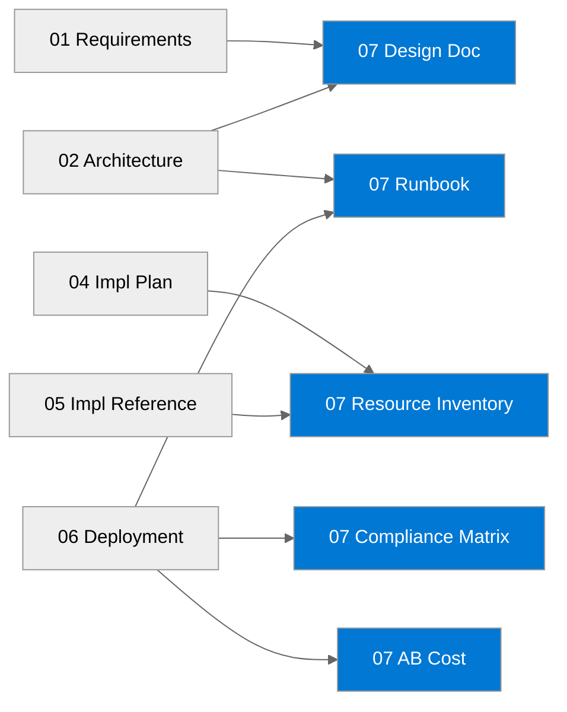

# 📚 hackops - Workload Documentation

<strong>📑 Documentation Contents</strong>

- [📦 1. Document Package Contents](#-1-document-package-contents)
- [📚 2. Source Artifacts](#-2-source-artifacts)
- [📋 3. Project Summary](#-3-project-summary)
- [🔗 4. Related Resources](#-4-related-resources)
- [⚡ 5. Quick Links](#-5-quick-links)

> Generated by as-built agent | 2026-02-26

| ⬅️ Previous                                          | 📑 Index            | Next ➡️                                        |
| ---------------------------------------------------- | ------------------- | ---------------------------------------------- |
| [06-deployment-summary.md](06-deployment-summary.md) | [README](README.md) | [07-design-document.md](07-design-document.md) |

**Generated**: 2026-02-26
**Version**: 1.0
**Status**: Draft

---

## 📦 1. Document Package Contents

| Document                                           | Description                                         | Status                                                        |
| -------------------------------------------------- | --------------------------------------------------- | ------------------------------------------------------------- |
| [Design Document](./07-design-document.md)         | Comprehensive architecture design                   |  |
| [Operations Runbook](./07-operations-runbook.md)   | Day-2 operational procedures                        |  |
| [Resource Inventory](./07-resource-inventory.md)   | Complete resource listing from deployed state + IaC |  |
| [Compliance Matrix](./07-compliance-matrix.md)     | Security controls mapping                           |  |
| [Backup & DR Plan](./07-backup-dr-plan.md)         | Recovery procedures and failover approach           |  |
| [As-Built Cost Estimate](./07-ab-cost-estimate.md) | MCP-backed as-built cost and optimization actions   |  |

---

## 📚 2. Source Artifacts

These documents were generated from the following agentic workflow outputs:

| Artifact             | Source                                                             | Generated  |
| -------------------- | ------------------------------------------------------------------ | ---------- |
| Requirements         | [01-requirements.md](./01-requirements.md)                         | 2026-02-26 |
| WAF Assessment       | [02-architecture-assessment.md](./02-architecture-assessment.md)   | 2026-02-26 |
| Cost Estimate        | Not available as separate `03-des-cost-estimate.md` artifact       | N/A        |
| Implementation Plan  | [04-implementation-plan.md](./04-implementation-plan.md)           | 2026-02-26 |
| Bicep Code Reference | [05-implementation-reference.md](./05-implementation-reference.md) | 2026-02-26 |
| Deployment Summary   | [06-deployment-summary.md](./06-deployment-summary.md)             | 2026-02-26 |

---

## 📋 3. Project Summary

| Attribute          | Value                                           |
| ------------------ | ----------------------------------------------- |
| **Project Name**   | hackops                                         |
| **Environment**    | dev                                             |
| **Primary Region** | centralus                                       |
| **Compliance**     | Baseline compliant with medium operational gaps |
| **Monthly Cost**   | $232.33 (as-built estimate)                     |

---

## 🔗 4. Related Resources

- **Infrastructure Code**: [infra/bicep/hackops/](../../infra/bicep/hackops/)
- **Agent Outputs**: [agent-output/hackops/](./)
- **ADRs**: `03-des-adr-0001-serverless-cosmos.md`, `03-des-adr-0002-app-service-compute.md`, `03-des-adr-0003-easy-auth-github.md`

---

## ⚡ 5. Quick Links

- 📂 **Code**: [Deployment Script](../../infra/bicep/hackops/deploy.ps1) | [Main Bicep Template](../../infra/bicep/hackops/main.bicep)
- 📄 **Docs**: [Design Document](./07-design-document.md) | [Runbook](./07-operations-runbook.md) | [Compliance](./07-compliance-matrix.md) | [Cost](./07-ab-cost-estimate.md)
- 🔗 **External**: [Azure Well-Architected Framework](https://learn.microsoft.com/azure/well-architected/) | [AVM Index](https://aka.ms/avm/index)

---

_Documentation index generated by As-Built Agent._

---

| ⬅️ [06-deployment-summary.md](06-deployment-summary.md) | 🏠 [Project Index](README.md) | ➡️ [07-design-document.md](07-design-document.md) |
| ------------------------------------------------------- | ----------------------------- | ------------------------------------------------- |

