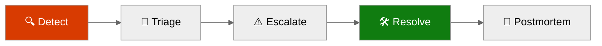
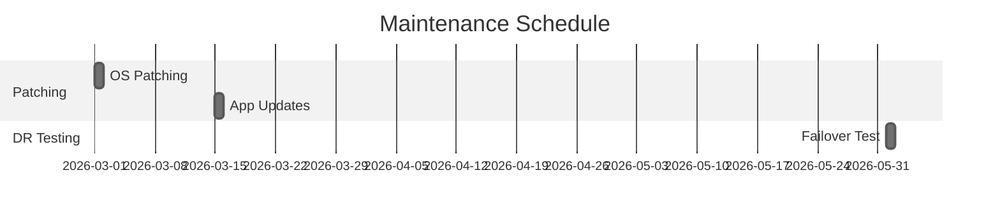
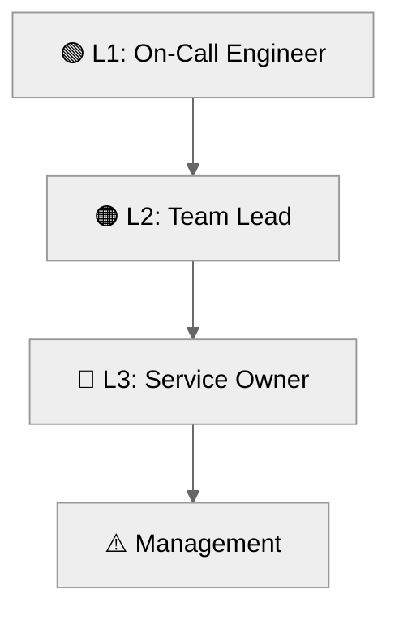

# 📖 Operations Runbook: hackops


<details open>
<summary><strong>📑 Runbook Contents</strong></summary>

- [⚡ Quick Reference](#-quick-reference)
- [📋 1. Daily Operations](#-1-daily-operations)
- [🚨 2. Incident Response](#-2-incident-response)
- [🔧 3. Common Procedures](#-3-common-procedures)
- [🕐 4. Maintenance Windows](#-4-maintenance-windows)
- [📞 5. Contacts & Escalation](#-5-contacts--escalation)
- [📝 6. Change Log](#-6-change-log)
- [References](#references)

</details>

> Generated by as-built agent | 2026-02-26

| ⬅️ Previous                                    | 📑 Index            | Next ➡️                                              |
| ---------------------------------------------- | ------------------- | ---------------------------------------------------- |
| [07-design-document.md](07-design-document.md) | [README](README.md) | [07-resource-inventory.md](07-resource-inventory.md) |

**Version**: 1.0
**Date**: 2026-02-26
**Environment**: dev
**Region**: centralus

---

## ⚡ Quick Reference

| Item                | Value                                              |
| ------------------- | -------------------------------------------------- |
| **Primary Region**  | centralus                                          |
| **Resource Group**  | rg-hackops-us-dev                                  |
| **Support Contact** | noalz@lordofthecloud.eu                            |
| **Escalation Path** | L1 InfraOps → L2 Platform Owner → L3 Service Owner |

### Critical Resources

| Resource      | Name                      | Resource Group    | Severity |
| ------------- | ------------------------- | ----------------- | -------- |
| Web App       | app-hackops-dev           | rg-hackops-us-dev | 🔴 P1    |
| Cosmos DB     | cosmos-hackops-dev-fplrs3 | rg-hackops-us-dev | 🔴 P1    |
| Key Vault     | kv-hackops-dev-fplrs3     | rg-hackops-us-dev | 🟠 P2    |
| Log Workspace | log-hackops-dev           | rg-hackops-us-dev | 🟠 P2    |

---

## 📋 1. Daily Operations

### 1.1 Health Checks

**Morning Health Check:**

1. ✅ Confirm web app state is `Running` and HTTPS endpoint responds
2. ✅ Verify Cosmos DB account `provisioningState` is `Succeeded`
3. ✅ Verify Key Vault private endpoint connection remains `Approved`

**KQL Query - System Health Overview:**

<details>
<summary><strong>📊 Health Check KQL</strong></summary>

```kusto
AppTraces
| where TimeGenerated > ago(24h)
| summarize Errors=countif(SeverityLevel >= 3), Infos=countif(SeverityLevel < 3) by bin(TimeGenerated, 1h)
| order by TimeGenerated desc
```

</details>

### 1.2 Log Review

**Priority Logs to Review:**

| Log Source                | Query Focus                                  | Action Threshold                  |
| ------------------------- | -------------------------------------------- | --------------------------------- |
| Application Insights      | Unhandled exceptions and dependency failures | > 5 critical errors/hour          |
| App Service Platform Logs | Startup/restart anomalies                    | > 2 restarts/day                  |
| Cosmos Diagnostics        | Throttling/latency anomalies                 | Sustained 429s or high RU latency |

---

## 🚨 2. Incident Response

### 2.1 Severity Definitions

| Severity | Definition                              | Response Time  |
| -------- | --------------------------------------- | -------------- |
| 🔴 P1    | Complete outage or critical user impact | 15 minutes     |
| 🟠 P2    | Partial degradation with workaround     | 1 hour         |
| 🟢 P3    | Minor defect/no immediate impact        | 1 business day |

### Incident Response Flow



### 2.2 Runbooks by Alert

| Alert                              | Runbook                                           | Owner               |
| ---------------------------------- | ------------------------------------------------- | ------------------- |
| Web app unavailable                | Section 3.1 restart and health verify             | InfraOps            |
| Cosmos connection failures         | Verify private endpoint + DNS + app settings      | InfraOps + App Team |
| Key Vault secret resolution errors | Validate RBAC identity access and endpoint status | Security + InfraOps |

---

## 🔧 3. Common Procedures

### 3.1 Restart Services

<details>
<summary>🔧 Restart App Service</summary>

```bash
az webapp restart -g rg-hackops-us-dev -n app-hackops-dev
az webapp show -g rg-hackops-us-dev -n app-hackops-dev --query state -o tsv
```

</details>

### 3.2 Scale Resources

<details>
<summary>📈 Scale Up/Out Commands</summary>

```bash
# Scale plan capacity (example to 2)
az appservice plan update -g rg-hackops-us-dev -n asp-hackops-dev --number-of-workers 2

# Scale SKU (example B1 -> S1)
az appservice plan update -g rg-hackops-us-dev -n asp-hackops-dev --sku S1
```

</details>

---

## 🕐 4. Maintenance Windows

| Task                          | Schedule           | Duration |
| ----------------------------- | ------------------ | -------- |
| App dependency updates        | Weekly (off-hours) | 1 hour   |
| Security configuration review | Monthly            | 2 hours  |
| DR readiness drill            | Quarterly          | 4 hours  |



> [!TIP]
> 💡 Schedule maintenance during low-traffic periods. Use Azure Update Manager for coordinated patching.

---

## 📞 5. Contacts & Escalation

| Role                | Contact        | Phone | On-Call Rotation |
| ------------------- | -------------- | ----- | ---------------- |
| L1 On-Call Engineer | InfraOps       | N/A   | Weekly           |
| L2 Team Lead        | Platform Owner | N/A   | Escalation only  |
| L3 Service Owner    | HackOps Owner  | N/A   | Escalation only  |

### Escalation Path



---

## 📝 6. Change Log

| Date       | Change                                                        | Author         |
| ---------- | ------------------------------------------------------------- | -------------- |
| 2026-02-26 | Initial as-built runbook generated for `centralus` deployment | as-built agent |

---

## References

> [!NOTE]
> 📚 The following Microsoft Learn resources provide operational guidance.

| Topic                 | Link                                                                                             |
| --------------------- | ------------------------------------------------------------------------------------------------ |
| Azure Monitor Alerts  | [Alerting Best Practices](https://learn.microsoft.com/azure/azure-monitor/best-practices-alerts) |
| Log Analytics Queries | [KQL Reference](https://learn.microsoft.com/azure/azure-monitor/logs/get-started-queries)        |
| Incident Management   | [Azure Status](https://status.azure.com/)                                                        |
| Service Health        | [Azure Service Health](https://learn.microsoft.com/azure/service-health/overview)                |

---

_Operations runbook generated from infrastructure artifacts and live resource state._

---

<div align="center">

| ⬅️ [07-design-document.md](07-design-document.md) | 🏠 [Project Index](README.md) | ➡️ [07-resource-inventory.md](07-resource-inventory.md) |
| ------------------------------------------------- | ----------------------------- | ------------------------------------------------------- |

</div>
