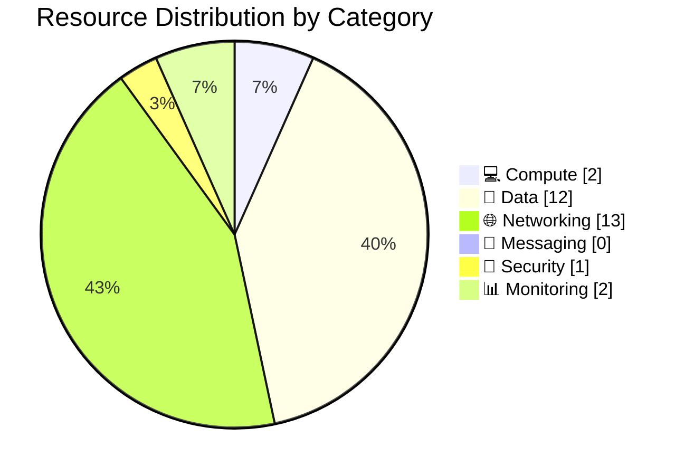

# 📦 Resource Inventory: hackops

<strong>📑 Inventory Contents</strong>

- [📊 Summary](#-summary)
- [📦 Resource Listing](#-resource-listing)
- [References](#references)

> Generated by as-built agent | 2026-02-26

| ⬅️ Previous                                          | 📑 Index            | Next ➡️                                      |
| ---------------------------------------------------- | ------------------- | -------------------------------------------- |
| [07-operations-runbook.md](07-operations-runbook.md) | [README](README.md) | [07-backup-dr-plan.md](07-backup-dr-plan.md) |

**Generated**: 2026-02-26
**Source**: Deployed Azure resources + Infrastructure as Code (Bicep)
**Environment**: dev
**Region**: centralus

---

## 📊 Summary

| Category            | Count |
| ------------------- | ----- |
| **Total Resources** | 19    |
| 💻 Compute          | 2     |
| 💾 Data Services    | 12    |
| 🌐 Networking       | 13    |
| 📨 Messaging        | 0     |
| 🔐 Security         | 1     |
| 📊 Monitoring       | 2     |

---

## 📦 Resource Listing

### 💻 Compute Resources

| Name            | Type                      | SKU        | Location  | Monthly Cost | Purpose                        | Portal                                                                                                                                                                               |
| --------------- | ------------------------- | ---------- | --------- | ------------ | ------------------------------ | ------------------------------------------------------------------------------------------------------------------------------------------------------------------------------------ |
| app-hackops-dev | Microsoft.Web/sites       | Included   | centralus | Included     | Next.js 15 application runtime | [View](https://portal.azure.com/#@/resource/subscriptions/00858ffc-dded-4f0f-8bbf-e17fff0d47d9/resourceGroups/rg-hackops-us-dev/providers/Microsoft.Web/sites/app-hackops-dev)       |
| asp-hackops-dev | Microsoft.Web/serverfarms | B1 (Basic) | centralus | $164.25      | Linux App Service compute plan | [View](https://portal.azure.com/#@/resource/subscriptions/00858ffc-dded-4f0f-8bbf-e17fff0d47d9/resourceGroups/rg-hackops-us-dev/providers/Microsoft.Web/serverfarms/asp-hackops-dev) |

### 💾 Data Services

| Name            | Type                            | SKU      | Configuration                       | Location  | Monthly Cost |
| --------------- | ------------------------------- | -------- | ----------------------------------- | --------- | ------------ |
| sql-hackops-dev | Microsoft.Sql/servers           | S2       | 50 DTU, Entra-only auth, PE-enabled | centralus | $75.00       |
| hackops-db      | Microsoft.Sql/servers/databases | S2       | 1 database                          | centralus | Included     |
| hackathons      | SQL Table                       | Included | PK `id`, FK constraints             | centralus | Included     |
| teams           | SQL Table                       | Included | PK `id`, FK `hackathonId`           | centralus | Included     |
| hackers         | SQL Table                       | Included | PK `id`, FK `hackathonId`           | centralus | Included     |
| rubrics         | SQL Table                       | Included | PK `id`, FK `hackathonId`           | centralus | Included     |
| rubric-active   | SQL Table                       | Included | PK `id`, FK `hackathonId`           | centralus | Included     |
| submissions     | SQL Table                       | Included | PK `id`, FK `teamId`                | centralus | Included     |
| scores          | SQL Table                       | Included | PK `id`, FK `teamId`                | centralus | Included     |
| challenges      | SQL Table                       | Included | PK `id`, FK `hackathonId`           | centralus | Included     |
| progression     | SQL Table                       | Included | PK `id`, FK `teamId`                | centralus | Included     |
| roles           | SQL Table                       | Included | PK `id`, FK `hackathonId`           | centralus | Included     |

### 🌐 Networking Resources

| Name                             | Type                                                  | Configuration                                       | Location  |
| -------------------------------- | ----------------------------------------------------- | --------------------------------------------------- | --------- |
| vnet-hackops-dev                 | Microsoft.Network/virtualNetworks                     | 10.0.0.0/16, 3 subnets                              | centralus |
| snet-app-dev                     | Microsoft.Network/virtualNetworks/subnets             | 10.0.1.0/24, delegated to Microsoft.Web/serverFarms | centralus |
| snet-pe-dev                      | Microsoft.Network/virtualNetworks/subnets             | 10.0.2.0/24, private endpoint subnet                | centralus |
| snet-default-dev                 | Microsoft.Network/virtualNetworks/subnets             | 10.0.0.0/24                                         | centralus |
| nsg-app-dev                      | Microsoft.Network/networkSecurityGroups               | AllowHTTPS(443 inbound)                             | centralus |
| nsg-pe-dev                       | Microsoft.Network/networkSecurityGroups               | DenyAllInbound                                      | centralus |
| nsg-default-dev                  | Microsoft.Network/networkSecurityGroups               | DenyAllInbound                                      | centralus |
| pe-kv-hackops-dev                | Microsoft.Network/privateEndpoints                    | Key Vault private endpoint                          | centralus |
| pe-sql-hackops-dev               | Microsoft.Network/privateEndpoints                    | SQL Database private endpoint                       | centralus |
| privatelink.vaultcore.azure.net  | Microsoft.Network/privateDnsZones                     | Private DNS zone for Key Vault                      | global    |
| privatelink.database.windows.net | Microsoft.Network/privateDnsZones                     | Private DNS zone for SQL Database                   | global    |
| link-kv-hackops                  | Microsoft.Network/privateDnsZones/virtualNetworkLinks | VNet link for Key Vault DNS                         | global    |
| link-sql-hackops                 | Microsoft.Network/privateDnsZones/virtualNetworkLinks | VNet link for SQL DNS                               | global    |

### 📨 Messaging Resources

| Name | Type | SKU | Configuration                   | Location |
| ---- | ---- | --- | ------------------------------- | -------- |
| None | N/A  | N/A | No messaging resources deployed | N/A      |

### 🔐 Security Resources

| Name                  | Type                      | Configuration                                                | Location  |
| --------------------- | ------------------------- | ------------------------------------------------------------ | --------- |
| kv-hackops-dev-fplrs3 | Microsoft.KeyVault/vaults | RBAC enabled, purge protection true, public network disabled | centralus |

### 📊 Monitoring Resources

| Name             | Type                                     | Retention | Location  |
| ---------------- | ---------------------------------------- | --------- | --------- |
| log-hackops-dev  | Microsoft.OperationalInsights/workspaces | 30 days   | centralus |
| appi-hackops-dev | Microsoft.Insights/components            | 365 days  | centralus |

---

---

## References

| Topic                | Link                                                                                                                   |
| -------------------- | ---------------------------------------------------------------------------------------------------------------------- |
| Azure Resource Types | [Resource Providers](https://learn.microsoft.com/azure/azure-resource-manager/management/resource-providers-and-types) |
| Naming Conventions   | [CAF Naming](https://learn.microsoft.com/azure/cloud-adoption-framework/ready/azure-best-practices/resource-naming)    |
| Pricing Calculator   | [Azure Pricing](https://azure.microsoft.com/pricing/calculator/)                                                       |

---

_Resource inventory generated from deployed resources and Bicep templates._

---

| ⬅️ [07-operations-runbook.md](07-operations-runbook.md) | 🏠 [Project Index](README.md) | ➡️ [07-backup-dr-plan.md](07-backup-dr-plan.md) |
| ------------------------------------------------------- | ----------------------------- | ----------------------------------------------- |

