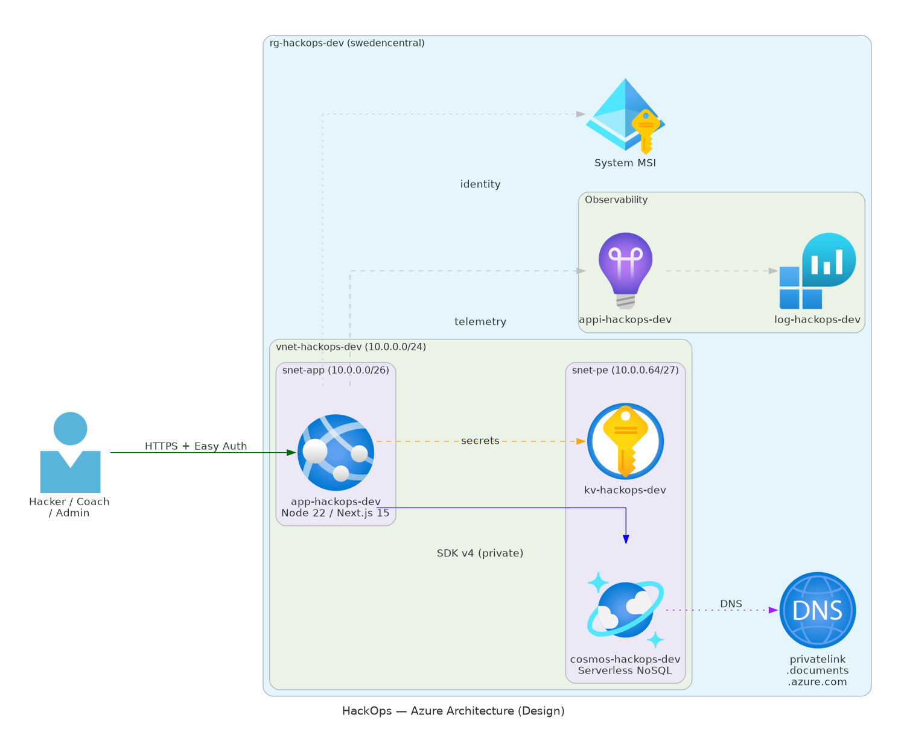

<a id="readme-top"></a>

<div align="center">


# 🏗️ hackops

**Azure hackathon management platform infrastructure artifacts**

[View Architecture](#-architecture) · [View Artifacts](#-generated-artifacts) · [View Progress](#-workflow-progress)

</div>

---

## 📋 Project Summary

| Property           | Value                        |
| ------------------ | ---------------------------- |
| **Created**        | 2026-02-26                   |
| **Last Updated**   | 2026-02-26                   |
| **Region**         | centralus                    |
| **Environment**    | dev                          |
| **Estimated Cost** | $232.33/month                |
| **AVM Coverage**   | 100% for supported resources |

---

## ✅ Workflow Progress

```text
[████████████████████████] 100% Complete
```

| Step | Phase          |                                Status                                 | Artifact                                                           |
| :--: | -------------- | :-------------------------------------------------------------------: | ------------------------------------------------------------------ |
|  1   | Requirements   |  | [01-requirements.md](./01-requirements.md)                         |
|  2   | Architecture   |  | [02-architecture-assessment.md](./02-architecture-assessment.md)   |
|  3   | Design         |  | [03-des-diagram.py](./03-des-diagram.py)                           |
|  4   | Planning       |  | [04-implementation-plan.md](./04-implementation-plan.md)           |
|  5   | Implementation |  | [05-implementation-reference.md](./05-implementation-reference.md) |
|  6   | Deployment     |  | [06-deployment-summary.md](./06-deployment-summary.md)             |
|  7   | Documentation  |  | [07-documentation-index.md](./07-documentation-index.md)           |

> **Legend**:
>  Complete |
>  In Progress |
>  Pending |
>  Skipped

---

## 🏛️ Architecture

<div align="center">



_Generated with [azure-diagrams](../../.github/skills/azure-diagrams/SKILL.md) skill_

</div>

### Key Resources

| Resource      | Type                                     | SKU              | Purpose                                |
| ------------- | ---------------------------------------- | ---------------- | -------------------------------------- |
| App Service   | Microsoft.Web/sites                      | B1/S1 plan       | Host HackOps web app                   |
| Cosmos DB     | Microsoft.DocumentDB/databaseAccounts    | Serverless       | Primary application datastore          |
| Key Vault     | Microsoft.KeyVault/vaults                | Standard/Premium | Secret and key management              |
| Log Analytics | Microsoft.OperationalInsights/workspaces | PerGB2018        | Centralized monitoring and diagnostics |

---

## 📄 Generated Artifacts

<details>
<summary><strong>📁 Step 1-3: Requirements, Architecture & Design</strong></summary>

| File                                                                               | Description                       |                                Status                                 | Created    |
| ---------------------------------------------------------------------------------- | --------------------------------- | :-------------------------------------------------------------------: | ---------- |
| [01-requirements.md](./01-requirements.md)                                         | Project requirements with NFRs    |  | 2026-02-26 |
| [02-architecture-assessment.md](./02-architecture-assessment.md)                   | WAF assessment with pillar scores |  | 2026-02-26 |
| [03-des-adr-0001-serverless-cosmos.md](./03-des-adr-0001-serverless-cosmos.md)     | Design ADR 1                      |  | 2026-02-26 |
| [03-des-adr-0002-app-service-compute.md](./03-des-adr-0002-app-service-compute.md) | Design ADR 2                      |  | 2026-02-26 |
| [03-des-adr-0003-easy-auth-github.md](./03-des-adr-0003-easy-auth-github.md)       | Design ADR 3                      |  | 2026-02-26 |
| [03-des-diagram.py](./03-des-diagram.py)                                           | Architecture diagram source       |  | 2026-02-26 |
| [03-des-diagram.png](./03-des-diagram.png)                                         | Architecture diagram image        |  | 2026-02-26 |

</details>

<details>
<summary><strong>📁 Step 4-6: Planning, Implementation & Deployment</strong></summary>

| File                                                               | Description                                |                                Status                                 | Created    |
| ------------------------------------------------------------------ | ------------------------------------------ | :-------------------------------------------------------------------: | ---------- |
| [04-governance-constraints.md](./04-governance-constraints.md)     | Azure Policy constraints                   |  | 2026-02-26 |
| [04-implementation-plan.md](./04-implementation-plan.md)           | Bicep implementation plan                  |  | 2026-02-26 |
| [04-preflight-check.md](./04-preflight-check.md)                   | AVM and type preflight checks              |  | 2026-02-26 |
| [04-dependency-diagram.py](./04-dependency-diagram.py)             | Step 4 dependency diagram source           |  | 2026-02-26 |
| [04-dependency-diagram.png](./04-dependency-diagram.png)           | Step 4 dependency diagram image            |  | 2026-02-26 |
| [04-runtime-diagram.py](./04-runtime-diagram.py)                   | Step 4 runtime diagram source              |  | 2026-02-26 |
| [04-runtime-diagram.png](./04-runtime-diagram.png)                 | Step 4 runtime diagram image               |  | 2026-02-26 |
| [05-implementation-reference.md](./05-implementation-reference.md) | Link to Bicep code                         |  | 2026-02-26 |
| [06-deployment-summary.md](./06-deployment-summary.md)             | Deployment results for centralus migration |  | 2026-02-26 |

</details>

<details>
<summary><strong>📁 Step 7: As-Built Documentation</strong></summary>

| File                                                         | Description                             |                                Status                                 | Created    |
| ------------------------------------------------------------ | --------------------------------------- | :-------------------------------------------------------------------: | ---------- |
| [07-documentation-index.md](./07-documentation-index.md)     | Step 7 package index                    |  | 2026-02-26 |
| [07-resource-inventory.md](./07-resource-inventory.md)       | As-built resource inventory             |  | 2026-02-26 |
| [07-design-document.md](./07-design-document.md)             | As-built design document                |  | 2026-02-26 |
| [07-operations-runbook.md](./07-operations-runbook.md)       | Day-2 operations procedures             |  | 2026-02-26 |
| [07-backup-dr-plan.md](./07-backup-dr-plan.md)               | Backup and disaster recovery plan       |  | 2026-02-26 |
| [07-compliance-matrix.md](./07-compliance-matrix.md)         | Compliance controls and gap analysis    |  | 2026-02-26 |
| [07-ab-cost-estimate.md](./07-ab-cost-estimate.md)           | As-built cost estimate and optimization |  | 2026-02-26 |
| [07-ab-diagram.py](./07-ab-diagram.py)                       | As-built architecture diagram source    |  | 2026-02-26 |
| [07-ab-diagram.png](./07-ab-diagram.png)                     | As-built architecture diagram image     |  | 2026-02-26 |
| [07-ab-cost-distribution.py](./07-ab-cost-distribution.py)   | Cost distribution chart source          |  | 2026-02-26 |
| [07-ab-cost-distribution.png](./07-ab-cost-distribution.png) | Cost distribution chart image           |  | 2026-02-26 |
| [07-ab-cost-projection.py](./07-ab-cost-projection.py)       | Cost projection chart source            |  | 2026-02-26 |
| [07-ab-cost-projection.png](./07-ab-cost-projection.png)     | Cost projection chart image             |  | 2026-02-26 |
| [07-ab-cost-comparison.py](./07-ab-cost-comparison.py)       | Design vs as-built chart source         |  | 2026-02-26 |
| [07-ab-cost-comparison.png](./07-ab-cost-comparison.png)     | Design vs as-built chart image          |  | 2026-02-26 |
| [07-ab-compliance-gaps.py](./07-ab-compliance-gaps.py)       | Compliance gaps chart source            |  | 2026-02-26 |
| [07-ab-compliance-gaps.png](./07-ab-compliance-gaps.png)     | Compliance gaps chart image             |  | 2026-02-26 |

</details>

---

## 🔗 Related Resources

| Resource            | Path                                                                                             |
| ------------------- | ------------------------------------------------------------------------------------------------ |
| **Bicep Templates** | [infra/bicep/hackops/](../../infra/bicep/hackops/)                                               |
| **Execution Plan**  | [docs/exec-plans/active/hackops-execution.md](../../docs/exec-plans/active/hackops-execution.md) |
| **User Guide**      | [docs/hackops-user-guide.md](../../docs/hackops-user-guide.md)                                   |

---

<div align="center">

**Generated by [Agentic InfraOps](../../README.md)**

<a href="#readme-top">⬆️ Back to Top</a>

</div>
